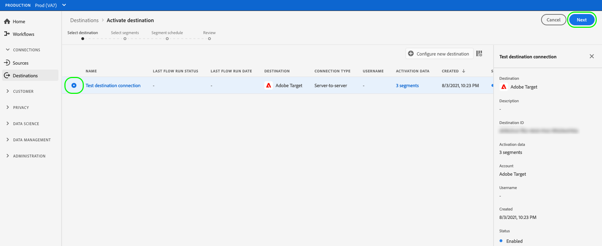
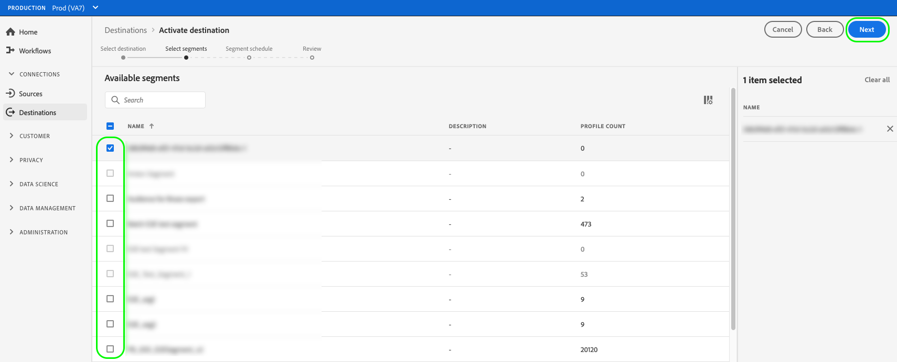
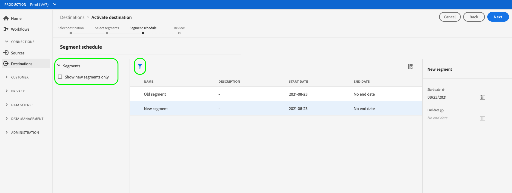
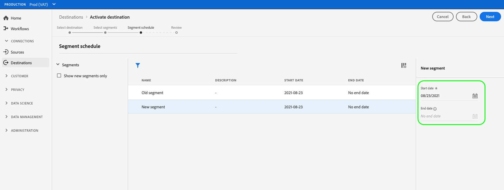
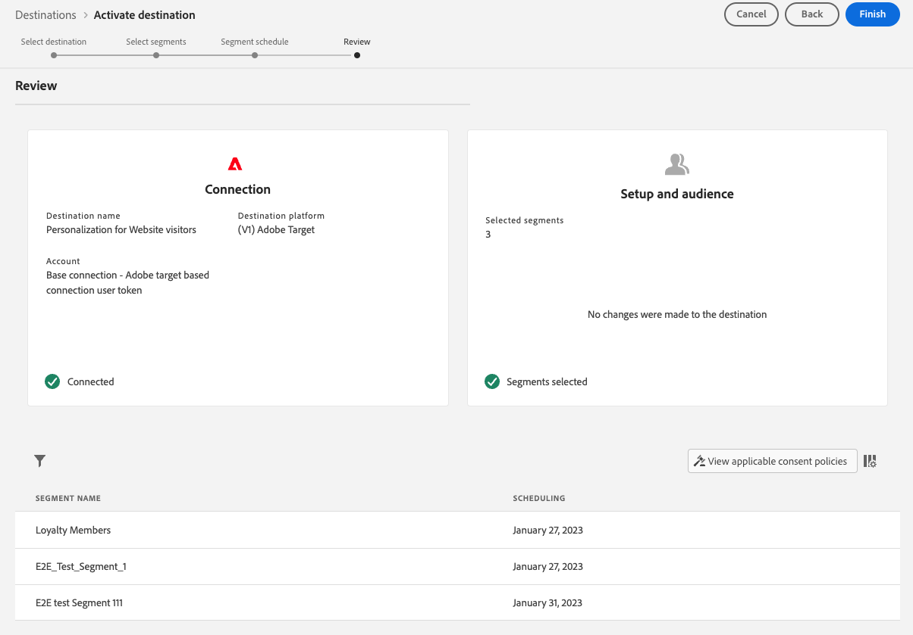

# Activate audience data to profile request destinations

## Overview {#overview}

This article explains the workflow required to activate audience data in Adobe Experience Platform profile request destinations. Examples of profile request destinations are the [Adobe Target](../../destinations/catalog/personalization/adobe-target-connection.md) and the [Custom personalization](../../destinations/catalog/personalization/custom-personalization.md) connections.

## Prerequisites {#prerequisites}

To activate data to destinations, you must have successfully [connected to a destination](./connect-destination.md). If you haven't done so already, go to the [destinations catalog](../catalog/overview.md), browse the supported destinations, and configure the destination that you want to use.

### Segment merge policy {#merge-policy}

Currently, profile request destinations only support the activation of segments that use the [default merge policy](../../segmentation/ui/segment-builder.md#merge-policies).

## Select your destination {#select-destination}

1. Go to **[!UICONTROL Connections > Destinations]**, and select the **[!UICONTROL Catalog]** tab.
    
    

1. Select **[!UICONTROL Activate segments]** on the card corresponding to the destination where you want to activate your segments, as shown in the image below.

    

1. Select the destination connection that you want to use to activate your segments, then select **[!UICONTROL Next]**.

    

1. Move to the next section to [select your segments](#select-segments).

## Select your segments {#select-segments}

Use the check boxes to the left of the segment names to select the segments that you want to activate to the destination, then select **[!UICONTROL Next]**.

## Schedule segment export {#scheduling}

By default, the [!UICONTROL Segment schedule] page shows only the newly selected segments that you chose in the current activation flow.

To see all the segments being activated to your destination, use the filtering option and disable the **[!UICONTROL Show new segments only]** filter.

On the **[!UICONTROL Segment schedule]** page, select each segment, then use the **[!UICONTROL Start date]** and **[!UICONTROL End date]** selectors to configure the time interval for sending data to your destination.

Select **[!UICONTROL Next]** to go to the [!UICONTROL Review] page.

## Review {#review}

On the **[!UICONTROL Review]** page, you can see a summary of your selection. Select **[!UICONTROL Cancel]** to break up the flow, **[!UICONTROL Back]** to modify your settings, or **[!UICONTROL Finish]** to confirm your selection and start sending data to the destination.

>[!IMPORTANT]
>
>In this step, Adobe Experience Platform checks for data usage policy violations. Shown below is an example where a policy is violated. You cannot complete the segment activation workflow until you have resolved the violation. For information on how to resolve policy violations, see [Policy enforcement](../../rtcdp/privacy/data-governance-overview.md#enforcement) in the data governance documentation section.
 

If no policy violations have been detected, select **[!UICONTROL Finish]** to confirm your selection and start sending data to the destination. 

<!--

Commenting out this part since destination monitoring is not available currently for the Adobe Target and Custom Personalization destinations.

## Verify segment activation {#verify}

Check the [destination monitoring documentation](../../dataflows/ui/monitor-destinations.md) for detailed information on how to monitor the flow of data to your destinations.

-->