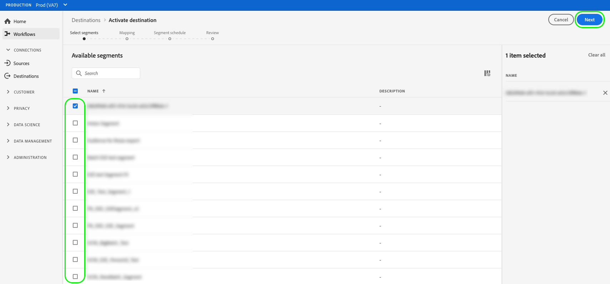
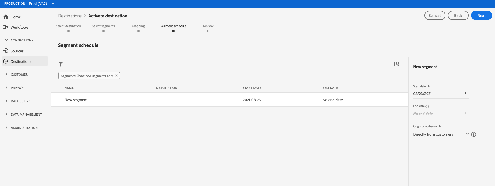
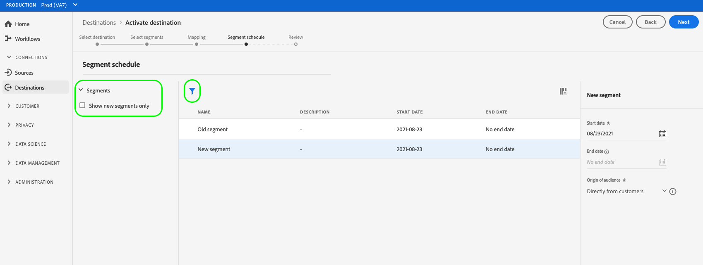
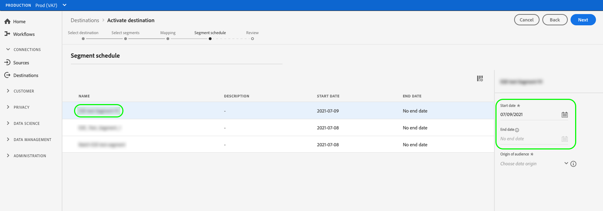

# Activate audience data to streaming segment export destinations

>[!IMPORTANT]
> 
>To activate data, you need the **[!UICONTROL Manage Destinations]**, **[!UICONTROL Activate Destinations]**, **[!UICONTROL View Profiles]**, and **[!UICONTROL View Segments]** [access control permissions](/help/access-control/home.md#permissions). Read the [access control overview](/help/access-control/ui/overview.md) or contact your product administrator to obtain the required permissions.

## Overview {#overview}

This article explains the workflow required to activate audience data in Adobe Experience Platform segment streaming destinations.

## Prerequisites {#prerequisites}

To activate data to destinations, you must have successfully [connected to a destination](./connect-destination.md). If you haven't done so already, go to the [destinations catalog](../catalog/overview.md), browse the supported destinations, and configure the destination that you want to use.

## Select your destination {#select-destination}

1. Go to **[!UICONTROL Connections > Destinations]**, and select the **[!UICONTROL Catalog]** tab.
    
    

1. Select **[!UICONTROL Activate segments]** on the card corresponding to the destination where you want to activate your segments, as shown in the image below.

    

1. Select the destination connection that you want to use to activate your segments, then select **[!UICONTROL Next]**.

    

1. Move to the next section to [select your segments](#select-segments).

## Select your segments {#select-segments}

Use the check boxes to the left of the segment names to select the segments that you want to activate to the destination, then select **[!UICONTROL Next]**.

## Map attributes and identities {#mapping}

>[!IMPORTANT]
>
>This step only applies to some segment streaming destinations. If your destination does not have a **[!UICONTROL Mapping]** step, skip to [Schedule segment export](#scheduling).

Some segment streaming destinations require you to select source attributes or identity namespaces to map as target identities in the destination.

1. In the **[!UICONTROL Mapping]** page, select **[!UICONTROL Add new mapping]**.
    
    

1. Select the arrow to the right of the **[!UICONTROL Source field]** entry.

    

1. In the **[!UICONTROL Select source field]** page, use the **[!UICONTROL Select attributes]** or the **[!UICONTROL Select identity namespace]** options to switch between the two categories of available source fields. From the available [!DNL XDM] profile attributes and identity namespaces, select the ones that you want to map to the destination, then choose **[!UICONTROL Select]**.

    

1. Select the button to the right of the **[!UICONTROL Target field]** entry.

    

1. In the **[!UICONTROL Select target field]** page, select the target identity namespace that you want to map the source field to, and choose **[!UICONTROL Select]**.

    

1. To add more mappings, repeat steps 1 to 5.

### Apply transformation {#apply-transformation}

>[!CONTEXTUALHELP]
>id="platform_destinations_activate_applytransformation"
>title="Apply transformation"
>abstract="Check this option when using unhashed source fields, to have Adobe Experience Platform automatically hash them on activation."

When you are mapping unhashed source attributes to target attributes that the destination expects to be hashed (for example: `email_lc_sha256` or `phone_sha256`), check the **Apply transformation** option to have Adobe Experience Platform automatically hash the source attributes on activation.

## Schedule segment export {#scheduling}

>[!CONTEXTUALHELP]
>id="platform_destinations_activate_enddate"
>title="End date"
>abstract="Adding an end date for segment schedule is not available."

By default, the [!UICONTROL Segment schedule] page shows only the newly selected segments that you chose in the current activation flow.

To see all the segments being activated to your destination, use the filtering option and disable the **[!UICONTROL Show new segments only]** filter.

1. On the **[!UICONTROL Segment schedule]** page, select each segment, then use the **[!UICONTROL Start date]** and **[!UICONTROL End date]** selectors to configure the time interval for sending data to your destination.

    

    * Some destinations require you to select the **[!UICONTROL Origin of audience]** for each segment, using the drop-down menu underneath the calendar selectors. If your destination does not include this selector, skip this step.

        

    * Some destinations require you to manually map [!DNL Platform] segments to their counterpart in the target destination. To do this, select each segment, then enter the corresponding segment ID from the destination platform in the **[!UICONTROL Mapping ID]** field. If your destination does not include this field, skip this step.

        

    * Some destinations require you to enter an **[!UICONTROL App ID]** when activating [!DNL IDFA] or [!DNL GAID] segments. If your destination does not include this field, skip this step.

        

1. Select **[!UICONTROL Next]** to go to the [!UICONTROL Review] page.

## Review {#review}

On the **[!UICONTROL Review]** page, you can see a summary of your selection. Select **[!UICONTROL Cancel]** to break up the flow, **[!UICONTROL Back]** to modify your settings, or **[!UICONTROL Finish]** to confirm your selection and start sending data to the destination.

### Consent policy evaluation {#consent-policy-evaluation}

If your organization purchased **Adobe Healthcare Shield** or **Adobe Privacy & Security Shield**, select **[!UICONTROL View applicable consent policies]** to see which consent policies are applied and how many profiles are included in the activation as a result of them. Read about [consent policy evaluation](/help/data-governance/enforcement/auto-enforcement.md#consent-policy-evaluation) for more information.

### Data usage policy checks {#data-usage-policy-checks}

In the **[!UICONTROL Review]** step, Experience Platform also checks for any data usage policy violations. Shown below is an example where a policy is violated. You cannot complete the segment activation workflow until you have resolved the violation. For information on how to resolve policy violations, read about [data usage policy violations](/help/data-governance/enforcement/auto-enforcement.md#data-usage-violation) in the data governance documentation section.
 

### Filter segments {#filter-segments}

Also in this step you can use the available filters on the page to display only the segments whose schedule or mapping has been updated as part of this workflow. You can also toggle which table columns you want to see. 

If you are satisfied with your selection and no policy violations have been detected, select **[!UICONTROL Finish]** to confirm your selection and start sending data to the destination. 

## Verify segment activation {#verify}

Check the [destination monitoring documentation](../../dataflows/ui/monitor-destinations.md) for detailed information on how to monitor the flow of data to your destinations.

<!-- 
For [!DNL Facebook Custom Audience], a successful activation means that a [!DNL Facebook] custom audience would be created programmatically in [[!UICONTROL Facebook Ads Manager]](https://www.facebook.com/adsmanager/manage/). Segment membership in the audience would be added and removed as users are qualified or disqualified for the activated segments.

>[!TIP]
>
>The integration between Adobe Experience Platform and [!DNL Facebook] supports historical audience backfills. All historical segment qualifications are sent to [!DNL Facebook] when you activate the segments to the destination.
-->
