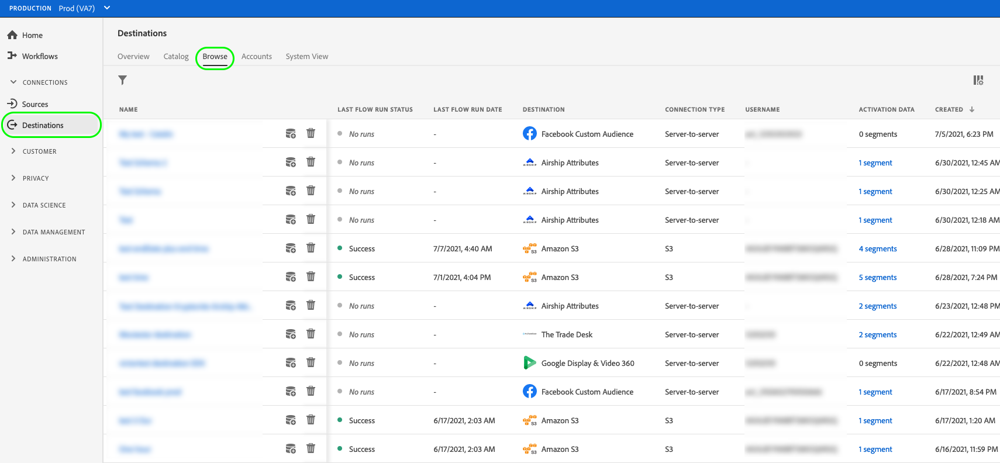
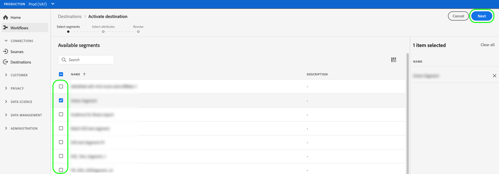
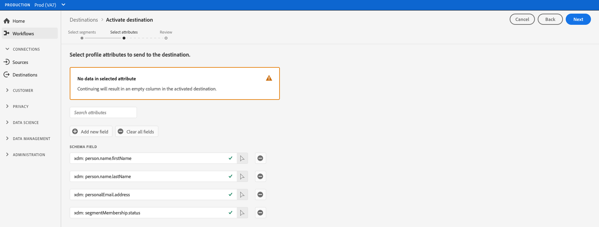

# Activate audience data to streaming profile-based destinations

## Overview {#overview}

This article explains the workflow required to activate audience data in Adobe Experience Platform streaming profile-based destinations, such as Amazon Kinesis.

## Prerequisites {#prerequisites}

To activate data to destinations, you must have successfully [connected to a destination](./connect-destination.md). If you haven't done so already, go to the [destinations catalog](../catalog/overview.md), browse the supported destinations, and configure the destination that you want to use.

## Select your destination {#select-destination}

1. Go to **[!UICONTROL Connections > Destinations]**, and select the **[!UICONTROL Browse]** tab.
    
    

1. Select the **[!UICONTROL Add segments]** button corresponding to the destination where you want to activate your segments, as shown in the image below.

    

1. Move to the next section to [select your segments](#select-segments).

## Select your segments {#select-segments}

Use the check boxes to the left of the segment names to select the segments that you want to activate to the destination, then select **[!UICONTROL Next]**.



## Select profile attributes {#select-attributes}

Select the profile attributes that you want to send to the target destination.

>[!NOTE] 
>
> Adobe Experience Platform prefills your selection with four recommended, commonly used attributes from your schema: `person.name.firstName`, `person.name.lastName`, `personalEmail.address`, `segmentMembership.status`.

File exports will vary in the following ways, depending on whether `segmentMembership.status` is selected:
* If the `segmentMembership.status` field is selected, exported files include **[!UICONTROL Active]** members in the initial full snapshot and **[!UICONTROL Active]** and **[!UICONTROL Expired]** members in subsequent incremental exports.
* If the `segmentMembership.status` field is not selected, exported files include only **[!UICONTROL Active]** members in the initial full snapshot and in subsequent incremental exports.

 

1. In the **[!UICONTROL Select attributes]** page, select **[!UICONTROL Add new field]**.
    
    

1. Select the arrow to the right of the **[!UICONTROL Schema field]** entry.

    

1. In the **[!UICONTROL Select field]** page, select the XDM attributes that you want to send to the destination, then choose **[!UICONTROL Select]**.

    


1. To add more mappings, repeat steps 1 to 3, then select **[!UICONTROL Next]**.

## Review {#review}

On the **[!UICONTROL Review]** page, you can see a summary of your selection. Select **[!UICONTROL Cancel]** to break up the flow, **[!UICONTROL Back]** to modify your settings, or **[!UICONTROL Finish]** to confirm your selection and start sending data to the destination.

>[!IMPORTANT]
>
>In this step, Adobe Experience Platform checks for data usage policy violations. Shown below is an example where a policy is violated. You cannot complete the segment activation workflow until you have resolved the violation. For information on how to resolve policy violations, see [Policy enforcement](../../rtcdp/privacy/data-governance-overview.md#enforcement) in the data governance documentation section.
 


If no policy violations have been detected, select **[!UICONTROL Finish]** to confirm your selection and start sending data to the destination. 


## Verify segment activation {#verify}


For email marketing destinations and cloud storage destinations, Adobe Experience Platform creates a tab-delimited `.csv` file in the storage location that you provided. Expect a new file to be created in your storage location every day. The default file format is:
`<destinationName>_segment<segmentID>_<timestamp-yyyymmddhhmmss>.csv`

The files you would receive on three consecutive days could look like this:

```console
Salesforce_Marketing_Cloud_segment12341e18-abcd-49c2-836d-123c88e76c39_20200408061804.csv
Salesforce_Marketing_Cloud_segment12341e18-abcd-49c2-836d-123c88e76c39_20200409052200.csv
Salesforce_Marketing_Cloud_segment12341e18-abcd-49c2-836d-123c88e76c39_20200410061130.csv
```

The presence of these files in your storage location is confirmation of successful activation. To understand how the exported files are structured, you can [download a sample .csv file](../assets/common/sample_export_file_segment12341e18-abcd-49c2-836d-123c88e76c39_20200408061804.csv). This sample file includes the profile attributes `person.firstname`, `person.lastname`, `person.gender`, `person.birthyear`, and `personalEmail.address`.
