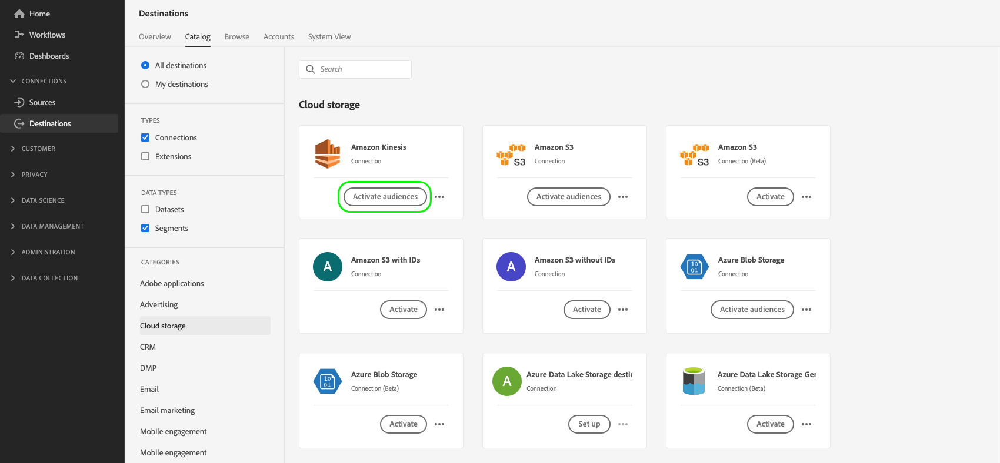
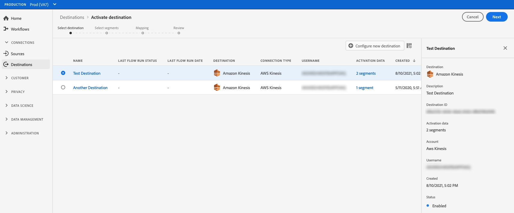
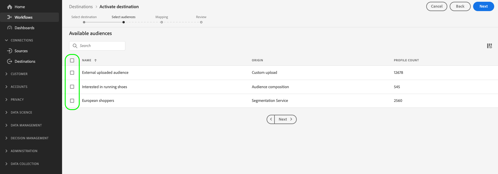
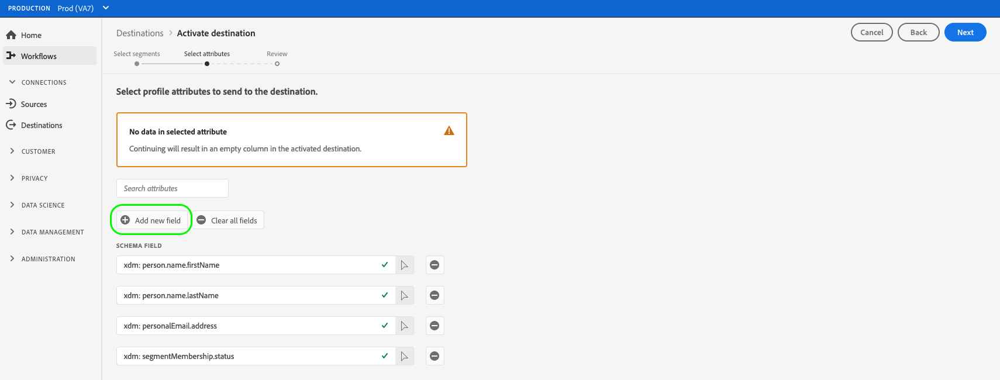
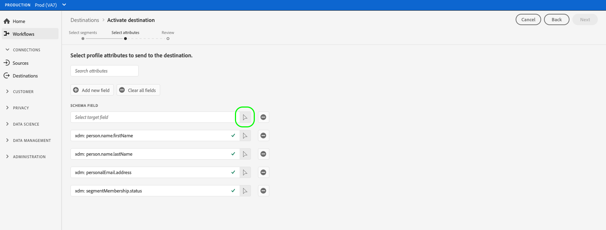
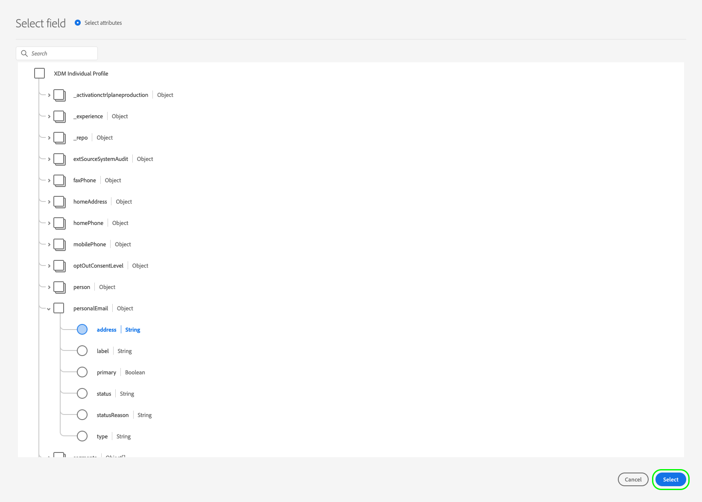
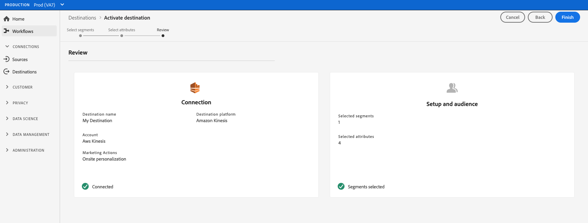
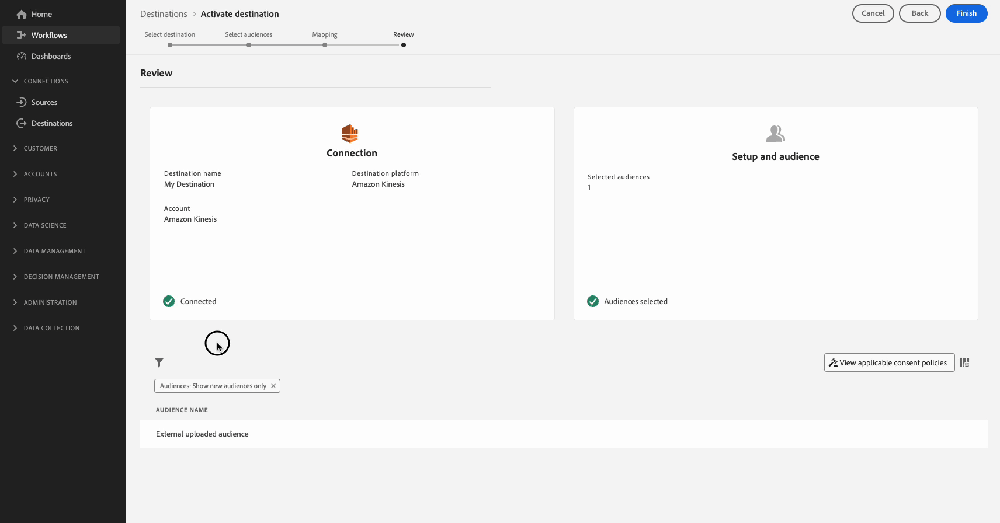

# Activate audiences to streaming profile export destinations

>[!IMPORTANT]
> 
> * To activate data and enable the [mapping step](#mapping) of the workflow, you need the **[!UICONTROL Manage Destinations]**, **[!UICONTROL Activate Destinations]**, **[!UICONTROL View Profiles]**, and **[!UICONTROL View Segments]** [access control permissions](/help/access-control/home.md#permissions).
> * To activate data without going through the [mapping step](#mapping) of the workflow, you need the **[!UICONTROL Manage Destinations]**, **[!UICONTROL Activate Segment without Mapping]**, **[!UICONTROL View Profiles]**, and **[!UICONTROL View Segments]** [access control permissions](/help/access-control/home.md#permissions).
> 
> Read the [access control overview](/help/access-control/ui/overview.md) or contact your product administrator to obtain the required permissions.

## Overview {#overview}

This article explains the workflow required to activate audience data in Adobe Experience Platform streaming profile-based destinations, such as Amazon Kinesis.

## Prerequisites {#prerequisites}

To activate data to destinations, you must have successfully [connected to a destination](./connect-destination.md). If you haven't done so already, go to the [destinations catalog](../catalog/overview.md), browse the supported destinations, and configure the destination that you want to use.

## Select your destination {#select-destination}

1. Go to **[!UICONTROL Connections > Destinations]**, and select the **[!UICONTROL Catalog]** tab.
    
    

1. Select **[!UICONTROL Activate audiences]** on the card corresponding to the destination where you want to activate your audiences, as shown in the image below.

    

1. Select the destination connection that you want to use to activate your audiences, then select **[!UICONTROL Next]**.

    

1. Move to the next section to [select your audiences](#select-audiences).

## Select your audiences {#select-audiences}

To select the audiences that you want to activate to the destination, use the check boxes to the left of the audience names, then select **[!UICONTROL Next]**.

You can select from multiple types of audiences, depending on their origin:

* **[!UICONTROL Segmentation Service]**: Audiences generated within Experience Platform by the Segmentation Service. See the [segmentation documentation](../../segmentation/ui/overview.md) for more details.
* **[!UICONTROL Custom uploads]**: Audiences generated outside of Experience Platform, and uploaded into Platform as CSV files. To learn more about external audiences, see the documentation on [importing an audience](../../segmentation/ui/overview.md#import-audience).
* Other types of audiences, originating from other Adobe solutions, such as [!DNL Audience Manager].



## Select profile attributes {#select-attributes}

In the **[!UICONTROL Mapping]** step, select the profile attributes that you want to send to the target destination.

1. In the **[!UICONTROL Select attributes]** page, select **[!UICONTROL Add new field]**.
    
    

1. Select the arrow to the right of the **[!UICONTROL Schema field]** entry.

    

1. In the **[!UICONTROL Select field]** page, select the XDM attributes that you want to send to the destination, then choose **[!UICONTROL Select]**.

    

1. To add more fields, repeat steps 1 to 3, then select **[!UICONTROL Next]**.

## Review {#review}

On the **[!UICONTROL Review]** page, you can see a summary of your selection. Select **[!UICONTROL Cancel]** to break up the flow, **[!UICONTROL Back]** to modify your settings, or **[!UICONTROL Finish]** to confirm your selection and start sending data to the destination.



### Consent policy evaluation {#consent-policy-evaluation}

If your organization purchased **Adobe Healthcare Shield** or **Adobe Privacy & Security Shield**, select **[!UICONTROL View applicable consent policies]** to see which consent policies are applied and how many profiles are included in the activation as a result of them. Read about [consent policy evaluation](/help/data-governance/enforcement/auto-enforcement.md#consent-policy-evaluation) for more information.

### Data usage policy checks {#data-usage-policy-checks}

In the **[!UICONTROL Review]** step, Experience Platform also checks for any data usage policy violations. Shown below is an example where a policy is violated. You cannot complete the audience activation workflow until you have resolved the violation. For information on how to resolve policy violations, read about [data usage policy violations](/help/data-governance/enforcement/auto-enforcement.md#data-usage-violation) in the data governance documentation section.
 


### Filter audiences {#filter-audiences}

Also in this step you can use the available filters on the page to display only the audiences whose schedule or mapping has been updated as part of this workflow. 



If you are satisfied with your selection and no policy violations have been detected, select **[!UICONTROL Finish]** to confirm your selection and start sending data to the destination. 

## Verify audience activation {#verify}

Your exported [!DNL Experience Platform] data lands in your target destination in JSON format. For example, the event below contains the email address attribute of a profile that has qualified for a certain audience and exited another audience. The identities for this prospect are `ECID` and `email_lc_sha256`.

```json
{
  "person": {
    "email": "yourstruly@adobe.com"
  },
  "segmentMembership": {
    "ups": {
      "7841ba61-23c1-4bb3-a495-00d3g5fe1e93": {
        "lastQualificationTime": "2020-05-25T21:24:39Z",
        "status": "exited"
      },
      "59bd2fkd-3c48-4b18-bf56-4f5c5e6967ae": {
        "lastQualificationTime": "2020-05-25T23:37:33Z",
        "status": "realized"
      }
    }
  },
  "identityMap": {
    "ecid": [
      {
        "id": "14575006536349286404619648085736425115"
      },
      {
        "id": "66478888669296734530114754794777368480"
      }
    ],
    "email_lc_sha256": [
      {
        "id": "655332b5fa2aea4498bf7a290cff017cb4"
      },
      {
        "id": "66baf76ef9de8b42df8903f00e0e3dc0b7"
      }
    ]
  }
}
```
