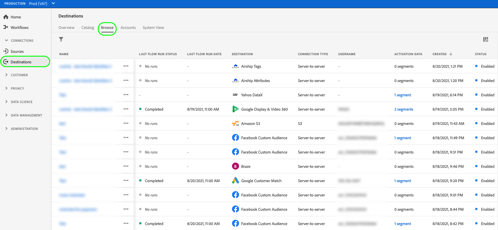
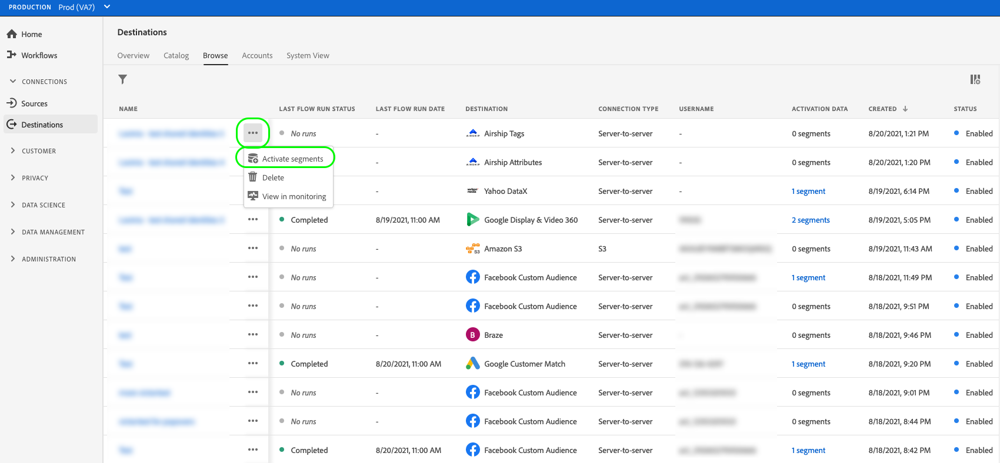

# Activation overview

>[!IMPORTANT]
> 
>To activate data, you need the **[!UICONTROL Manage Destinations]**, **[!UICONTROL Activate Destinations]**, **[!UICONTROL View Profiles]**, and **[!UICONTROL View Segments]** [access control permissions](/help/access-control/home.md#permissions). Read the [access control overview](/help/access-control/ui/overview.md) or contact your product administrator to obtain the required permissions.

Adobe Experience Platform supports a wide range of destinations. The audience activation workflow varies between the destinations, based on the type of audience data they support, and the frequency of the data export.

## Activation methods {#activation-methods}

After you [configure your destination](connect-destination.md), you can activate audiences in multiple ways:

### Activate audiences from the destinations catalog

See the following guides for detailed information on activating audiences to your destination from the destinations catalog:

* [Activate audience data to streaming audience export destinations](activate-segment-streaming-destinations.md)
* [Activate audience data to streaming profile export destinations](activate-streaming-profile-destinations.md)
* [Activate audience data to batch profile export destinations](activate-batch-profile-destinations.md)

### Activate audiences from the [!UICONTROL Browse] page

Follow the steps below to activate data to your destinations from the **[!UICONTROL Browse]** page.

1. Go to **[!UICONTROL Connections > Destinations]**, and select the **[!UICONTROL Browse]** tab.

    

1. Find the destination connection that you want to use to activate your segments, select the three dots in the [!UICONTROL Name] column, then select **[!UICONTROL Activate audiences]**.

    

1. Depending on the selected destination, follow the steps described in the articles below, starting with the **[!UICONTROL Select segments]** step, to finish the activation workflow:

    * [Activate audience data to streaming audience export destinations](activate-segment-streaming-destinations.md)
    * [Activate audience data to streaming profile export destinations](activate-streaming-profile-destinations.md)
    * [Activate audience data to batch profile export destinations](activate-batch-profile-destinations.md)

### Activate audiences from the audience details page {#activate-audience-details}

You can activate audiences to destinations from the audience details page. See [Audience details](../../segmentation/ui/overview.md#audience-details) for more information.

Depending on the selected destination, follow the steps described in the articles below to finish the activation workflow:
    
* [Activate audience data to streaming audience export destinations](activate-segment-streaming-destinations.md)
* [Activate audience data to streaming profile export destinations](activate-streaming-profile-destinations.md)
* [Activate audience data to batch profile export destinations](activate-batch-profile-destinations.md)
