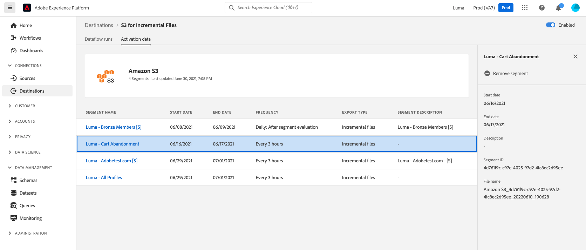

# Activate audience segments on-demand to batch destinations using the Experience Platform UI

>[!IMPORTANT]
> 
>To activate data, you need the **[!UICONTROL Manage Destinations]**, **[!UICONTROL Activate Destinations]**, **[!UICONTROL View Profiles]**, and **[!UICONTROL View Segments]** [access control permissions](/help/access-control/home.md#permissions). Read the [access control overview](/help/access-control/ui/overview.md) or contact your product administrator to obtain the required permissions.

## Overview {#overview}

This article explains how to use the Experience Platform UI to activate audience segments on-demand to batch destinations such as cloud storage and email marketing destinations.

The **[!UICONTROL Activate On-demand]** control allows you to export a full file without interrupting the current schedule of a previously scheduled segment. This export happens in addition to previously scheduled exports and does not change the export frequency of the segment.

You can also use the Flow service API for this purpose. Read how to [activate audience segments on-demand to batch destinations via the ad-hoc activation API](/help/destinations/api/ad-hoc-activation-api.md).

## Prerequisites {#prerequisites}

To activate data to destinations, you must have successfully [connected to a destination](./connect-destination.md). If you haven't done so already, go to the [destinations catalog](../catalog/overview.md), browse the supported destinations, and configure the destination that you want to use.

## How to activate segments on-demand {#select-activate-on-demand-control}

Include popover with ID platform_destinations_activationchaining_activatenow
Text will be: Select this control to deliver a full file export on top of any previously scheduled exports. The file export is triggered immediately.

1. Go to **[!UICONTROL Connections > Destinations]**, select the **[!UICONTROL Browse]** tab and the filter symbol to filter the displayed connections to your desired batch destination.
    
    

2. Select your preferred destination connection to inspect the existing dataflow to the destination.

    

3. Select the segment for which you want to export a file on-demand.

    

4. Select the **[!UICONTROL Activate on-demand]** control to trigger a one-time export which will deliver a file to your batch destination.

    

5. Select **[!UICONTROL Yes]** to confirm and trigger the file export.

    

6. A confirmation message appears, letting you know that the file export has started.

    

## Considerations {#considerations}

Keep in mind the following considerations when using the activate on-demand control:

* Activate on-demand works only for segments that have no end date (export frequency of **[!UICONTROL Once]**) or where the end date has not yet passed.
* If a new merge policy was created, and a segment was created off that merge policy, activate on-demand will not work until 24 hours have passed,
* Net new segments created off existing merge policies older than 24 hours may work, however, daily segmentation may not have ran and would cause in 0 profiles in the file.
* For best results, activate on-demand should be used for segments that have been activated longer than 24 hours.

## Related information {#related-information}

* [Activate audience segments to batch destinations on-demand using the Experience Platform UI](/help/destinations/ui/ad-hoc-activation-ui.md)
* [Activate audience data to batch profile export destinations](/help/destinations/ui/activate-batch-profile-destinations.md)