# Subscribe to in-context destination alerts

Adobe Experience Platform allows you to subscribe to event-based alerts regarding Adobe Experience Platform activities. Alerts reduce or eliminate the need to poll the [[!DNL Observability Insights] API](../../observability/api/overview.md) in order to check if a job has completed, if a certain milestone within a workflow has been reached, or if any errors have occurred.

You can subscribe to alerts when creating a dataflow to receive alert messages regarding the status, success, or failure of your flow run.

This document provides steps on how to subscribe receive alerts messages for your destination dataflows.

## Getting started

This document requires a working understanding of the following components of Adobe Experience Platform:

* [Destinations](../home.md): Pre-built integrations with destination platforms that allow for the seamless activation of data from Adobe Experience Platform. You can use destinations to activate your known and unknown data for cross-channel marketing campaigns, email campaigns, targeted advertising, and many other use cases.
* [Observability](../../observability/home.md): [!DNL Observability Insights] allows you to monitor Platform activities through the use of statistical metrics and event notifications.
  * [Alerts](../../observability/alerts/overview.md): When a certain set of conditions in your Platform operations is reached (such as a potential problem when the system breaches a threshold), Platform can deliver alert messages to any users in your organization who have subscribed to them.

## Subscribe to alerts in the UI {#subscribe-destination-alerts}

>[!CONTEXTUALHELP]
>id="platform_destination_alerts_subscribe"
>title="Subscribe to destination alerts"
>abstract="Alerts allow you to receive notifications based on the status of your destination dataflows. You can set alert notifications to get updates if your dataflow has started, is successful, has failed, or did not send any data to your destination."
>text="Learn more in documentation"

>[!IMPORTANT]
>
>You must enable instant notifications of emails for your Platform account in order to receive email-based alert notifications for your dataflows.

You can enable alerts for your dataflows during the [!UICONTROL Configure new destination] step of the [destination connection](connect-destination.md) workflow.

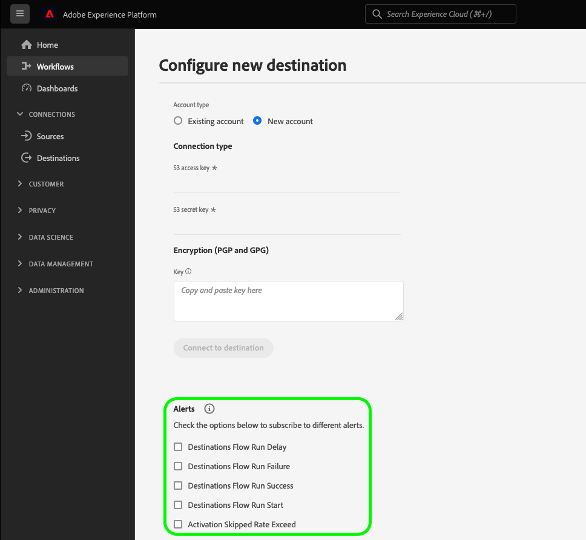

Select the alerts you would like to subscribe to and then select **[!UICONTROL Next]** to review and finish your dataflow.

The alerts available to destination dataflows are described in the table below.

* For streaming destinations, only the [!DNL Activation Skipped Rate Exceeded] alert is available.
* For file-based destinations, all alerts are available.

| Alerts | Description |
| --- | --- |
| Destination Flow Run Delay | This alert notifies you when a destination flow run takes longer than 150 minutes to activate an audience. |
| Destination Flow Run Failure | This alert notifies you when an error occurs while activating an audience to a destination. |
| Destination Flow Run Success | This alert notifies you when an audience is successfully activated to a destination. |
| Destination Flow Run Start | This alert notifies you when a destination flow run starts activating an audience. |
| Activation Skipped Rate Exceeded| This alert notifies you when the activation skip rate has exceeded 1% of total activations. Identities are skipped during activation when they have missing attributes or consent violation.|

## Receiving alerts {#receiving-alerts}

Once your destination dataflow runs, you can receive alerts through the UI or by email.

### Receiving alerts in the UI {#receiving-alerts-in-ui}

Alerts are represented in the UI by a notification icon in the top header of the Platform UI. Select the notification icon to see specific alert messages regarding your dataflows.

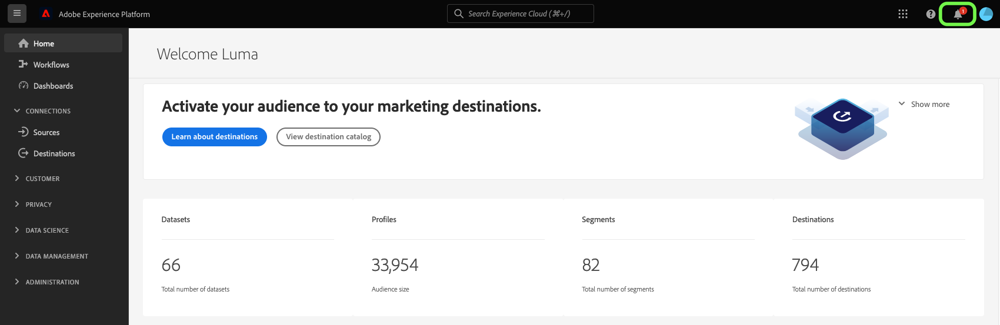

The notifications panel appears, displaying a list of status updates on the dataflow that you created.

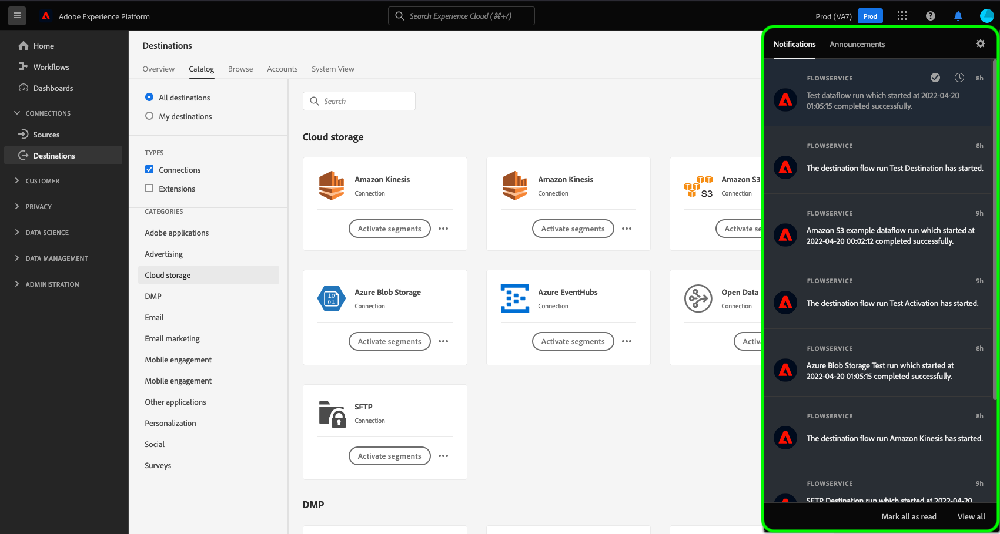

You can hover on an alert message to mark them as read or you can select the clock icon to set future reminders on the status of your dataflow.

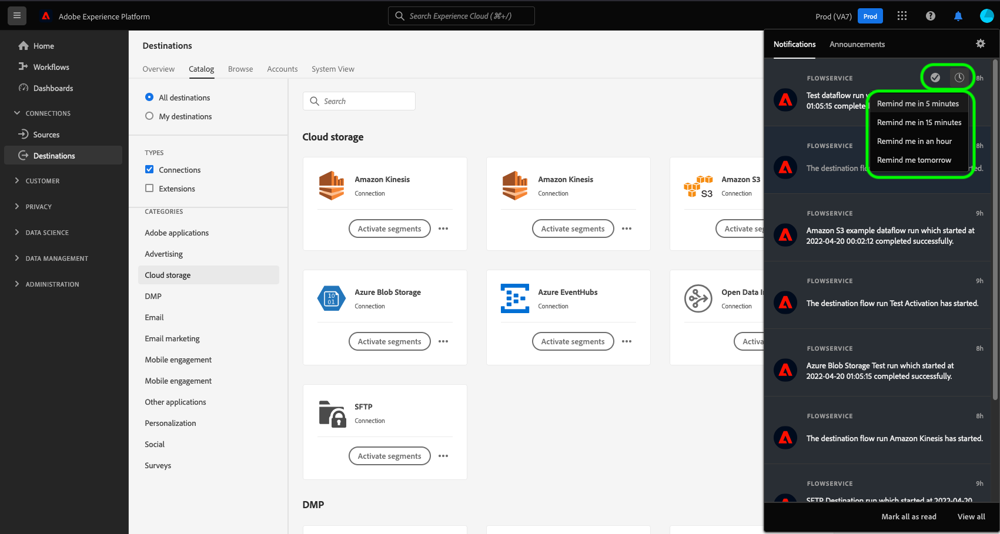

Select the alert message to see specific information on your dataflow.

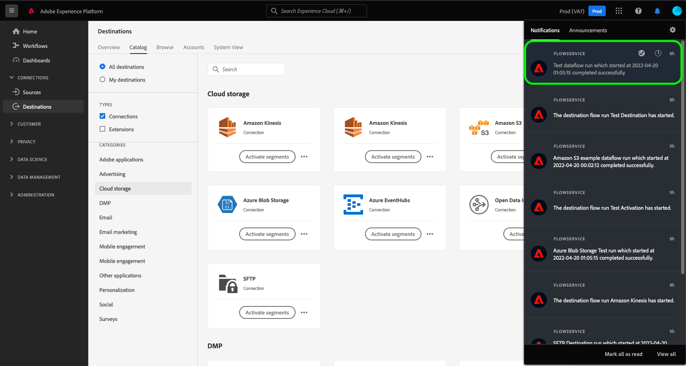

The [!UICONTROL Dataflow run details] page appears. The upper half of the screen displays an overview on your dataflow, including information on its attributes, corresponding dataflow run ID, and high-level error summary.

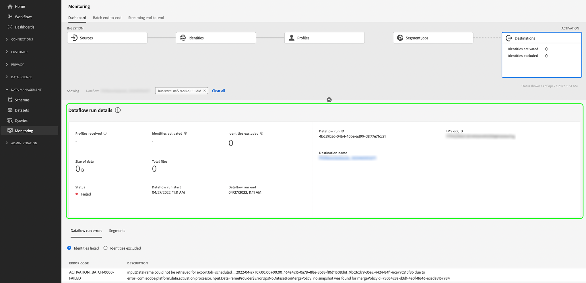

The lower half of the page displays any [!UICONTROL Dataflow run errors] that ocurred during the dataflow run stage. From here, you can preview error diagnostics or use the [[!DNL Data Access] API](https://www.adobe.io/experience-platform-apis/references/data-access/) to download error diagnostics or the file manifest that corresponds to your dataflow.

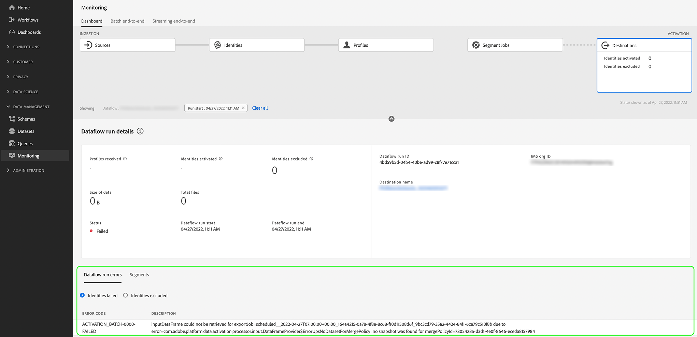

For more information on handling dataflow errors, see the guide on [monitoring destinations dataflows in the UI](../../dataflows/ui/monitor-destinations.md).

### Receiving alerts by email {#receiving-alerts-by-email}

Alerts for your dataflows are also delivered to you by email. Select the dataflow name in the email body to see more information on your dataflow.

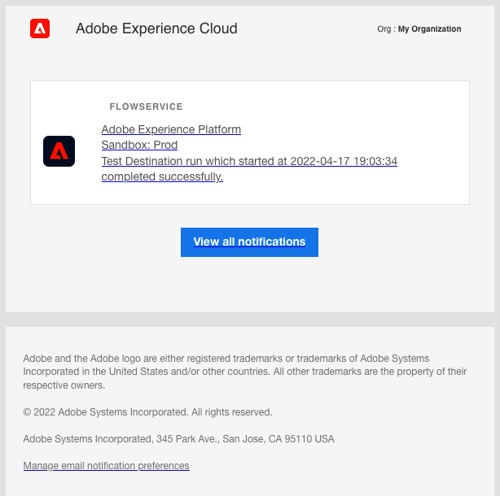

Similar to the UI alert, the [!UICONTROL Dataflow run overview] page appears, providing you with an interface to investigate any errors associated with your dataflow.

## Subscribe and unsubscribe to alerts {#subscribe-and-unsubscribe}

You can subscribe to more alerts or unsubscribe from established alerts for an existing destination dataflow in the destinations [!UICONTROL Browse] page.

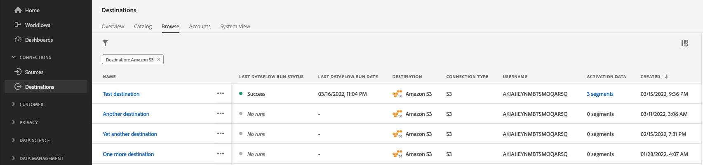

Locate the destination connection that you want to receive alerts for and select the ellipses (`...`) to see a dropdown menu of options. Next, select **[!UICONTROL Subscribe to alerts]** to modify the alert settings of your destination dataflow.

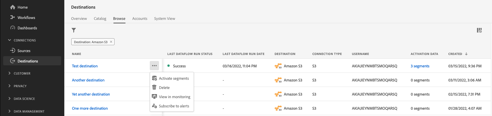

A pop-up window appears, providing you with a list of destination alerts. Select any alerts you want to subscribe to or deselect alerts that you want to unsubscribe from. When finished, select **[!UICONTROL Save]**.

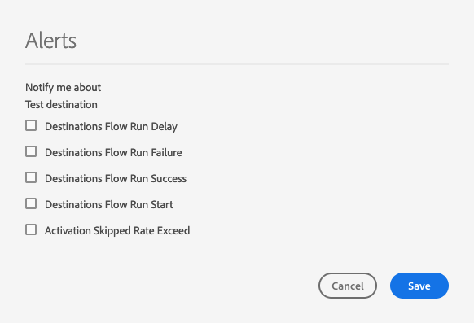

## Next steps {#next-steps}

This document provided a step-by-step guide on how to subscribe to in-context alerts for your destination dataflows. For more information, see the [alerts UI guide](../../observability/alerts/ui.md).
