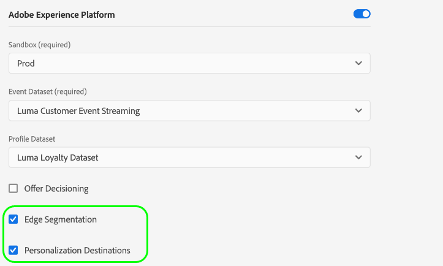

# Configure personalization destinations for same-page and next-page personalization

## Overview {#overview}

>[!NOTE]
>
>When [configuring the Adobe Target connection](../catalog/personalization/adobe-target-connection.md) without using a datastream ID, the use cases described in this article are not supported.

Adobe Experience Platform uses [edge segmentation](../../segmentation/ui/edge-segmentation.md) to enable customers to create and target audience segments at high scale, in real time.

This capability helps you configure same-page and next-page personalization use cases.

This article provides step-by-step instructions on how to configure Experience Platform and your personalization destinations for these use cases.

Additionally, watch the video below for an overview of the end-to-end configuration process.

>[!VIDEO](https://video.tv.adobe.com/v/340091/)

>[!NOTE]
>
>The Experience Platform user interface is frequently updated and may have changed since the recording of this video. For the most up-to-date information, refer to the configuration steps described in the sections below.

## Step 1: Configure a datastream in the Data Collection UI {#configure-datastream}

The first step in setting up your personalization destination is to configure a datastream for the Experience Platform Web SDK. This is done in the Data Collection UI. 

When configuring the datastream, under **[!UICONTROL Adobe Experience Platform]** make sure that both **[!UICONTROL Edge Segmentation]** and **[!UICONTROL Personalization Destinations]** are selected.

For more details on how to set up a datastream, follow the instructions described in the [Platform Web SDK documentation](../../edge/datastreams/overview.md).

## Step 2: Configure your personalization destination {#configure-destination}

After you have configured your datastream, you can start configuring your personalization destination.

Follow the [destination connection creation tutorial](../ui/connect-destination.md) for detailed instructions on how to create a new destination connection.

Depending on the destination you are configuring, refer to the following articles for destination-specific prerequisites and related information:

* [Adobe Target connection](../catalog/personalization/adobe-target-connection.md)
* [Custom personalization connection](../catalog/personalization/custom-personalization.md)

## Step 3: Create an [!DNL Active-On-Edge] merge policy {#create-merge-policy}

After you have created your destination connection, you must create an [!DNL Active-On-Edge] merge policy.

Follow the instructions on [creating a merge policy](../../profile/merge-policies/ui-guide.md#create-a-merge-policy), and make sure to enable the **[!UICONTROL Active-On-Edge Merge Policy]** toggle.

## Step 4: Create a new segment in Platform {#create-segment}

After you have created the [!DNL Active-On-Edge] merge policy, you must create a new segment in Platform.

Follow the [segment builder](../../segmentation/ui/segment-builder.md) guide to create your new segment, and make sure to [assign it](../../segmentation/ui/segment-builder.md#merge-policies) the [!DNL Active-On-Edge] merge policy that you created in step 3.

## Step 5: Activate the segment to your destination

The last step of the configuration process is to activate the segment that you created in step 4 to the destination that you created in step 2.

To do this, follow this [activation tutorial](../ui/activate-profile-request-destinations.md).

## Validate the configuration {#validate-configuration}

After succesfully following the steps above, you should see your new segments in your personalization destination.
