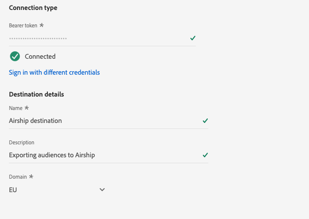

# Create a new destination connection

>[!IMPORTANT]
> 
>* To connect to a destination, you need the **[!UICONTROL Manage Destinations]** [access control permission](/help/access-control/home.md#permissions). Read the [access control overview](/help/access-control/ui/overview.md) or contact your product administrator to obtain the required permissions.
>* To connect to a destination that supports dataset exports, you need the **[!UICONTROL Manage and Activate Datasets]** [access control permission](/help/access-control/home.md#permissions). Read the [access control overview](/help/access-control/ui/overview.md) or contact your product administrator to obtain the required permissions.

## Overview {#overview}

Before you can send audience data to a destination, you must set up a connection to your destination platform. This article shows you how to set up a new destination connection, to which you can then activate segments or export datasets using the Adobe Experience Platform user interface.

## Find desired destination in the catalog {#setup}

1. Go to **[!UICONTROL Connections]** > **[!UICONTROL Destinations]**, and select the **[!UICONTROL Catalog]** tab.

   

2. Destination cards in the catalog might have different action controls, depending on whether you have an existing connection to the destination and whether the destinations support activating segments, exporting datasets, or both. You might see any of the following controls for destination cards: 

   * **[!UICONTROL Set up]**. A connection first needs to be set up to this destination before you can activate segments or export datasets.
   * **[!UICONTROL Activate]**. A connection has already been set up to this destination. This destination supports segment activation and dataset exports.
   * **[!UICONTROL Activate segments]**. A connection has already been set up to this destination. This destination supports segment activation only.
   
   For more information about the difference between these controls, you can also refer to the [Catalog](../ui/destinations-workspace.md#catalog) section of the destination workspace documentation.

   Select either **[!UICONTROL Set up]** or **[!UICONTROL Activate segments]**, depending on which button is available to you.

   

   

3. If you selected **[!UICONTROL Set up]**, skip to the next step. 
   
   If you selected **[!UICONTROL Activate]**, **[!UICONTROL Activate segments]**, or **[!UICONTROL Export datasets]**, you can now see a list of existing destination connections. 

   Select **[!UICONTROL Configure new destination]**.

   

## Authenticate to destination {#authenticate}

The first step in connecting to a destination is to authenticate to the destination platform. 

Depending on the destination that you are connecting to, you might be taken to the destination partner's page to authenticate, or you might be asked to input authentication credentials directly in the Platform workflow. Below are two examples of authentication flows for an Amazon S3 destination and a Criteo destination. Detailed instructions about the required input is provided in each destination documentation page.

## Set up connection parameters {#set-up-connection-parameters}

If you have already set up authentication to the destination, you can continue with the existing account or you can set up a new account. 

Depending on the destination that you are connecting to, you might be asked to input different types of connection parameters. For example, when connecting to an Amazon S3 destination, you are asked to provide details regarding the Amazon S3 bucket name and folder path where files will be deposited. Below are two examples of the authentication flow for an Amazon S3 destination and a Criteo destination. Detailed instructions about the required input is provided in each destination documentation page.

1. Enter the destination platform connection details, then select **[!UICONTROL Connect to destination]**.

   >[!NOTE]
   >
   >The image below is used for illustration purposes only. The destination connection details vary between destinations. For detailed information about the connection details for your destination, see the **Connect to the destination** section in each [destination catalog](../catalog/overview.md) page (for example, [Amazon S3](..//catalog/advertising/google-customer-match.md#connect)).

   

### Set up destination connection for segment activation or dataset exports

Some file-based destinations support segment activation as well as dataset exports. For those destinations, you can select if you are creating a connection which will enable you to activate segments or export datasets.

### Set up file formatting options for exported files

For destinations which export files to a desired storage location, you can configure various settings related to how the file should be formatted and compressed. For more information, read THIS PAGE ABOUT FILE FORMATTING OPTIONS 

### Enable destination alerts

1. (Optional) Select the destination dataflow alerts that you want to subscribe to. You can subscribe to alerts when creating a dataflow to receive alert messages regarding the status, success, or failure of your flow run. The available alerts differ based on the destination type (file-based or streaming) that you are connecting to. Read [Subscribe to in-context destination alerts](alerts.md) for detailed information on destination dataflow alerts.

   

2. Select **[!UICONTROL Next]**.

   

## Select marketing actions

1. Select the marketing actions applicable to the data that you want to export to the destination. Marketing actions indicate the intent for which data will be exported to the destination. You can select from Adobe-defined marketing actions or you can create your own marketing action. For more information about marketing actions, see the [data usage policies overview](../../data-governance/policies/overview.md) page.

   

2. Select **[!UICONTROL Save & Exit]** to save the destination configuration, or select **[!UICONTROL Next]** to proceed to the audience data [activation flow](activation-overview.md).