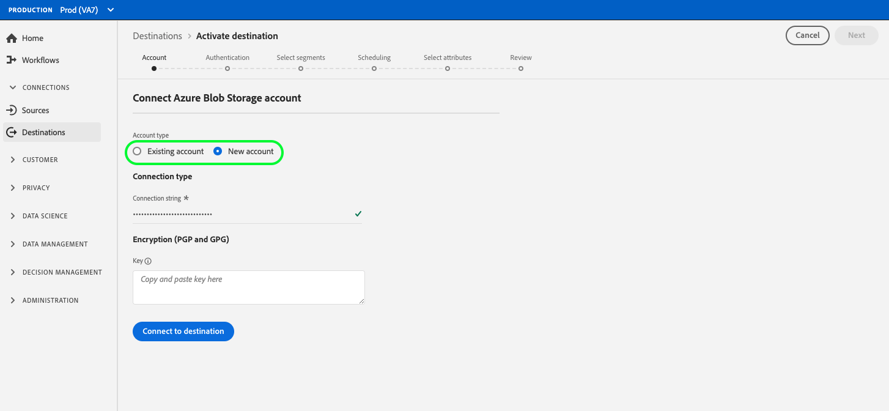
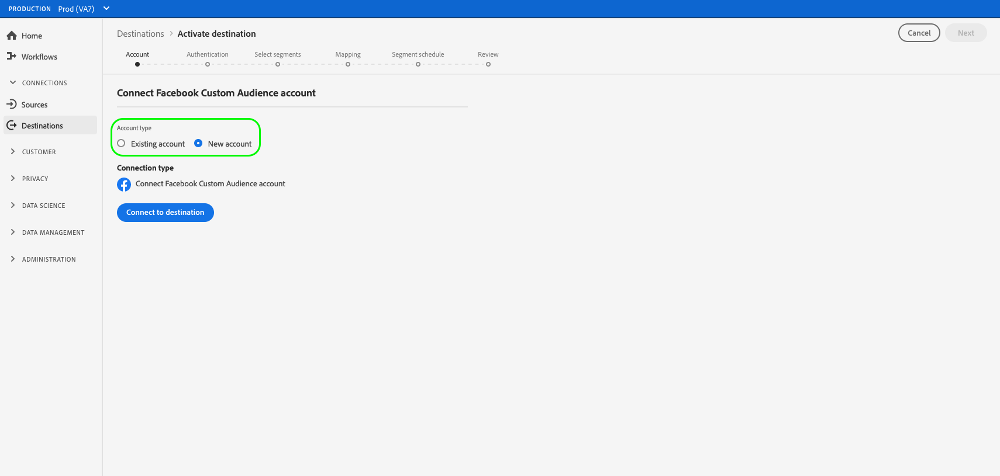

# Create a new destination connection

## Overview {#overview}

Before you can send audience data to a destination, you must set up a connection to your destination platform. This article shows you how to set up a new destination using the Adobe Experience Platform user interface.

## Create a new destination connection {#setup}

### Select destination {#select-destination}

1. Go to **[!UICONTROL Connections]** > **[!UICONTROL Destinations]**, and select the **[!UICONTROL Catalog]** tab.

   

1. Depending on whether you have an existing connection to your destination, you can see either a **[!UICONTROL Configure]** or an **[!UICONTROL Activate]** button on the destination card. For more information about the difference between **[!UICONTROL Activate]** and **[!UICONTROL Configure]**, refer to the [Catalog](../ui/destinations-workspace.md#catalog) section of the destination workspace documentation. Select either **[!UICONTROL Configure]** or **[!UICONTROL Activate]**, depending on which button is available to you.

   

   

<!-- 1. If you selected **[!UICONTROL Set up]**, skip this step. If you selected **[!UICONTROL Activate segments]**, you can now see a list of the existing destination connections. Select **[!UICONTROL Configure new destination]**.

    -->

### Account step {#account}

Select **[!UICONTROL New Account]** to set up a new connection to your destination. Or, if you have previously set up a connection to your destination, select **[!UICONTROL Existing Account]** and select the existing connection. 

The credentials that you are required to enter in the account step vary by destination and authentication type.

* For cloud storage destinations, you need to provide credentials for Experience Platform to connect to your storage location.

   

* For Facebook and several other social and advertising destinations, select **[!UICONTROL New account]** , then select **[!UICONTROL Connect to destination]**. This will take you to the destination login page, so you can connect Experience Platform to your destination.

   

>[!IMPORTANT]
>
>Refer to the **[!UICONTROL Connection parameters]** section in each destination catalog page for detailed information about the parameters required in this step (for example, [Azure Blob](../catalog/cloud-storage/azure-blob.md#parameters) requires a connection string).

### Authentication step {#authentication}

Enter the destination platform connection details, then select **[!UICONTROL Create destination]**.

1. Select the marketing actions applicable to the data that you want to export to the destination. Marketing actions indicate the intent for which data will be exported to the destination. You can select from Adobe-defined marketing actions or you can create your own marketing action. For more information about marketing actions, see the [data usage policies overview](../../data-governance/policies/overview.md) page.

   >[!IMPORTANT]
   >
   >The image below is used for illustration purposes only. The destination connection details vary between destinations. For detailed information about the connection details for your destination, see the **[!UICONTROL Connection parameters]** section in each [destination catalog](../catalog/overview.md) page (for example, [Google Customer Match](../catalog/advertising/google-customer-match.md#parameters)).

   

1. Select **[!UICONTROL Save & Exit]** to save the destination configuration, or select **[!UICONTROL Next]** to proceed to the audience data [activation flow](activate-destinations.md).