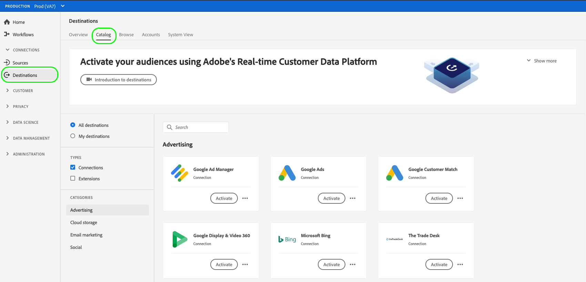
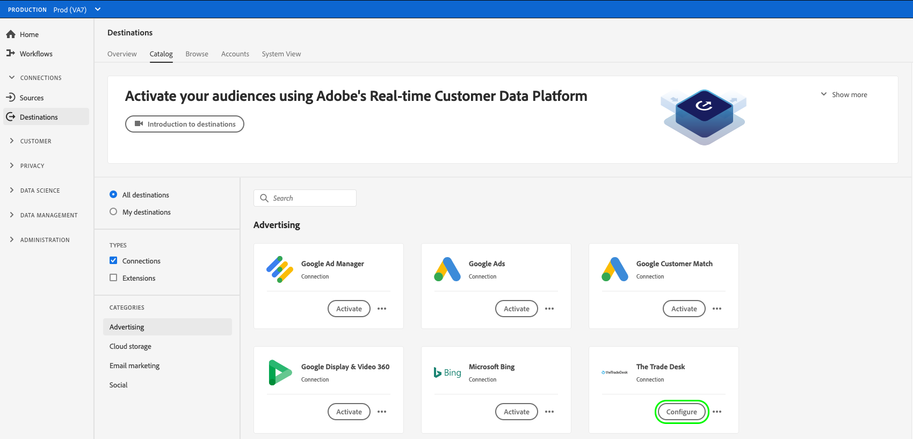
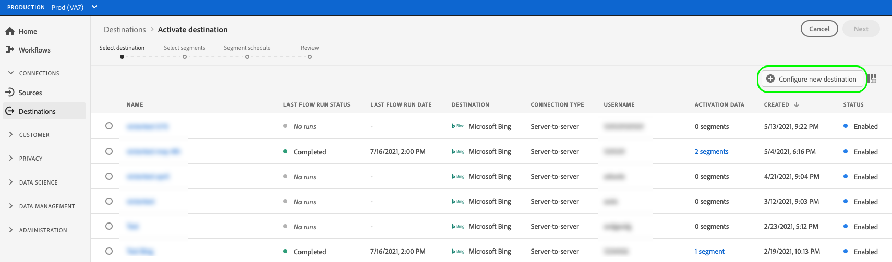
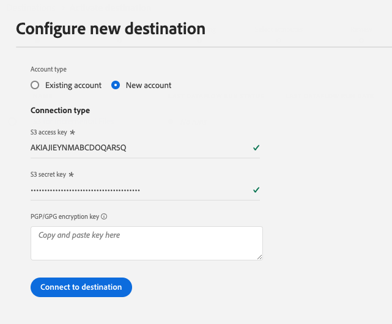
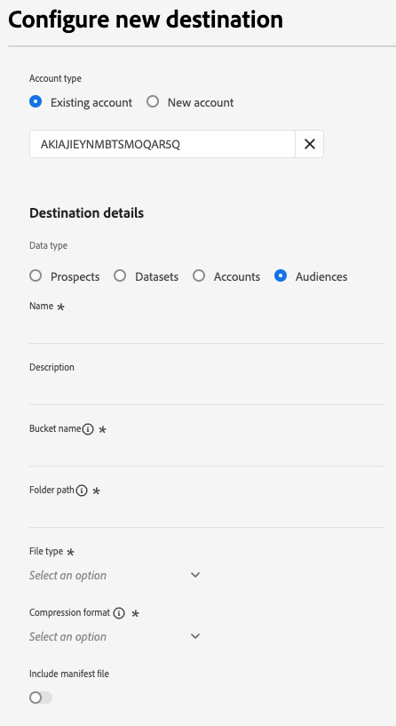
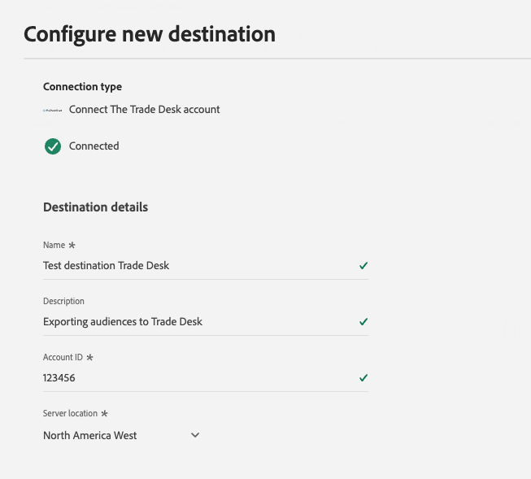
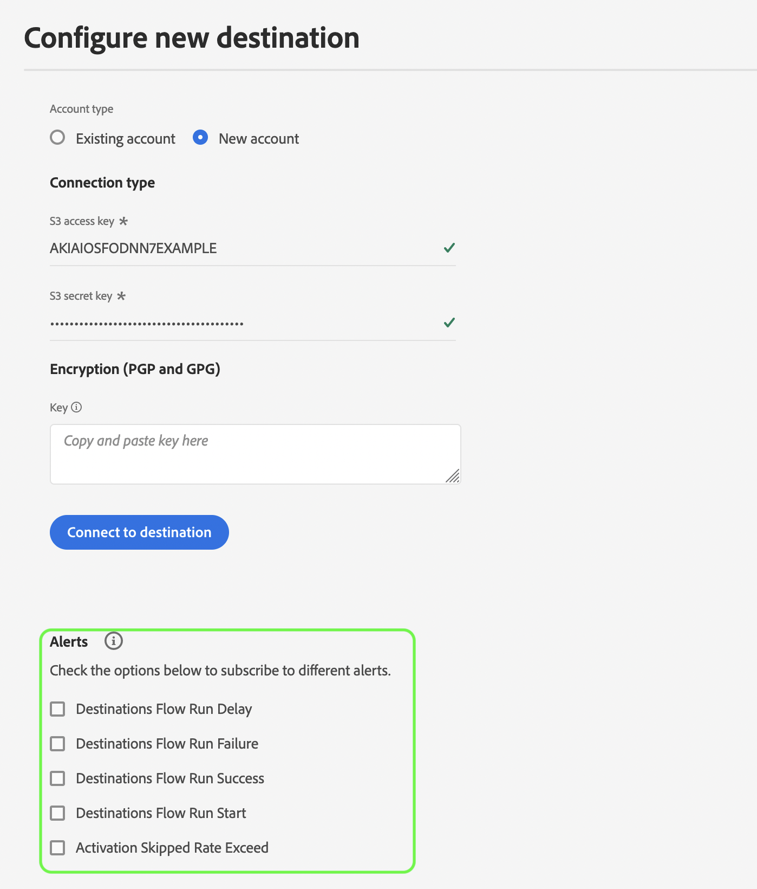
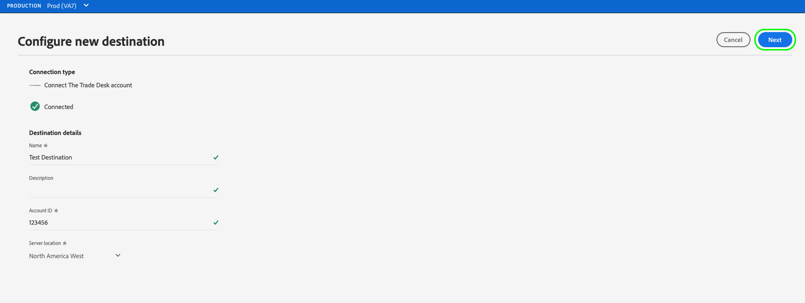
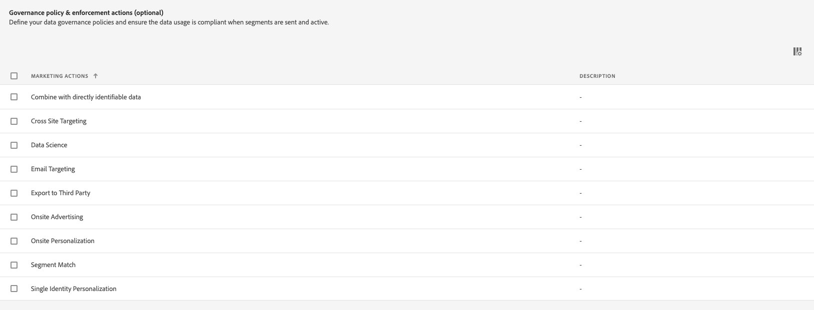

# Create a new destination connection

>[!IMPORTANT]
> 
>* To connect to a destination, you need the **[!UICONTROL Manage Destinations]** [access control permission](/help/access-control/home.md#permissions). Read the [access control overview](/help/access-control/ui/overview.md) or contact your product administrator to obtain the required permissions.
>* To connect to a destination that supports dataset exports, you need the **[!UICONTROL Manage and Activate Dataset Destinations]** [access control permission](/help/access-control/home.md#permissions). Read the [access control overview](/help/access-control/ui/overview.md) or contact your product administrator to obtain the required permissions.

## Overview {#overview}

Before you can send audience data to a destination, you must set up a connection to your destination platform. This article shows you how to set up a new destination connection, to which you can then activate audiences or export datasets using the Adobe Experience Platform user interface.

## Find the desired destination in the catalog {#setup}

1. Go to **[!UICONTROL Connections]** > **[!UICONTROL Destinations]**, and select the **[!UICONTROL Catalog]** tab.

   

2. Destination cards in the catalog might have different action controls, depending on whether you have an existing connection to the destination and whether the destinations support activating audiences, exporting datasets, or both. You might see any of the following controls for destination cards: 

   * **[!UICONTROL Set up]**. A connection first needs to be set up to this destination before you can activate audiences or export datasets.
   * **[!UICONTROL Activate]**. A connection has already been set up to this destination. This destination supports audience activation and dataset exports.
   * **[!UICONTROL Activate audiences]**. A connection has already been set up to this destination. This destination supports audience activation only.
   
   For more information about the difference between these controls, you can also refer to the [Catalog](../ui/destinations-workspace.md#catalog) section of the destination workspace documentation.

   Select either **[!UICONTROL Set up]**, **[!UICONTROL Activate]**, or **[!UICONTROL Activate audiences]**, depending on which control is available to you.

   

   

3. If you selected **[!UICONTROL Set up]**, skip to the next step, to [authenticate](#authenticate) to the destination. 
   
   If you selected **[!UICONTROL Activate]**, **[!UICONTROL Activate audiences]**, or **[!UICONTROL Export datasets]**, you can now see a list of existing destination connections. 

   Select **[!UICONTROL Configure new destination]** to establish a new connection to the destination.

   

## Authenticate to destination {#authenticate}

The first step in connecting to a destination is to authenticate to the destination platform. 

Depending on the destination that you are connecting to, you might be taken to the destination partner's page to authenticate, or you might be asked to input authentication credentials directly in the Platform workflow. Below is an example of required input to authenticate to an [!DNL Amazon S3] destination. Detailed instructions about the required input is provided in each destination documentation page (see, for example, the authentication section for [[!DNL Amazon S3]](/help/destinations/catalog/cloud-storage/amazon-s3.md#authenticate) and for [[!DNL Facebook]](/help/destinations/catalog/social/facebook.md#authenticate)).

**[!DNL Amazon S3] required and optional authentication parameters**

## Set up connection parameters {#set-up-connection-parameters}

If you have already set up authentication to the destination, you can continue with the existing account or you can set up a new account. 

Depending on the destination that you are connecting to, you might be asked to input different types of connection parameters. For example, when connecting to an [!DNL Amazon S3] destination, you are asked to provide details regarding the [!DNL Amazon S3] bucket name and folder path where files will be deposited. Below are two examples of required inputs for an [!DNL Amazon S3] destination and a [!DNL Trade Desk] destination. Detailed instructions about the required input is provided in each destination documentation page.

>[!IMPORTANT]
>
>The images below are used for illustration purposes only. The destination connection details vary between destinations. For detailed information about the connection details for your destination, read the **Connect to the destination** section in each [destination catalog](../catalog/overview.md) page (for example, [[!DNL Google Customer Match]](../catalog/advertising/google-customer-match.md#connect), [[!DNL Trade Desk]](/help/destinations/catalog/advertising/tradedesk.md#connect), or [[!DNL Amazon S3]](/help/destinations/catalog/cloud-storage/amazon-s3.md#destination-details)).

**[!DNL Amazon S3] required and optional input parameters**

**[!DNL The Trade Desk] required and optional input parameters**

### Set up file formatting options for exported files {#file-formatting-and-compression-options}

For file-based destinations, you can configure various settings related to how the exported files are formatted and compressed. For more information about all the available formatting and compression options, read the [Configure file formatting options for file-based destinations tutorial](/help/destinations/ui/batch-destinations-file-formatting-options.md).

### Set up destination connection for audience activation, account activation, prospects activation, or dataset exports {#segment-activation-or-dataset-exports}

Some file-based destinations support audience activation to known customers, account customers, or prospects, as well as dataset exports. For those destinations, you can choose whether to create a connection that enables you to [activate audiences](/help/destinations/ui/activate-batch-profile-destinations.md), [accounts](/help/destinations/ui/activate-account-audiences.md), [prospects](/help/destinations/ui/activate-prospect-audiences.md), or [export datasets](/help/destinations/ui/export-datasets.md).

>[!WARNING]
>
>When exporting datasets, note that exports to JSON files are supported in a compressed mode only. Exports to [!DNL Parquet] files are supported in a compressed and uncompressed mode.

### Enable destination alerts {#enable-alerts}

1. (Optional) Select the destination dataflow alerts that you want to subscribe to. You can subscribe to alerts when creating a dataflow to receive alert messages regarding the status, success, or failure of your flow run. The available alerts differ based on the destination type (file-based or streaming) that you are connecting to. Read [Subscribe to in-context destination alerts](alerts.md) for detailed information on destination dataflow alerts.

   

2. Select **[!UICONTROL Next]**.

   

## Select marketing actions {#select-marketing-actions}

1. Select the marketing actions applicable to the data that you want to export to the destination. Marketing actions indicate the intent for which data will be exported to the destination. You can select from Adobe-defined marketing actions or you can create your own marketing action. For more information about marketing actions, see the [data usage policies overview](../../data-governance/policies/overview.md) page.

   

2. Select **[!UICONTROL Save & Exit]** to save the destination configuration, or select **[!UICONTROL Next]** to proceed to the audience data [activation flow](activation-overview.md).

## Next steps {#next-steps}

By reading this document, you have learned how to use the Experience Platform UI to establish a connection to a destination. As a reminder, the available and required connection parameters vary from destination to destination. You should also consult the destination documentation page in the [destinations catalog](/help/destinations/catalog/overview.md) for specific information about the required inputs and available options per destination type. 

Next, you can proceed to [activating audiences](/help/destinations/ui/activation-overview.md) or [exporting datasets](/help/destinations/ui/export-datasets.md) to your destination.