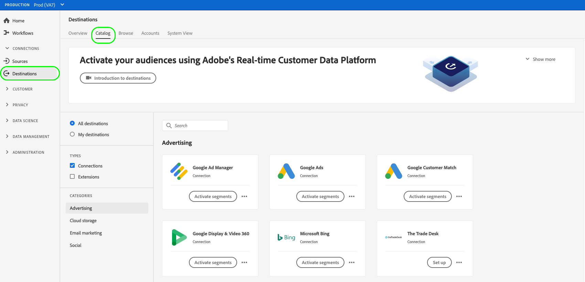

# Create a new destination connection

>[!IMPORTANT]
> 
>To connect to a destination, you need the **[!UICONTROL Manage Destinations]** [access control permission](/help/access-control/home.md#permissions). Read the [access control overview](/https://experienceleague.adobe.com/docs/experience-platform/access-control/ui/overview.html?lang=en) or contact your product administrator to obtain the required permissions.

## Overview {#overview}

Before you can send audience data to a destination, you must set up a connection to your destination platform. This article shows you how to set up a new destination using the Adobe Experience Platform user interface.

## Create a new destination connection {#setup}

1. Go to **[!UICONTROL Connections]** > **[!UICONTROL Destinations]**, and select the **[!UICONTROL Catalog]** tab.

   

1. Depending on whether you have an existing connection to your destination, you can see either a **[!UICONTROL Set up]** or an **[!UICONTROL Activate segments]** button on the destination card. For more information about the difference between **[!UICONTROL Activate segments]** and **[!UICONTROL Set up]**, refer to the [Catalog](../ui/destinations-workspace.md#catalog) section of the destination workspace documentation.

   Select either **[!UICONTROL Set up]** or **[!UICONTROL Activate segments]**, depending on which button is available to you.

   

   

1. If you selected **[!UICONTROL Set up]**, skip to the next step. 
   
   If you selected **[!UICONTROL Activate segments]**, you can now see a list of existing destination connections. 

   Select **[!UICONTROL Configure new destination]**.

   

1. Enter the destination platform connection details, then select **[!UICONTROL Connect to destination]**.

   >[!NOTE]
   >
   >The image below is used for illustration purposes only. The destination connection details vary between destinations. For detailed information about the connection details for your destination, see the **Connection parameters** section in each [destination catalog](../catalog/overview.md) page (for example, [Google Customer Match](..//catalog/advertising/google-customer-match.md#parameters)).

   

1. Select **[!UICONTROL Next]**.

   

1. Select the marketing actions applicable to the data that you want to export to the destination. Marketing actions indicate the intent for which data will be exported to the destination. You can select from Adobe-defined marketing actions or you can create your own marketing action. For more information about marketing actions, see the [data usage policies overview](../../data-governance/policies/overview.md) page.

   

1. Select **[!UICONTROL Save & Exit]** to save the destination configuration, or select **[!UICONTROL Next]** to proceed to the audience data [activation flow](activation-overview.md).