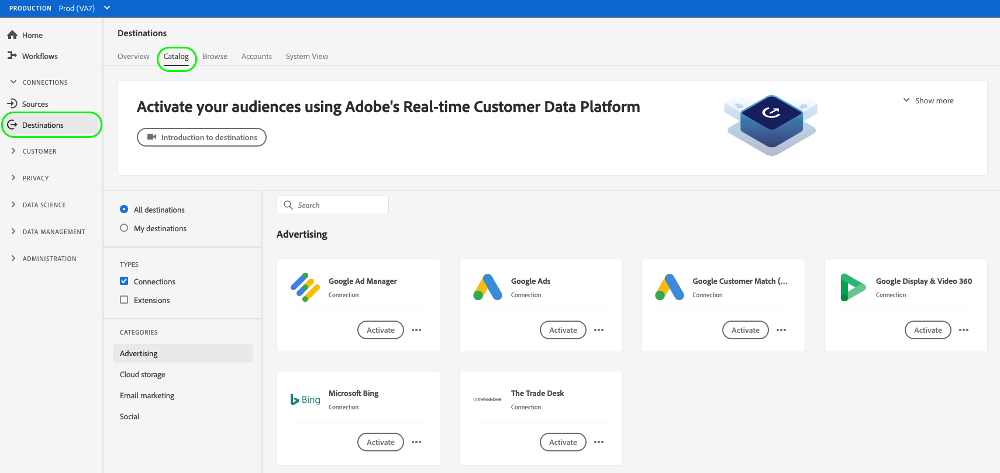
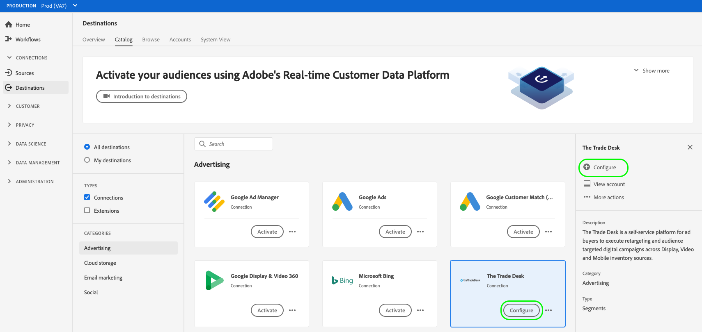
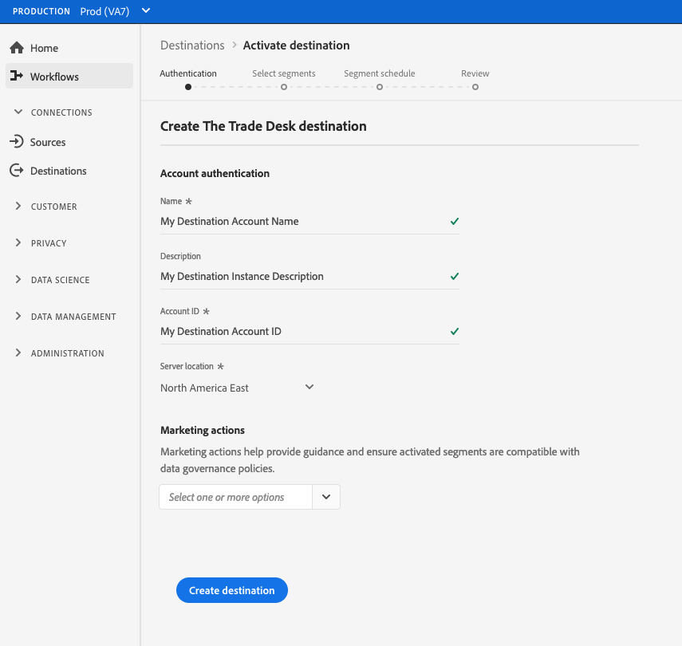

# Create a new streaming destination

## Overview {#overview}

This article shows you how to create a new streaming destination in [!DNL Adobe Experience Platform], by configuring the new destination instance with your corresponding destination credentials.

## Prerequisites {#prerequisites}

Before you configure your new destination instance, check the destination catalog entry for your specific destination, to learn about its requirements. During the set up process, you will need your destination credentials. These are described in the destination catalog entry for each specific destination.

## Create a new streaming destination {#create}

Follow the steps below to create a new destination instance from scratch.

1. Go to **[!UICONTROL Connections > Destinations]**, and select the **[!UICONTROL Catalog]** tab.
    
    

1. In the [!DNL Catalog] tab, find the card corresponding to the destination you want to configure, and select the **[!UICONTROL Configure]** button.

    >[!NOTE]
    >
    >If a connection with this destination already exists, you will see an [!DNL Activate] button on the destination card, instead of [!DNL Configure]. For more information about the difference between [!DNL Activate] and [!DNL Configure], refer to the [Catalog section](destinations-workspace.md#catalog) of the destination workspace documentation.

    

1. In the **[!UICONTROL Authentication]** step, enter your destination account credentials and other destination-specific parameters.

    >[!IMPORTANT]
    > 
    >The example shown in the image below is meant for illustration purposes only. The credentials and other destination parameters can vary significantly between destinations. To learn what destination parameters you need, check the [destination catalog](../catalog/overview.md) entry for your specific destination.

    

1. Select a **[!UICONTROL Marketing action]** for your destination. Marketing actions indicate the intent for which data will be exported to the destination. You can select from Adobe-defined marketing actions or you can create your own marketing action. For more information about marketing actions, see the [Data Governance in Adobe Experience Platform](../../data-governance/policies/overview.md) page. For information about the individual Adobe-defined marketing actions, see the [Data usage policies overview](../../data-governance/policies/overview.md).

1. Select **[!UICONTROL Create destination]**. Your destination instance is now created.

## Next steps: activate audience data to your destination {#activate}

<!-- Now that you have created your destination instance, you can start sending audience data to it. See the following guides for detailed instructions on how to send audience data to your streaming destinations:

* [Activate audiences to advertising destinations](activate-advertising-destinations.md)
* [Activate audiences to social destinations](activate-social-destinations.md) -->

