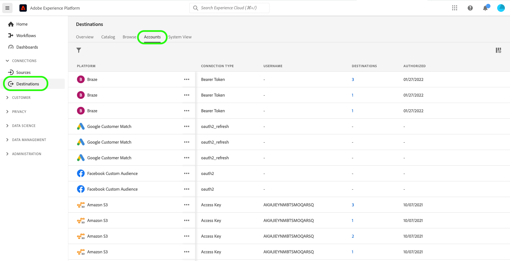
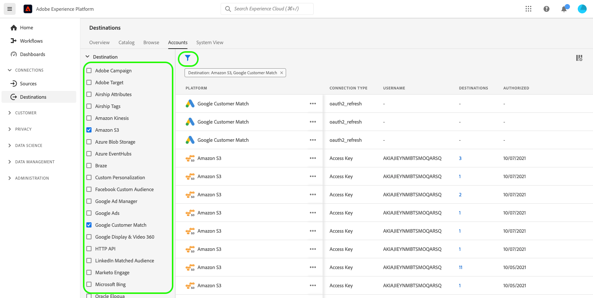
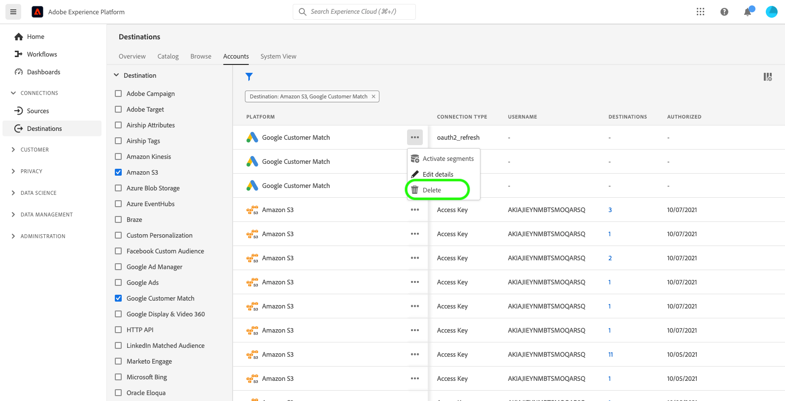
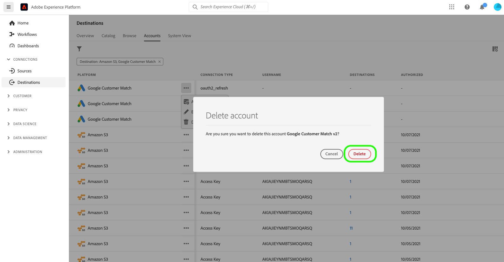

# Delete destination accounts

## Overview {#overview}

The **[!UICONTROL Accounts]** tab shows you details about the connections that you have established with various destinations. Refer to the [Accounts overview](../ui/destinations-workspace.md#accounts) for all the information you can get on each destination account.

This tutorial covers the steps to delete destination accounts that are not needed anymore by using the Experience Platform UI.

## Delete accounts {#delete}

>[!TIP]
>
>Before deleting the destination account, you must first delete any existing dataflows associated with the destination account. To delete existing destination dataflows, refer to the tutorial on [deleting destination dataflows in the UI](./delete-destinations.md).

Follow the steps below to delete existing destination accounts.

1. Log in to the [Experience Platform UI](https://platform.adobe.com/) and select **[!UICONTROL Destinations]** from the left navigation bar. Select **[!UICONTROL Accounts]** from the top header to view your existing accounts.

    

2. Select the filter icon  on the top left to launch the sort panel. The sort panel provides a list of all your destinations. You can select more than one destination from the list to see a filtered selection of accounts associated with the selected destinations.

    

3. Select the ellipses (`...`) beside the name of the account you intend to delete. A pop-up panel appears, providing options to **[!UICONTROL Activate audiences]**, **[!UICONTROL Edit details]**, and **[!UICONTROL Delete]** the account. Select the  **[!UICONTROL Delete]** button to delete the desired account.

    

4. A final confirmation dialog box appears, select **[!UICONTROL Delete]** to complete the process.

## Next steps

By following this tutorial, you have successfully used the destinations workspace to delete existing accounts.

For steps on how to perform these operations programmatically using the [!DNL Flow Service] API, please refer to the tutorial on [deleting connections using the Flow Service API](../api/delete-destination-account.md)
