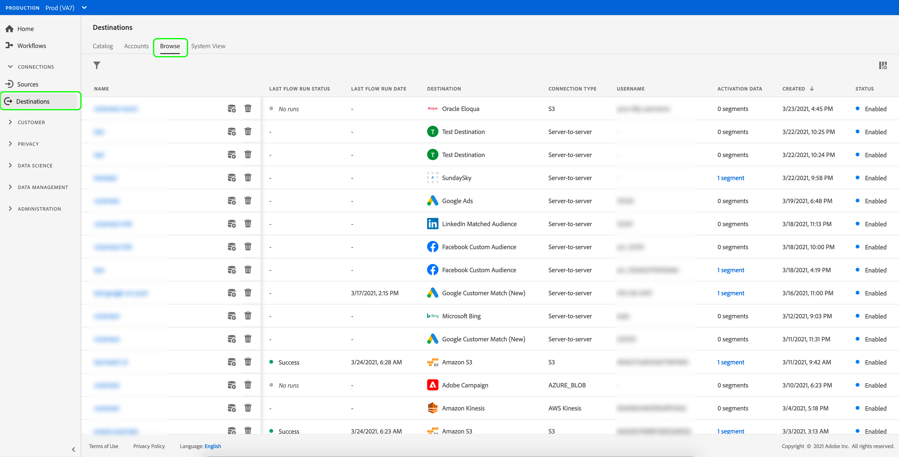
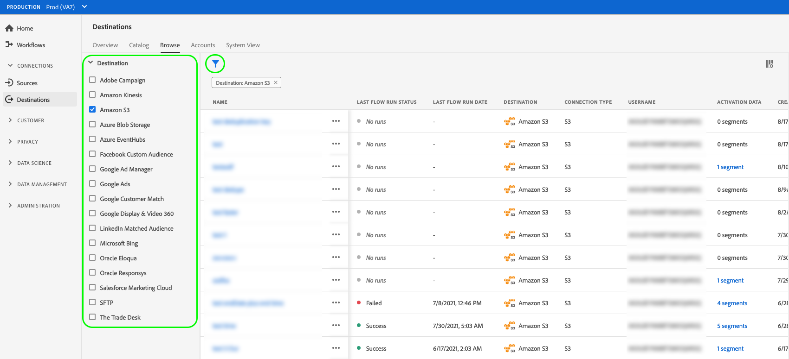
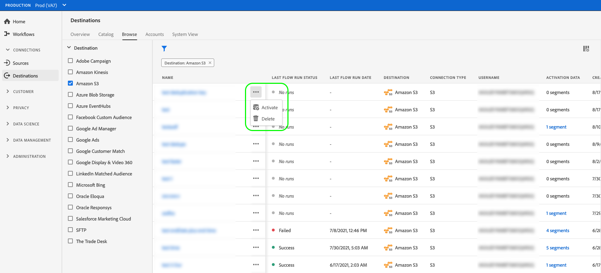
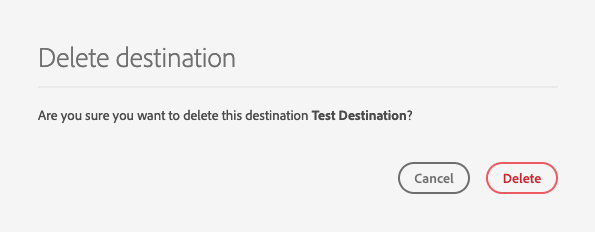
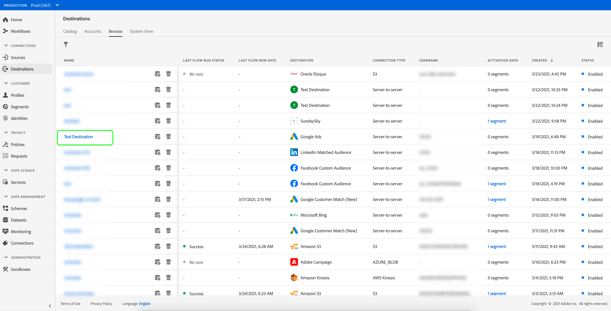
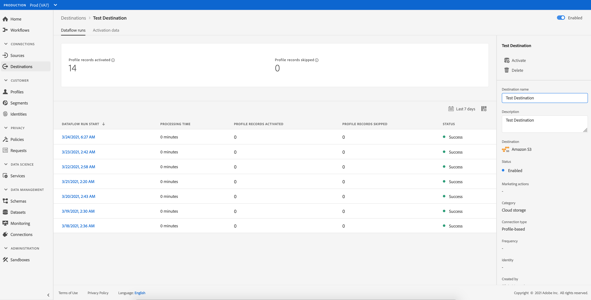
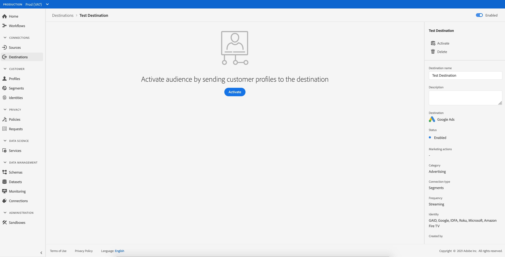
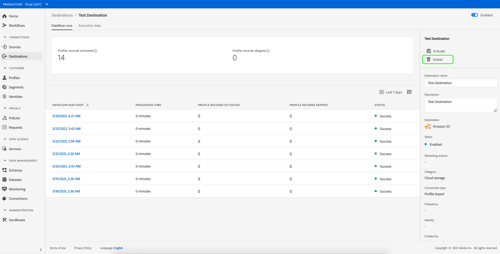
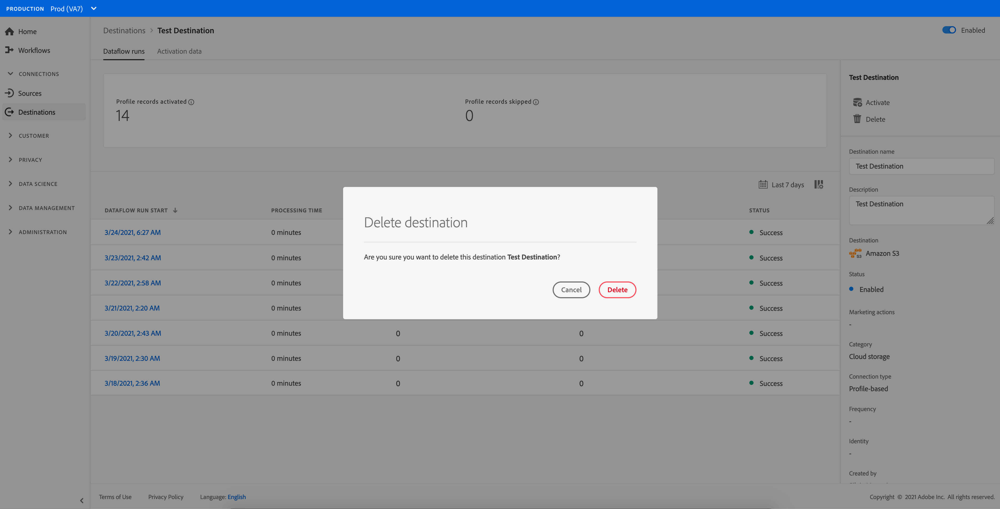

# Delete destinations {#delete-destinations}

## Overview {#overview}

In the Adobe Experience Platform user interface, you can delete existing connections to destinations.

Deleting a destination removes any existing dataflows to that destination. All audiences activated to the destinations that you delete are unmapped before the dataflow is deleted.

There are two ways you can delete destinations from the [!DNL Platform] [!DNL UI]. You can:

* [Delete destinations from the [!UICONTROL Browse] tab](#delete-browse-tab)
* [Delete destinations from the destination details page](#delete-destination-details-page)

## Delete destinations from the Browse tab{#delete-browse-tab}

Follow the steps below to delete a destination from the [!UICONTROL Browse] tab.

1. Log in to the [Experience Platform UI](https://platform.adobe.com/) and select **[!UICONTROL Destinations]** from the left navigation bar. To view your existing destinations, select **[!UICONTROL Browse]** from the top header.

    

2. Select the filter icon  on the top left to launch the sort panel. The sort panel provides a list of all your destinations. You can select more than one destination from the list to see a filtered selection of dataflows associated with the selected destination.

    

3. Select the  button in the Name column and then select  **[!UICONTROL Delete]** to remove an existing destination connection.
    

4. Select **[!UICONTROL Delete]** to confirm the removal of the destination connection.

    

## Delete destinations from the destination details page{#delete-destination-details-page}

Follow the steps below to delete a destination from the destination details page.

1. Log in to the [Experience Platform UI](https://platform.adobe.com/) and select **[!UICONTROL Destinations]** from the left navigation bar. To view your existing destinations, select **[!UICONTROL Browse]** from the top header.

    

2. Select the filter icon  on the top left to launch the sort panel. The sort panel provides a list of all your destinations. You can select more than one destination from the list to see a filtered selection of dataflows associated with the selected destination.

    

3. Select the name of the destination that you want to delete.

    

   * If the destination has existing dataflows, you are taken to the [!UICONTROL Dataflow runs] tab.

        

   * If the destination does not have existing dataflows, you are taken to an empty page where you can start activating audiences.

        

4. Select **[!UICONTROL Delete]** in the right rail.

    

5. Select **[!UICONTROL Delete]** in the confirmation dialog to remove the destination.

    

    >[!NOTE]
    >
    >Depending on server load, it can take a few minutes for [!DNL Platform] to delete the destination.
