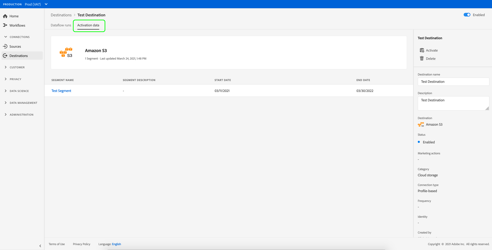

# View destination details

## Overview {#overview}

In the Adobe Experience Platform user interface, you can view and monitor the attributes and activities of your destinations. These details include the destination's name and ID, controls to activate or disable the destinations, and more. Details for batch destinations also include metrics for activated profile records and a history of dataflow runs.

>[!NOTE]
>
>The destinations details page is part of the [!UICONTROL Destinations] workspace in the Platform UI. See the [[!UICONTROL Destinations] workspace overview](./destinations-workspace.md) for more information.

## View destination details {#view-details}

Follow the steps below to view more details about an existing destination.

1. Log in to the [Experience Platform UI](https://platform.adobe.com/) and select **[!UICONTROL Destinations]** from the left navigation bar. Select **[!UICONTROL Browse]** from the top header to view your existing destinations.

    

2. Select the name of the destination that you want to view.

    

3. The details page for the destination appears, showing its available controls. If you are viewing the details of a batch destination, a monitoring dashboard also appears.

    

## Right rail

The right rail displays the basic information about the selected destination.

The following table covers the controls and details provided by the right rail:

| Right rail item | Description |
| --- | --- |
| [!UICONTROL Activate] | Select this control to edit which segments are mapped to the destination. See the guide on [activating segments to a destination](./activate-destinations.md) for more information. |
| [!UICONTROL Delete] | Allows you to delete this dataflow and unmaps the segments that were previously activated, if any exist. |
| [!UICONTROL Destination name] | This field can be edited in order to update the destination's name. |
| [!UICONTROL Description] |  This field can be edited in order to update or add an optional description to the destination. |
| [!UICONTROL Destination] | Represents the destination platform that audiences are sent to. See the [destinations catalog](../catalog/overview.md) for more information. |
| [!UICONTROL Status] | Indicates whether the destination is enabled or disabled. |
| [!UICONTROL Marketing actions] | Indicates the marketing actions (use cases) that apply for this destination for data-governance purposes. |
| [!UICONTROL Category] | Indicates the destination type. See the [destinations catalog](../catalog/overview.md) for more information. |
| [!UICONTROL Connection type] | Indicates the form by which your audiences are being sent to the destination. Possible values include "[!UICONTROL Cookie]" and "[!UICONTROL Profile-based]". |
| [!UICONTROL Frequency] | Indicates how often the audiences are sent to the destination. Possible values include "[!UICONTROL Streaming]" and "[!UICONTROL Batch]".  |
| [!UICONTROL Identity] | Represents the identity namespace accepted by the destination, such as `GAID`, `IDFA`, or `email`. For more information on accepted identity namespaces, see the [identity namespace overview](../../identity-service/namespaces.md). |
| [!UICONTROL Created by] | Indicates the user who created this destination. |
| [!UICONTROL Created] | Indicates the UTC datetime when this destination was created. |

{style="table-layout:auto"}

## [!UICONTROL Enabled]/[!UICONTROL Disabled] toggle

You can use the **[!UICONTROL Enabled]/[!UICONTROL Disabled]** toggle to start and pause all data exports to the destination.

## [!UICONTROL Dataflow runs]

The Dataflow runs tab provides metric data on your dataflow runs to batch destinations. See [Monitor dataflows](monitor-dataflows.md) for details.

## [!UICONTROL Activation data] {#activation-data}

The [!UICONTROL Activation data] tab displays a list of segments that have been mapped to the destination, including their start date and end date (if applicable). To view the details about a particular segment, select its name from the list.

>[!NOTE]
>
>For details on exploring the details page of a segment, refer to the [Segmentation UI overview](../../segmentation/ui/overview.md#segment-details).
