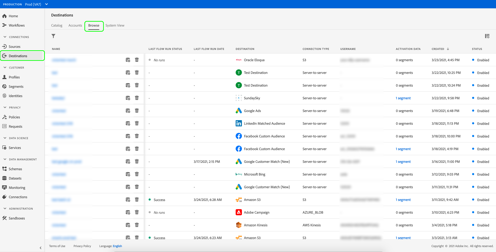
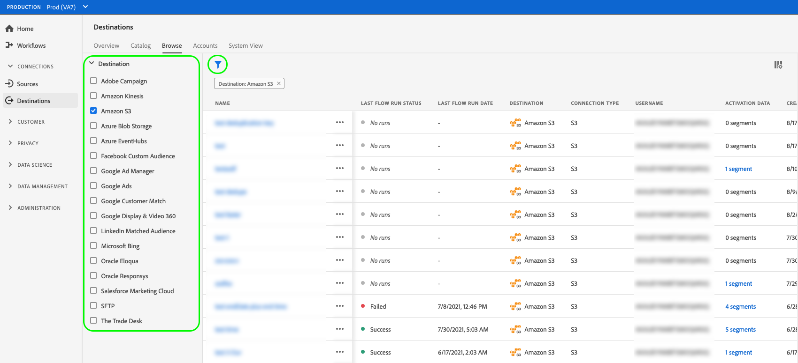
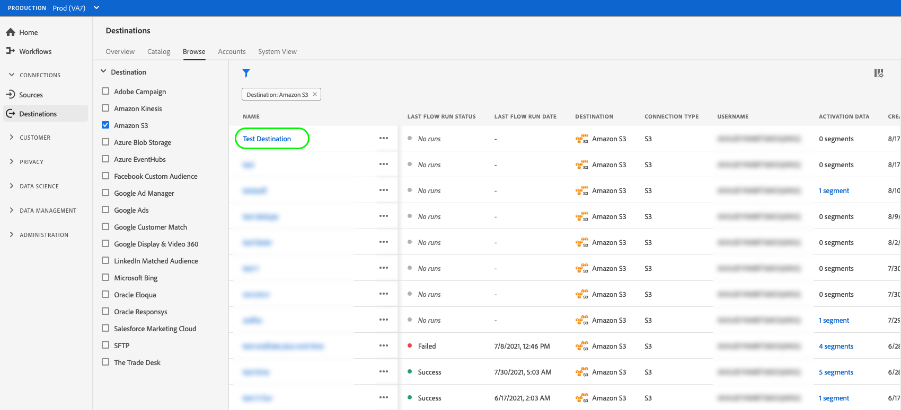
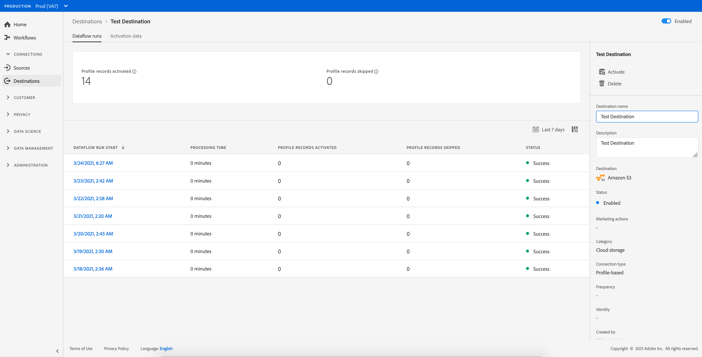
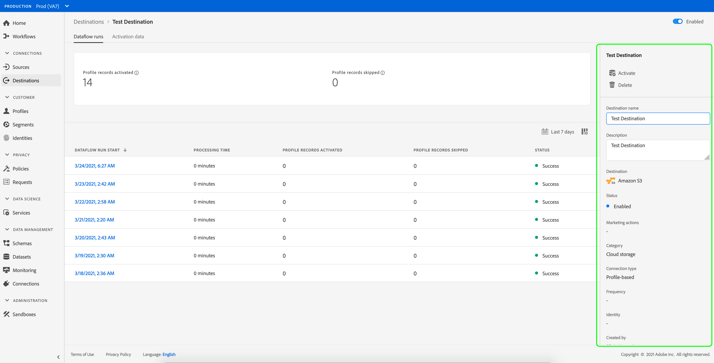
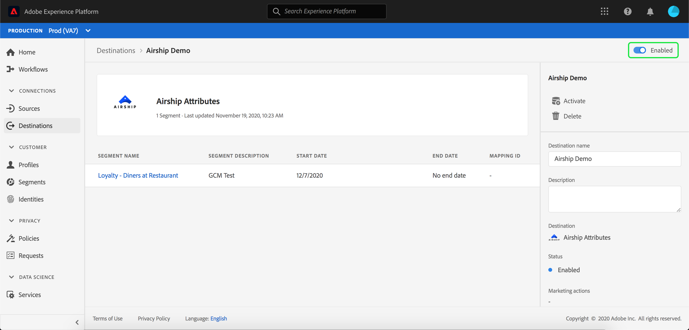
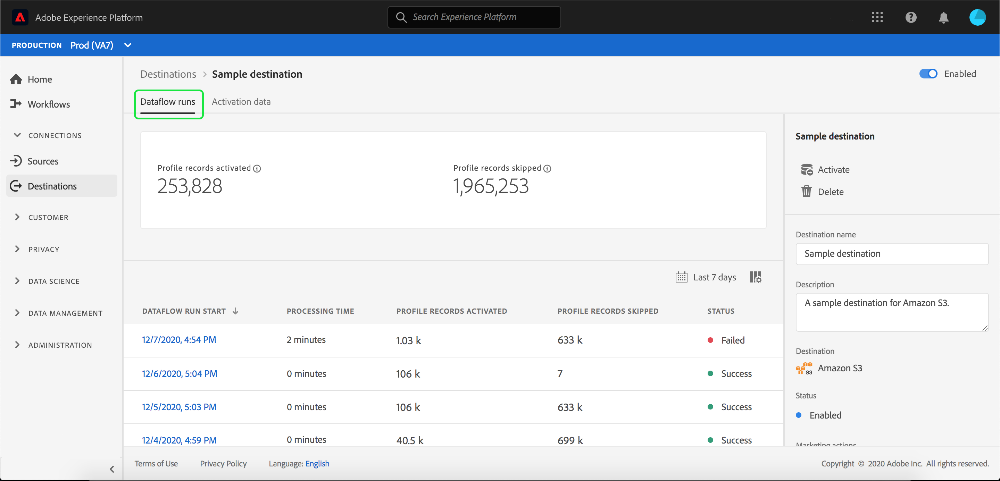
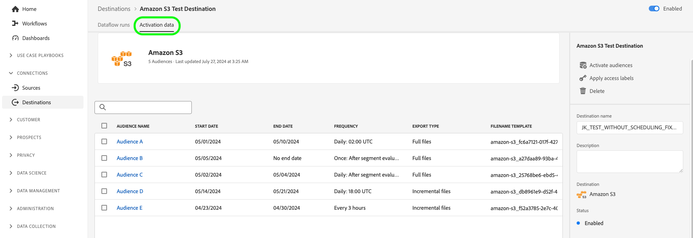
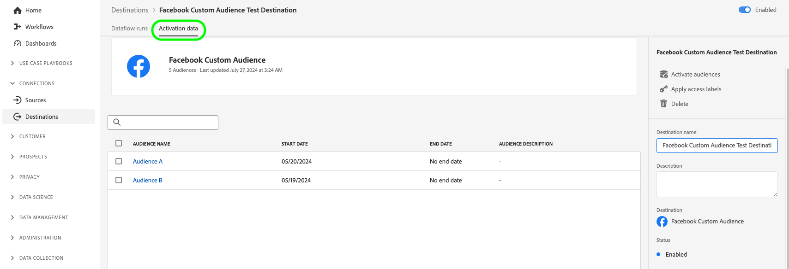

# View destination details

## Overview {#overview}

In the Adobe Experience Platform user interface, you can view and monitor the attributes and activities of your destinations. These details include the destination's name and ID, controls to activate or disable the destinations, and more. Details also include metrics for activated profile records, identities activated, failed, and excluded, and a history of dataflow runs.

>[!NOTE]
>
>The destinations details page is part of the [!UICONTROL Destinations] workspace in the [!DNL Platform] [!DNL UI]. See the [[!UICONTROL Destinations] workspace overview](./destinations-workspace.md) for more information.

## View destination details {#view-details}

Follow the steps below to view more details about an existing destination.

1. Log in to the [Experience Platform UI](https://platform.adobe.com/) and select **[!UICONTROL Destinations]** from the left navigation bar. Select **[!UICONTROL Browse]** from the top header to view your existing destinations.

    

1. Select the filter icon  on the top left to launch the sort panel. The sort panel provides a list of all your destinations. You can select more than one destination from the list to see a filtered selection of dataflows associated with the selected destination.

    

1. Select the name of the destination that you want to view.

    

1. The details page for the destination appears, showing its available controls. 

    

## Right rail {#right-rail}

The right rail displays the basic information about the selected destination.

The following table covers the controls and details provided by the right rail:

| Right rail item | Description |
| --- | --- |
| [!UICONTROL Activate segments] | Select this control to edit which segments are mapped to the destination, update export schedules, or add and remove mapped attributes and identities. See the guides on [activating audience data to segment streaming destinations](./activate-segment-streaming-destinations.md), [activating audience data to batch profile-based destinations](./activate-batch-profile-destinations.md), and [activating audience data to streaming profile-based destinations](./activate-streaming-profile-destinations.md) for more information. |
| [!UICONTROL Delete] | Allows you to delete this dataflow and unmaps the segments that were previously activated, if any exist. |
| [!UICONTROL Destination name] | This field can be edited in order to update the destination's name. |
| [!UICONTROL Description] |  This field can be edited in order to update or add an optional description to the destination. |
| [!UICONTROL Destination] | Represents the destination platform that audiences are sent to. See the [destinations catalog](../catalog/overview.md) for more information. |
| [!UICONTROL Status] | Indicates whether the destination is enabled or disabled. |
| [!UICONTROL Marketing actions] | Indicates the marketing actions (use cases) that apply for this destination for data-governance purposes. |
| [!UICONTROL Category] | Indicates the destination type. See the [destinations catalog](../catalog/overview.md) for more information. |
| [!UICONTROL Connection type] | Indicates the form by which your audiences are being sent to the destination. Possible values include [!UICONTROL Cookie] and [!UICONTROL Profile-based]. |
| [!UICONTROL Frequency] | Indicates how often the audiences are sent to the destination. Possible values include [!UICONTROL Streaming] and [!UICONTROL Batch].  |
| [!UICONTROL Identity] | Represents the identity namespace accepted by the destination, such as `GAID`, `IDFA`, or `email`. For more information on accepted identity namespaces, see the [identity namespace overview](../../identity-service/namespaces.md). |
| [!UICONTROL Created by] | Indicates the user who created this destination. |
| [!UICONTROL Created] | Indicates the UTC datetime when this destination was created. |

{style="table-layout:auto"}

## [!UICONTROL Enabled]/[!UICONTROL Disabled] toggle {#enabled-disabled-toggle}

You can use the **[!UICONTROL Enabled]/[!UICONTROL Disabled]** toggle to start and pause all data exports to the destination.

## [!UICONTROL Dataflow runs] {#dataflow-runs}

The [!UICONTROL Dataflow runs] tab provides metric data on your dataflow runs to batch and streaming destinations. Refer to [Monitor dataflows](monitor-dataflows.md) for details and metric definitions.

>[!NOTE]
>
>* Destinations monitoring functionality is currently supported for all destinations in Experience Platform *except* the [Adobe Target](/help/destinations/catalog/personalization/adobe-target-connection.md), [Custom personalization](/help/destinations/catalog/personalization/custom-personalization.md) and [Experience Cloud Audiences](/help/destinations/catalog/adobe/experience-cloud-audiences.md) destinations.
>* For the [Amazon Kinesis](/help/destinations/catalog/cloud-storage/amazon-kinesis.md), [Azure Event Hubs](/help/destinations/catalog/cloud-storage/azure-event-hubs.md), and [HTTP API](/help/destinations/catalog/streaming/http-destination.md) destinations, identities excluded, failed, and activated are currently not displayed.

### Dataflow runs duration {#dataflow-runs-duration}

There is a known issue in the displayed duration of dataflow runs. While the **[!UICONTROL Processing duration]** indicated for most dataflow runs is about four hours, as shown in the image below, the actual processing time for any dataflow run is much shorter. Dataflow run windows stay open for longer in the event that Experience Platform needs to retry making calls to the destination.  

## [!UICONTROL Activation data] {#activation-data}

The [!UICONTROL Activation data] tab displays a list of segments that have been mapped to the destination, including their start date and end date (if applicable), and other relevant information for the data export, such as export type, schedule, and frequency. To view the details about a particular segment, select its name from the list.

>[!TIP]
>
>To view and edit details about the attributes and identities mapped to a destination, select **[!UICONTROL Activate segments]** in the [right rail](#right-rail).

>[!NOTE]
>
>For details on exploring the details page of a segment, refer to the [Segmentation UI overview](../../segmentation/ui/overview.md#segment-details).
