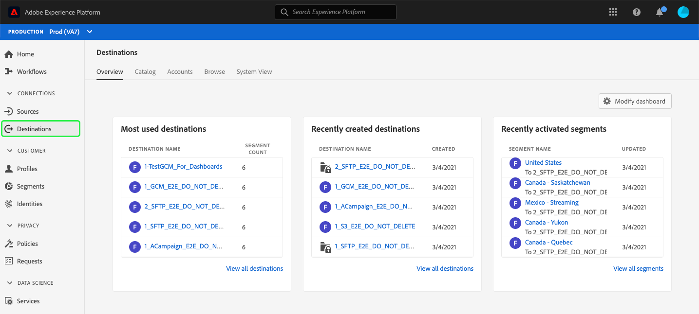
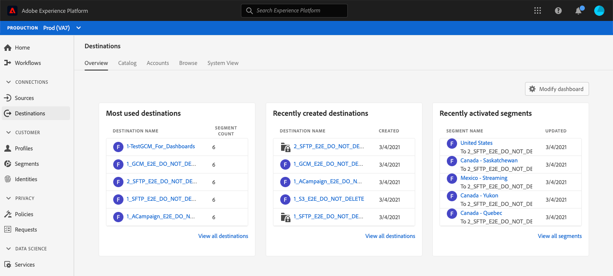
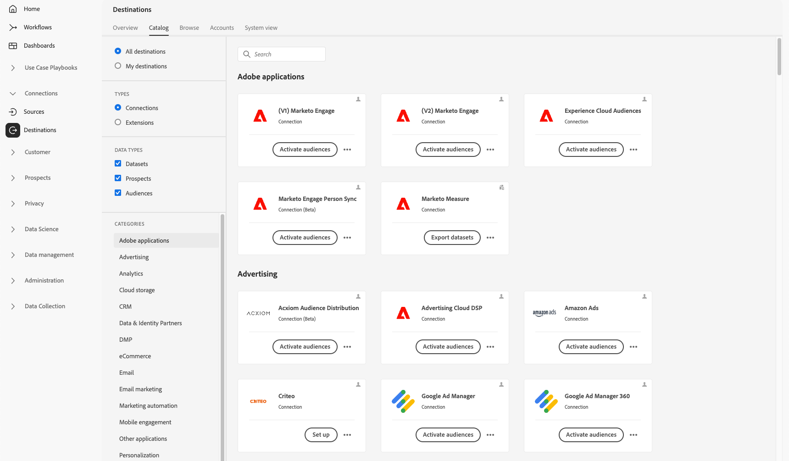
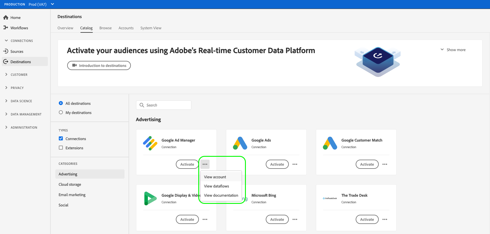
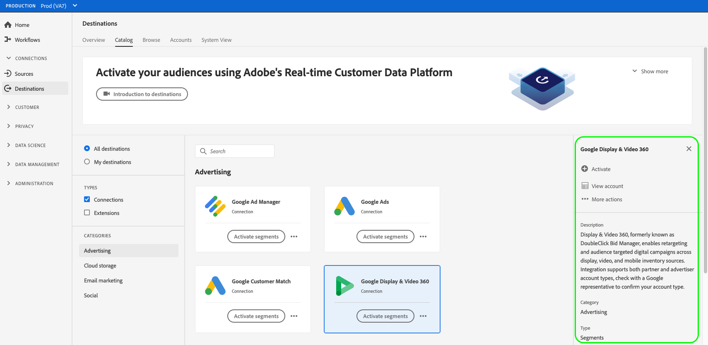
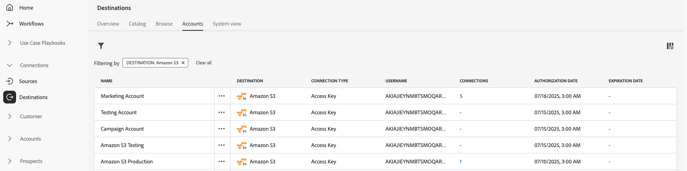
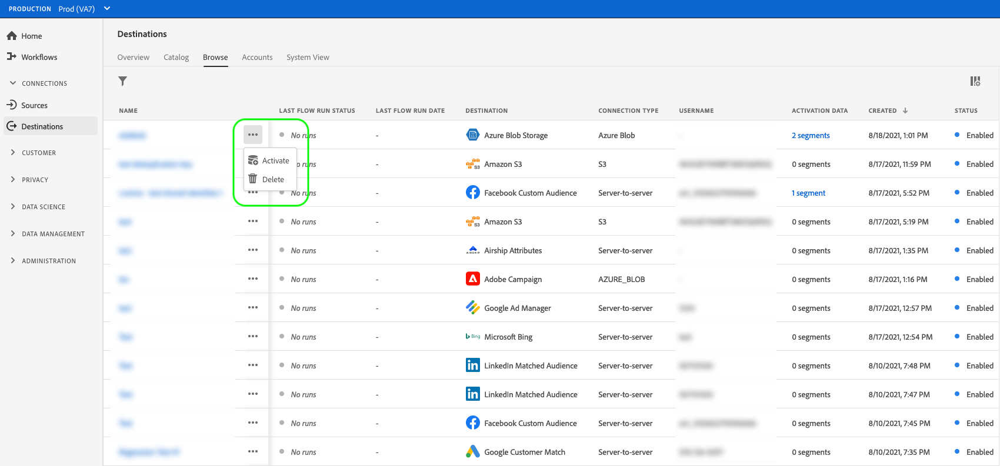
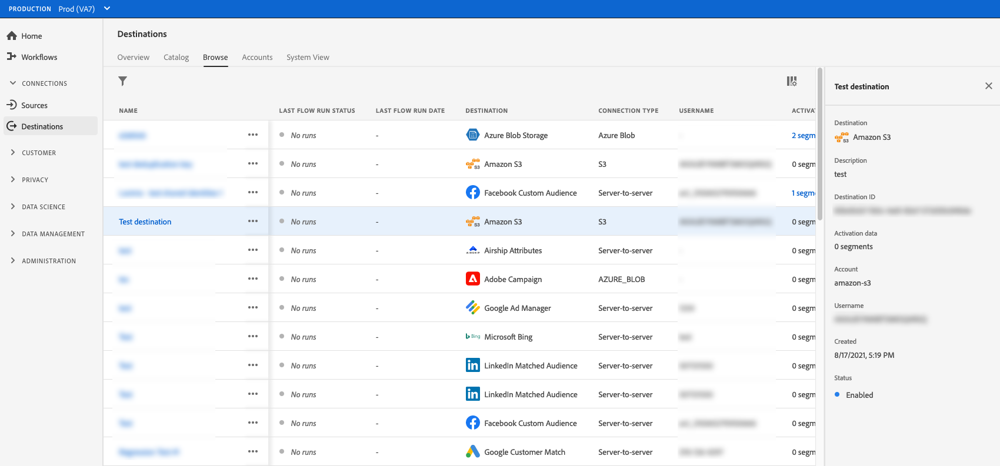
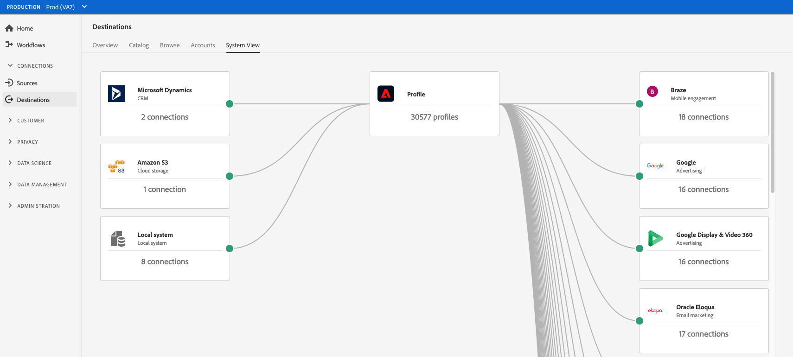
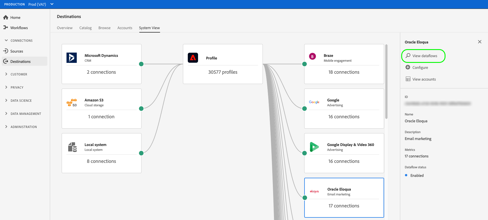

# Destinations workspace {#destinations-workspace}

In Adobe Experience Platform, select **[!UICONTROL Destinations]** from the left navigation bar to access the [!UICONTROL Destinations] workspace.

The [!UICONTROL Destinations] workspace consists of five sections, [!UICONTROL Overview], [!UICONTROL Catalog], [!UICONTROL Browse], [!UICONTROL Accounts], and [!UICONTROL System View], described in the sections below.

## [!UICONTROL Overview] {#overview}

The **[!UICONTROL Overview]** tab displays the [!UICONTROL Destinations] dashboard, providing key metrics related your organization's destination data. To learn more, visit the [[!UICONTROL Destinations] dashboard guide](../../dashboards/guides/destinations.md).

>[!NOTE]
>
>If your organization is new to Experience Platform and does not yet have active destinations, the [!UICONTROL Destinations] dashboard and [!UICONTROL Overview] tab are not visible. Instead, selecting [!UICONTROL Destinations] from the left navigation displays the [[!UICONTROL Catalog] tab](#catalog).

## [!UICONTROL Catalog] {#catalog}

The **[!UICONTROL Catalog]** tab displays a list of all destinations available in [!DNL Platform], that you can send data to. 

The [!DNL Platform] user interface provides several search and filter options on the destinations catalog page:

* Use the search functionality on the page to locate a specific destination.
* Filter destinations using the [!UICONTROL Categories] control.
* Toggle between [!UICONTROL All destinations] and [!UICONTROL My destinations]. When you select **[!UICONTROL All destinations]**, all available [!DNL Platform] destinations are displayed. When you select **[!UICONTROL My destinations]**, you can only see the destinations with which you have established a connection.
* Select to view the **[!UICONTROL Connections]** and/or **[!UICONTROL Extensions]** types. To understand the difference between the two categories, read [Destination Types and Categories](../destination-types.md).

The destination cards contain primary and secondary control options. The primary controls include [!UICONTROL Set up], [!UICONTROL Activate], [!UICONTROL Activate audiences], or [!UICONTROL Export datasets]. The secondary controls allow for viewing options. These controls are described below:

| Control | Description | 
|---------|----------|
|[!UICONTROL Set up] | Allows you to create a connection to the destination.|
|[!UICONTROL Activate] | Once you have established a connection to the destination, you can activate audiences or export datasets to this destination.|
|[!UICONTROL Activate audiences] | Once you have established a connection to the destination, you can activate audiences to this destination.|
|[!UICONTROL Export datasets] | Once you have established a connection to the destination, you can export datasets to this destination.|    
|[!UICONTROL View account] | View the accounts you have connected for a destination.|
|[!UICONTROL View dataflows] | View the data activation flows that exist for a destination.|
|[!UICONTROL View documentation] | Opens a link to the documentation page for that specific destination, for more information and to help you set it up.|

{style="table-layout:auto"}

Select a destination card in the catalog to open the right rail. Here, you can see a description of the destination. The right rail provides the same controls described in the table above, including a description of the destination, and an indication of the destination category and type.

For more information on destination categories and information on each destination, see the [Destination catalog](../catalog/overview.md) and [Destination types and categories](../destination-types.md).

## [!UICONTROL Accounts] {#accounts}

The **[!UICONTROL Accounts]** tab shows you details about the connections that you have established with various destinations, and allows you to update or delete existing account details. See the table below for all the information you can get on each destination account.

>[!TIP]
>
> * Select the ellipsis (`...`) in the [!UICONTROL Platform] column and use the **[!UICONTROL Activate]**/**[!UICONTROL Activate audiences]**/**[!UICONTROL Export datasets]** control to export audiences or datasets to that destination.
> * Select the ellipsis (`...`) in the [!UICONTROL Platform] column and use the **[!UICONTROL Edit details]** control to [update](update-accounts.md) the details of an existing destination account.
> * Select the ellipsis (`...`) in the [!UICONTROL Platform] column and use the **[!UICONTROL Delete]** control to [delete](delete-destination-account.md) an existing destination account.

| Element | Description |
|---|---|
|[!UICONTROL Platform] | The destination for which you have set up the connection.|
|[!UICONTROL Connection Type] | Represents the account connection type to your storage bucket or destination. Depending on the destination, authentication options are: <ul><li>For email marketing destinations: Can be S3, FTP, or Azure Blob.</li><li>For real-time advertising destinations: Server-to-server</li><li>For Amazon S3 cloud storage destinations: Access Key </li><li>For SFTP cloud storage destinations: Basic authentication for SFTP</li><li>OAuth 1 or OAuth 2 authentication</li><li>Bearer token authentication</li></ul>|
|[!UICONTROL Username] | The username you selected in the [connect destination wizard](../catalog/email-marketing/overview.md#connect-destination).|
|[!UICONTROL Destinations] | Represents the number of unique successful destination dataflows connected with basic information created for a destination.|
|[!UICONTROL Authorized] | The date when the connection to this destination was authorized.|

{style="table-layout:auto"}

## [!UICONTROL Browse] {#browse}

The **[!UICONTROL Browse]** tab displays the destinations with which you have established a connection. Destinations with the **[!UICONTROL Enabled/Disabled]** toggle turned on set the destination to active or inactive, respectively. You can also view the destinations where you have data flowing by selecting **[!UICONTROL Audiences]** > **[!UICONTROL Browse]** and selecting an audience to inspect. See the table below for all the information that is provided for each destination in the [!UICONTROL Browse] tab:

>[!TIP]
>
> * Select the ellipsis (`...`) in the [!UICONTROL Name] column and use the **[!UICONTROL Activate]** control to export audiences or datasets to that destination.
> * Select the ellipsis (`...`) in the [!UICONTROL Name] column and use the **[!UICONTROL Delete]** control to [remove](delete-destinations.md) an existing connection to a destination.
> * Select the ellipsis (`...`) in the [!UICONTROL Name] column and use the **[!UICONTROL View in monitoring]** control to view activation information for this destination in the [monitoring dashboard](/help/dataflows/ui/monitor-destinations.md#monitoring-destinations-dashboard).
> * Select the ellipsis (`...`) in the [!UICONTROL Name] column and use the **[!UICONTROL Subscribe to alerts]** control to subscribe to destination dataflow alerts. You can subscribe to alerts to receive messages regarding the status, success, or failure of your flow run. See [Subscribe to in-context destination alerts](alerts.md) for detailed information on destination dataflow alerts..

|Element | Description |
|---------|----------|
|Name | The name you provided for your activation flow to this destination. The same column includes two controls: [!UICONTROL Activate ] and [!UICONTROL Delete destination].|
|[!UICONTROL Last Flow Run Status] | The status of the last dataflow run. See [View destination details](destination-details-page.md) for more information about dataflow runs.|
|[!UICONTROL Last Flow Run Date] | Time and date when the last dataflow run has occurred. See [View destination details](destination-details-page.md) for more information about dataflow runs.|
|[!UICONTROL Destination] | The destination platform that you selected for your activation flow.|
|[!UICONTROL Connection Type] | Represents the connection type to your storage bucket or destination. <ul><li>For email marketing destinations: Can be S3, FTP, or [!DNL Azure Blob].</li><li>For real-time advertising destinations: Server-to-server.</li><li>For streaming destinations: Can be [!DNL Azure Event Hubs] or [!DNL Amazon Kinesis].</li></ul>|
|[!UICONTROL Username] | The account credentials you selected for the destination flow.|
|[!UICONTROL Activation Data] | Indicates the number of audiences that are being activated to this destination. Select this control to find out more about the activated audiences. Refer to [Activation Data](/help/destinations/ui/destination-details-page.md#activation-data) in the destination details page for more information about the activated audiences.|
|[!UICONTROL Created] | The date and UTC time when the activation flow to the destination was created. Select the up/down arrow symbol to sort the activation flows by newest first or oldest first.|
| [!UICONTROL Status] | `Enabled` or `Disabled`. Indicates whether data is being activated to this destination.|

Click on a destination row to bring up more information about the destination in the right rail, such as destination ID, description, the number of activated audiences, and more.

Select the destination name to see information about the audiences activated to this destination. Click **[!UICONTROL Edit activation]** to modify or add to the audiences that are being sent to this destination.
 
## [!UICONTROL System View] {#system-view}

The **[!UICONTROL System View]** tab displays a graphic representation of the activation flows that you have set up in the Adobe Experience Platform.

Select any of the destinations displayed on the page and click **[!UICONTROL View dataflows]** to see information on all the connections you have set up for each destination.

