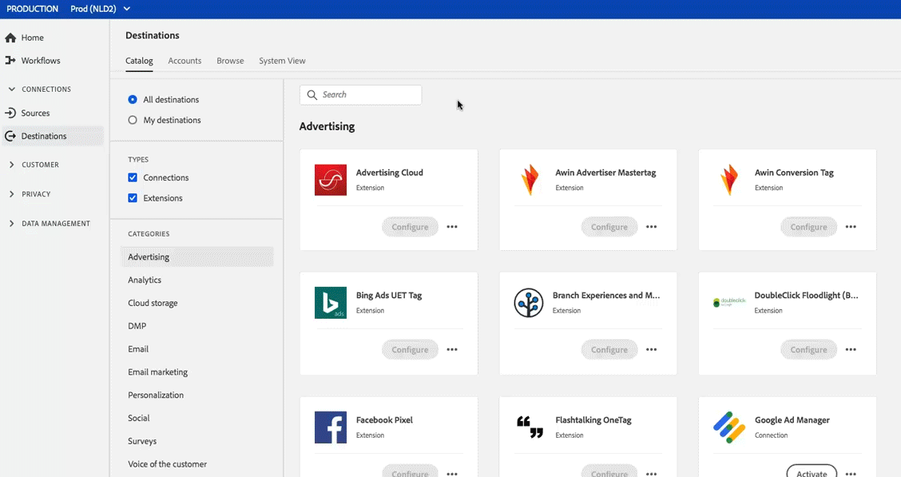
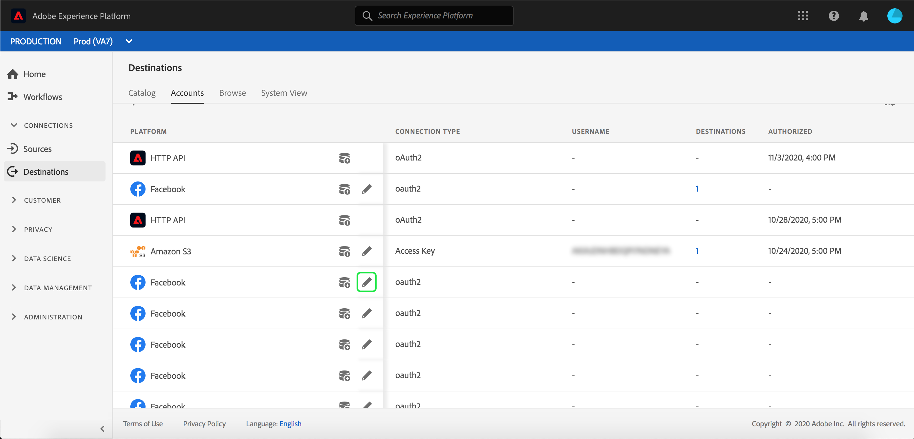
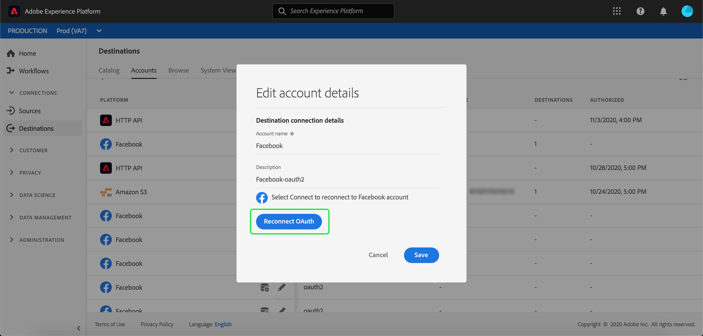
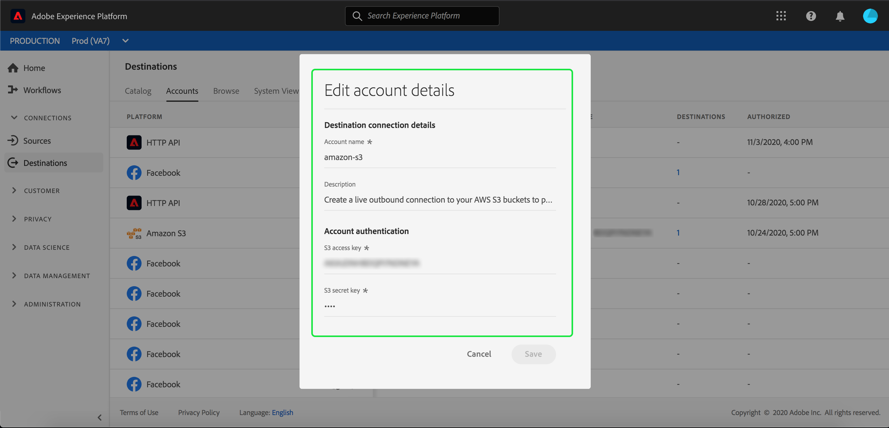

# Destinations workspace {#destinations-workspace}

In Real-time Customer Data Platform, select **[!UICONTROL Destinations]** from the left navigation bar to access the [!UICONTROL Destinations] workspace.

The [!UICONTROL Destinations] workspace consists of four sections, [!UICONTROL Catalog], [!UICONTROL Browse], [!UICONTROL Accounts], and [!UICONTROL System View], which are described in the sections below.

## [!UICONTROL Catalog] {#catalog}

The **[!UICONTROL Catalog]** tab displays a list of all destinations available in Real-time CDP, that you can send data to. 

The Real-time CDP user interface provides a number of search and filter options on the destinations catalog page:

* Use the search functionality on the page to locate a specific destination.
* Filter destinations using the [!UICONTROL Categories] control.
* Toggle between [!UICONTROL All destinations] and [!UICONTROL My destinations]. When **[!UICONTROL All destinations]** is selected, all available Real-time CDP destinations are displayed. When **[!UICONTROL My destinations]** is selected, you can only see the destinations with which you have established a connection.
* Select to view **[!UICONTROL Connections]** and/or **[!UICONTROL Extensions]**. To understand the difference between the two categories, see [Destination Types and Categories](../destination-types.md).

The destination cards contain either a **[!UICONTROL Configure]** or an **[!UICONTROL Activate]** control, and a secondary control that brings up more options. These are all described below:

Control | Description 
---------|----------
[!UICONTROL Configure] | Allows you to create a connection to the destination.
[!UICONTROL Activate] | Once you have established a connection to the destination, you can activate segments. 
[!UICONTROL View account] | View the accounts you have connected for a destination.
[!UICONTROL View dataflows] | View the data activation flows that exist for a destination.
[!UICONTROL View documentation] | Opens a link to the documentation page for that specific destination, for more information and to help you set it up.

Select a destination card in the catalog to open the right rail.  Here, you can see a description of the destination. The right rail provides the same controls described in the table above, as well as a description of the destination, and an indication of the destination category and type.

For more information on destination categories and information on each destination, see the [Destination Catalog](../catalog/destinations-catalog.md) and [Destination Types and Categories](../destination-types.md).

## [!UICONTROL Accounts] {#accounts}

In the **[!UICONTROL Accounts]** tab, you can learn more about the connections that you have established with various destinations. See the table below for all the information you can get on each destination:

>[!TIP]
>
>Use the  button in the **[!UICONTROL Platform]** column to create a new destination connection for that account.

Element | Description
---------|----------
[!UICONTROL Platform] | The destination for which you have set up the connection.
[!UICONTROL Connection Type] | Represents the connection type to your storage bucket or destination. <ul><li>For email marketing destinations: Can be S3 or FTP.</li><li>For real-time advertising destinations: Server-to-server</li><li>For Amazon S3 cloud storage destinations: Access Key </li><li>For SFTP cloud storage destinations: Basic authentication for SFTP</li></ul>
[!UICONTROL Username] | The username you selected in the [connect destination wizard](../catalog/email-marketing/overview.md#connect-destination).
[!UICONTROL Destinations] | Represents the number of unique successful destination flows connected with basic information created for a destination.
[!UICONTROL Authorized] | The date when the connection to this destination was authorized.

Additionally, you can edit or update your account information. Select the  in the **[!UICONTROL Platform]** column to edit the account's information.

For accounts that use an `OAuth2` connection type, you can select **[!UICONTROL Reconnect OAuth]** to renew your account credentials.

For accounts that use an `Access Key` or `ConnectionString` connection type, you can edit your account authentication information, including information such as access ID, secret keys, or connection strings.

Once you are finished editing your account details, select **[!UICONTROL Save]** to complete the update.

## [!UICONTROL Browse] {#browse}

The **[!UICONTROL Browse]** tab displays the destinations with which you have established a connection. Destinations with the **[!UICONTROL Enabled]** toggle turned on set the destination to active and vice-versa. You can also view the destinations where you have data flowing by selecting **[!UICONTROL Segments]** > **[!UICONTROL Browse]** and selecting a segment to inspect. See the table below for all the information that is provided for each destination in the Browse tab:

>[!TIP]
>
>Use the  button in the **[!UICONTROL Name]** column to activate additional segments to that destination.

Element | Description 
---------|----------
 Name | The name you provided for your activation flow to this destination.
 [!UICONTROL Destination] | The destination platform that you selected for your activation flow.
 [!UICONTROL Connection Type] | Represents the connection type to your storage bucket or destination. <ul><li>For email marketing destinations: Can be S3 or FTP.</li><li>For real-time advertising destinations: Server-to-server</li></ul>
 [!UICONTROL Username] | The account credentials you selected for the destination flow.
 [!UICONTROL Segments] | The number of segments that are being activated to this destination.
 [!UICONTROL Created] | The date and UTC time when the activation flow to the destination was created.
 [!UICONTROL Status] | `Active` or `Inactive`. Indicates whether data is currently being activated to this destination. To edit the status, see [Disable activation](./activate-destinations.md#disable-activation).

Click on a destination row to bring up more information about the destination in the right rail.

Select the destination name to see information about the segments activated to this destination. Click **[!UICONTROL Edit activation]** to modify or add to the segments that are being sent to this destination.
 
## [!UICONTROL System View] {#system-view}

The **[!UICONTROL System View]** tab displays a graphic representation of the activation flows that you have set up in the Real-time Customer Data Platform.

Select any of the destinations displayed on the page and press **[!UICONTROL View flows]** to see information on all the connections you have set up for each destination.

