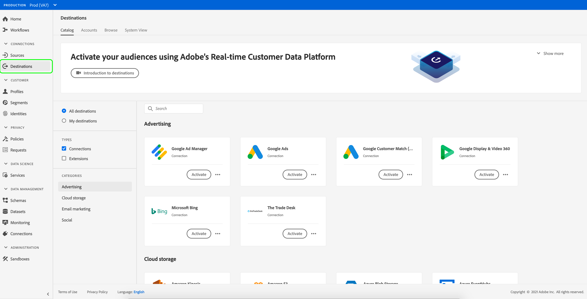

# Destinations workspace {#destinations-workspace}

## Overview {#overview}

In Adobe Experience Platform, select **[!UICONTROL Destinations]** from the left navigation bar to access the [!UICONTROL Destinations] workspace.

The [!UICONTROL Destinations] workspace consists of four sections, [!UICONTROL Catalog], [!UICONTROL Browse], [!UICONTROL Accounts], and [!UICONTROL System View], described in the sections below.

## [!UICONTROL Catalog] {#catalog}

The **[!UICONTROL Catalog]** tab displays a list of all destinations available in [!DNL Platform], that you can send data to. 

The [!DNL Platform] user interface provides several search and filter options on the destinations catalog page:

* Use the search functionality on the page to locate a specific destination.
* Filter destinations using the [!UICONTROL Categories] control.
* Toggle between [!UICONTROL All destinations] and [!UICONTROL My destinations]. When you select **[!UICONTROL All destinations]**, all available [!DNL Platform] destinations are displayed. When you select **[!UICONTROL My destinations]**, you can only see the destinations with which you have established a connection.
* Select to view **[!UICONTROL Connections]** and/or **[!UICONTROL Extensions]**. To understand the difference between the two categories, see [Destination Types and Categories](../destination-types.md).

The destination cards contain either a **[!UICONTROL Configure]** or an **[!UICONTROL Activate]** control, and a secondary control that brings up more options. These controls are described below:

| Control | Description | 
|---------|----------|
|[!UICONTROL Configure] | Allows you to create a connection to the destination.|
|[!UICONTROL Activate] | Once you have established a connection to the destination, you can activate segments.| 
|[!UICONTROL View account] | View the accounts you have connected for a destination.|
|[!UICONTROL View dataflows] | View the data activation flows that exist for a destination.|
|[!UICONTROL View documentation] | Opens a link to the documentation page for that specific destination, for more information and to help you set it up.|

{style="table-layout:auto"}

Select a destination card in the catalog to open the right rail. Here, you can see a description of the destination. The right rail provides the same controls described in the table above, including a description of the destination, and an indication of the destination category and type.

For more information on destination categories and information on each destination, see the [Destination catalog](../catalog/overview.md) and [Destination types and categories](../destination-types.md).

## [!UICONTROL Accounts] {#accounts}

The **[!UICONTROL Accounts]** tab shows you details about the connections that you have established with various destinations, and allows you to update existing connection details. See [Update accounts](update-accounts.md) for detailed instructions.

## [!UICONTROL Browse] {#browse}

The **[!UICONTROL Browse]** tab displays the destinations with which you have established a connection. Destinations with the **[!UICONTROL Enabled/Disabled]** toggle turned on set the destination to active or inactive, respectively. You can also view the destinations where you have data flowing by selecting **[!UICONTROL Segments]** > **[!UICONTROL Browse]** and selecting a segment to inspect. See the table below for all the information that is provided for each destination in the Browse tab:

>[!TIP]
>
> * Use the  button in the **[!UICONTROL Name]** column to [activate](activate-destinations.md) more segments to that destination.
> * Use the  button in the **[!UICONTROL Name]** column to [delete](delete-destinations.md) an existing connection to a destination.

|Element | Description |
|---------|----------|
|Name | The name you provided for your activation flow to this destination. The same column includes two controls: [!UICONTROL Activate ] and [!UICONTROL Delete destination].|
|[!UICONTROL Last Flow Run Status] | The status of the last dataflow run. See [View destination details](destination-details-page.md) for more information about dataflow runs.|
|[!UICONTROL Last Flow Run Date] | Time and date when the last dataflow run has occurred. See [View destination details](destination-details-page.md) for more information about dataflow runs.|
|[!UICONTROL Destination] | The destination platform that you selected for your activation flow.|
|[!UICONTROL Connection Type] | Represents the connection type to your storage bucket or destination. <ul><li>For email marketing destinations: Can be S3, FTP, or [!DNL Azure Blob].</li><li>For real-time advertising destinations: Server-to-server.</li><li>For streaming destinations: Can be [!DNL Azure Event Hubs] or [!DNL Amazon Kinesis].</li></ul>|
|[!UICONTROL Username] | The account credentials you selected for the destination flow.|
|[!UICONTROL Activation Data] | Indicates the number of segments that are being activated to this destination. Select this control to find out more about the activated segments. Refer to [Activation Data](/help/destinations/ui/destination-details-page.md#activation-data) in the destination details page for more information about the activated segments.|
|[!UICONTROL Created] | The date and UTC time when the activation flow to the destination was created.|
| [!UICONTROL Status] | `Active` or `Inactive`. Indicates whether data is being activated to this destination. To edit the status, see [Disable activation](./activate-destinations.md#disable-activation).|

Click on a destination row to bring up more information about the destination in the right rail.

Select the destination name to see information about the segments activated to this destination. Click **[!UICONTROL Edit activation]** to modify or add to the segments that are being sent to this destination.
 
## [!UICONTROL System View] {#system-view}

The **[!UICONTROL System View]** tab displays a graphic representation of the activation flows that you have set up in the Adobe Experience Platform.

Select any of the destinations displayed on the page and click **[!UICONTROL View flows]** to see information on all the connections you have set up for each destination.

