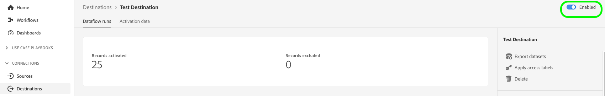
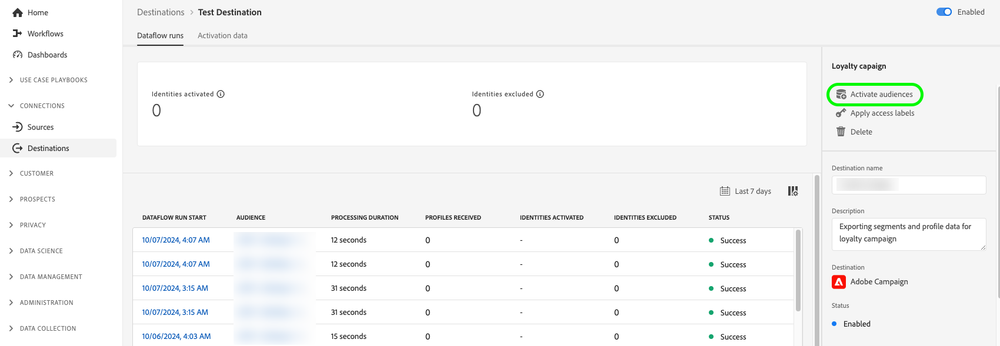
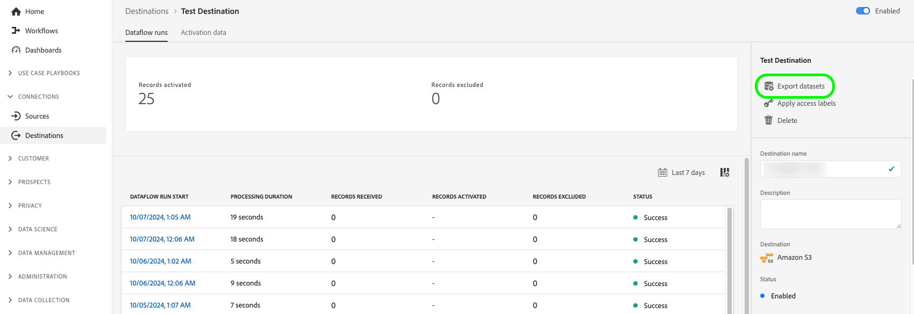
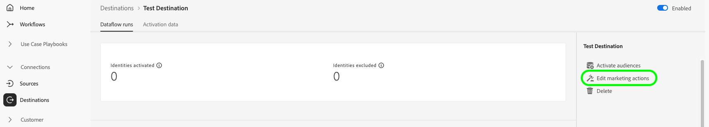
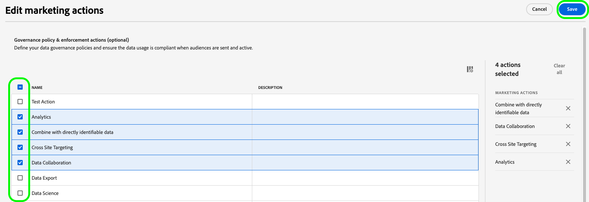
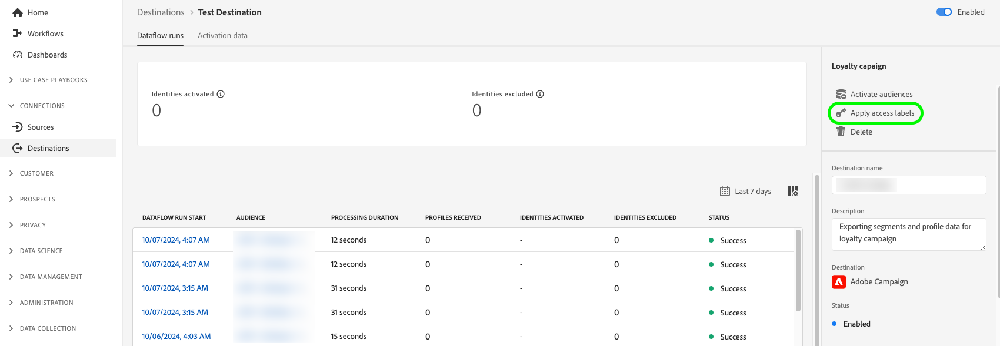
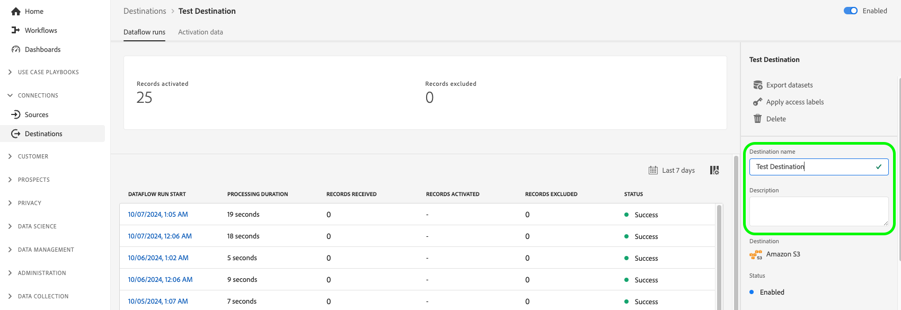

# Edit activation dataflows {#edit-activation-flows}

In Adobe Experience Platform, you can configure various components of existing activation dataflows to destinations, such as:

* [Enable or disable](#enable-disable-dataflows) activation dataflows
* [Add additional audiences](#add-audiences) to activation dataflows
* [Edit mapped attributes and identities](#edit-mapped-attributes)
* [Edit the activation schedule and export frequency](#edit-schedule-frequency)
* [Add additional datasets](#add-datasets) to activation workflow
* [Edit marketing actions](#edit-marketing-actions) for your activation dataflows
* [Apply access labels](#apply-access-labels) to exported data
* [Edit names and descriptions](#edit-names-descriptions) for your activation dataflows

## Browse activation dataflows {#browse-activation-dataflows}

Follow the steps below to browse your existing activation dataflows and identify the one you want to edit.

1. Log in to the [Experience Platform UI](https://platform.adobe.com/) and select **[!UICONTROL Destinations]** from the left navigation bar. Select **[!UICONTROL Browse]** from the top header to view your existing destination dataflows.

    

2. Select the filter icon  on the top left to launch the sort panel. The sort panel provides a list of all your destinations. You can select more than one destination from the list to see a filtered selection of dataflows associated with the selected destination.

    

3. Select the name of the destination dataflow that you want to edit.

    

4. The **[!UICONTROL Dataflow runs]** page for the destination appears, showing its available controls. Depending on the destination type, you can perform various dataflow operations. See the next sections for each supported dataflow operation.

## Enable or disable activation dataflows {#enable-disable-dataflows}

Use the **[!UICONTROL Enabled]/[!UICONTROL Disabled]** toggle to start or pause all data exports to the destination.

   
## Add audiences to an activation dataflow {#add-audiences}

Select **[!UICONTROL Activate audiences]** in the right rail to change which audiences to send to the destination. This action takes you to the activation workflow.

In the **[!UICONTROL Select audiences]** step of the activation workflow, you can remove existing audiences or add new audiences to the activation workflow.

The activation workflow differs slightly depending on destination type. For more information on the activation workflows for each destination type, read the following guides: 

* [Activate audiences to streaming destinations](./activate-segment-streaming-destinations.md) (for example, Facebook or Twitter);
* [Activate audiences to batch profile export destinations](./activate-batch-profile-destinations.md) (for example, Amazon S3 or Oracle Eloqua);
* [Activate audiences to streaming profile export destinations](./activate-streaming-profile-destinations.md) (for example, HTTP API or Amazon Kinesis).

## Edit the activation schedule and export frequency {#edit-schedule-frequency}

Select **[!UICONTROL Activate audiences]** in the right rail. This action takes you to the activation workflow.

Select the **[!UICONTROL Scheduling]** step in the activation workflow to edit the activation schedule and export frequency for your dataflow. This step allows you to configure how often data is exported to the destination.

In the **[!UICONTROL Scheduling]** step of the activation workflow, you can:

* Adjust the export frequency.
* Set or modify the start and end dates for the activation dataflow, and more.

The scheduling operations that you can perform vary slightly depending on destination type. For more information on the activation workflows for each destination type, read the following guides: 

* [Activate audiences to streaming destinations](./activate-segment-streaming-destinations.md) (for example, Facebook or Twitter);
* [Activate audiences to batch profile export destinations](./activate-batch-profile-destinations.md) (for example, Amazon S3 or Oracle Eloqua);
* [Activate audiences to streaming profile export destinations](./activate-streaming-profile-destinations.md) (for example, HTTP API or Amazon Kinesis).

## Edit mapped attributes and identities {#edit-mapped-attributes}

Select **[!UICONTROL Activate audiences]** in the right rail. This action takes you to the activation workflow.

Select the **[!UICONTROL Mapping]** step in the activation workflow to edit the mapped attributes and identities for your activation dataflow. This allows you to adjust which profile attributes and identities should be exported to the destination.

In the **[!UICONTROL Mapping]** step of the activation workflow, you can:

* Add new attributes or identities to the mapping.
* Remove existing attributes or identities from the mapping.
* Adjust the order of mappings to define the column order in exported files.

The activation workflow differs slightly depending on destination type. For more information on the activation workflows for each destination type, read the following guides: 

* [Activate audiences to streaming destinations](./activate-segment-streaming-destinations.md) (for example, Facebook or Twitter);
* [Activate audiences to batch profile export destinations](./activate-batch-profile-destinations.md) (for example, Amazon S3 or Oracle Eloqua);
* [Activate audiences to streaming profile export destinations](./activate-streaming-profile-destinations.md) (for example, HTTP API or Amazon Kinesis).

## Add datasets to an activation dataflow {#add-datasets}

Select **[!UICONTROL Export datasets]** in the right rail to select additional datasets to export to your destination. This option takes you to the [dataset export workflow](export-datasets.md).

>[!NOTE]
>
>This option is only visible for [destinations which support dataset export](export-datasets.md#supported-destinations).

## Edit marketing actions {#edit-marketing-actions}

You can add or remove marketing actions that you set up when initially connecting to the destination.

Select **[!UICONTROL Edit marketing actions]** in the right rail to open the marketing actions selection screen.

Select the applicable marketing actions and then select **[!UICONTROL Save]** to apply the changes.

## Apply access labels {#apply-access-labels}

Select **[!UICONTROL Apply access labels]** to edit the data usage labels for the exported data. See the [data usage labels documentation](../../data-governance/labels/overview.md) to learn more.

## Edit activation dataflow names and descriptions {#edit-names-descriptions}

To edit the activation dataflow name and description, use the **[!UICONTROL Destination name]** and **[!UICONTROL Description]** fields.

## Next steps {#next-steps}

By following this tutorial, you have successfully used the **[!UICONTROL destinations]** workspace to update existing destination dataflows.

For more information about destinations, refer to the [destinations overview](../catalog/overview.md).
