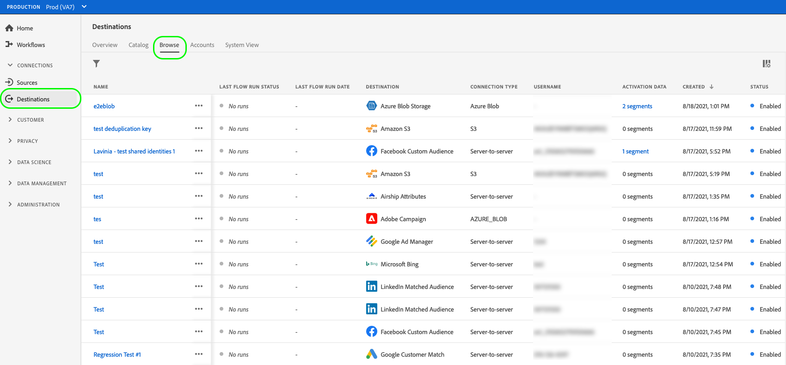
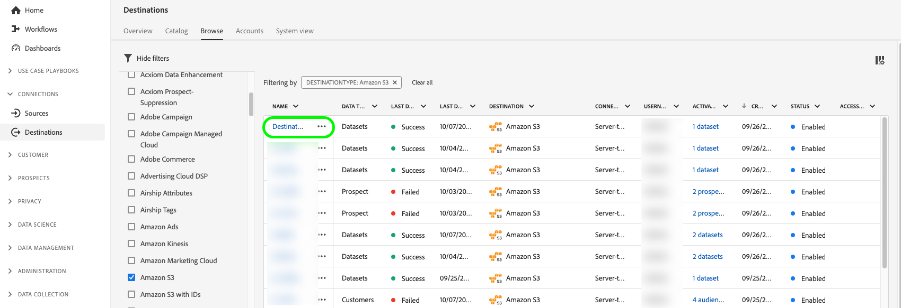
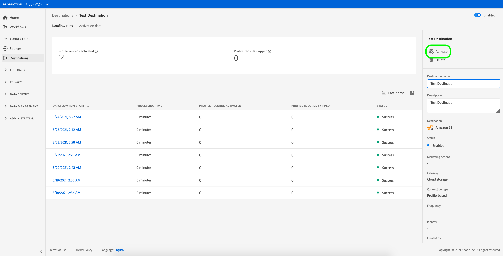

# Edit activation dataflows {#edit-activation-flows}

In Adobe Experience Platform, you can edit various components of existing activation dataflows to destinations, like the exported audiences and profile attributes, the export frequency, whether the activation dataflow is enabled or disabled, and more.

## Edit dataflows {#edit-dataflows}

Follow the steps below to edit existing activation dataflows:

1. Log in to the [Experience Platform UI](https://platform.adobe.com/) and select **[!UICONTROL Destinations]** from the left navigation bar. Select **[!UICONTROL Browse]** from the top header to view your existing destination dataflows.

    

2. Select the filter icon  on the top left to launch the sort panel. The sort panel provides a list of all your destinations. You can select more than one destination from the list to see a filtered selection of dataflows associated with the selected destination.

    

3. Select the name of the destination dataflow that you want to edit.

    

4. The **[!UICONTROL Dataflow runs]** page for the destination appears, showing its available controls. At this point, you can edit several components of the destination dataflow: 

    * Select **[!UICONTROL Activate audiences]** in the right rail to change which audiences or profile attributes to send to the destination. This action takes you to the activation workflow, which differs depending on destination type. For more information, see the guides on: 
      * [activating audience data to audience streaming destinations](./activate-segment-streaming-destinations.md) (for example, Facebook or Twitter);
      * [activating audience data to batch profile-based destinations](./activate-batch-profile-destinations.md) (for example, Amazon S3 or Oracle Eloqua);
      * [activating audience data to streaming profile-based destinations](./activate-streaming-profile-destinations.md) (for example, HTTP API or Amazon Kinesis).

    * Additionally, you can edit the destination dataflow name and description.
    * You can use the **[!UICONTROL Enabled]/[!UICONTROL Disabled]** toggle to start and pause all data exports to the destination.

    

## Next steps {#next-steps}

By following this tutorial, you have successfully used the **[!UICONTROL destinations]** workspace to update existing destination dataflows.

For more information about destinations, refer to the [destinations overview](../catalog/overview.md).
