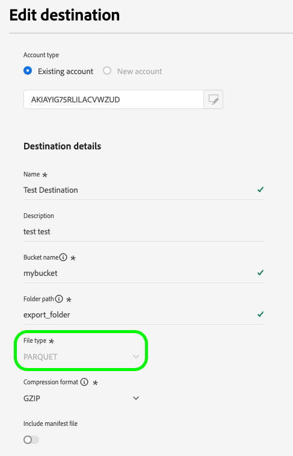
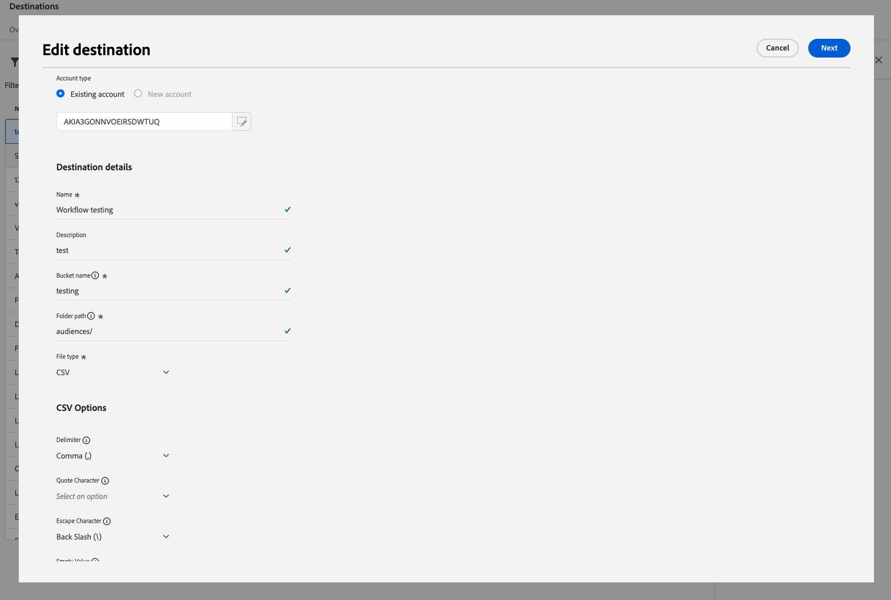
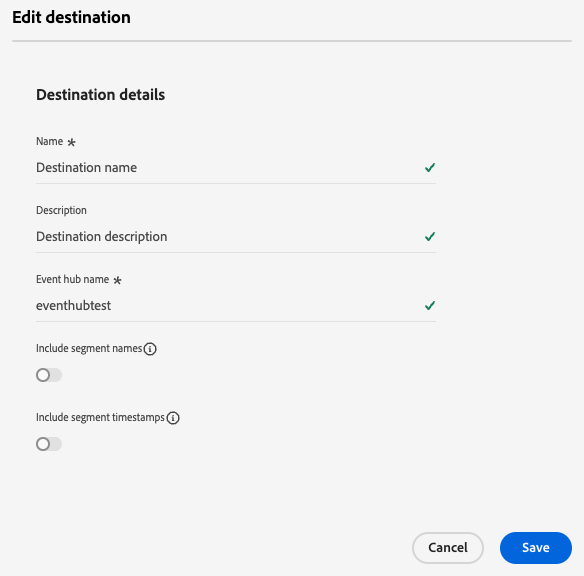
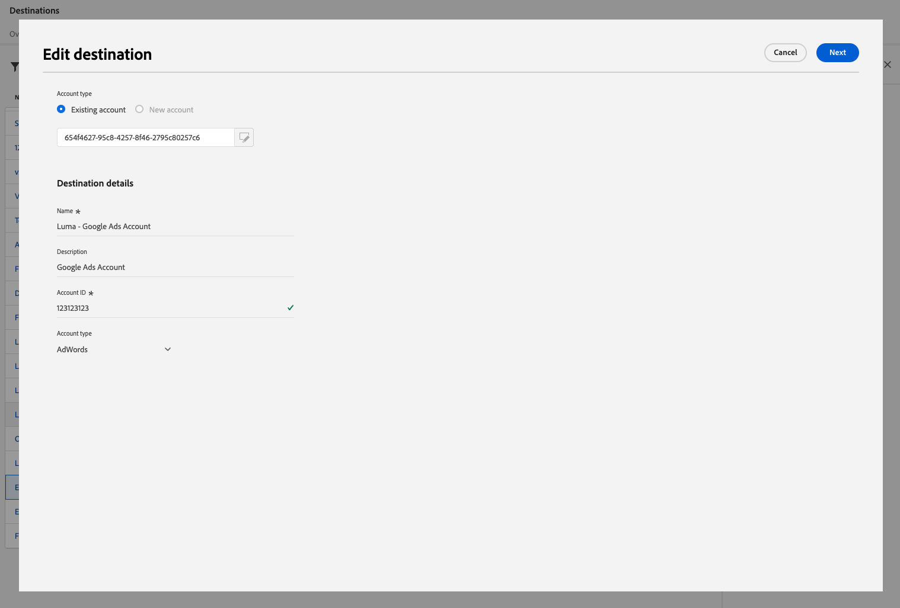

# Edit destinations

Learn how to edit various components of an existing destination connection, including how to update authentication credentials, export location, and more by using the Experience Platform UI.

>[!NOTE]
>
> The edit operations described in this tutorial are also supported via API operations. Read the tutorial on how to [edit destinations in the API](/help/destinations/api/edit-destination.md) for more information.

## Prerequisites {#prerequisites}

To edit destination connections you need the **[!UICONTROL Manage Destinations]** [access control permission](/help/access-control/home.md#permissions). Read the [access control overview](/help/access-control/ui/overview.md) or contact your product administrator to obtain the required permissions.

## Edit destination connections {#edit}

To edit various components of an existing destination connection: 

1. Navigate to **[!UICONTROL Destinations]** > **[!UICONTROL Browse]**.
2. Select the desired destination that you want to edit.
3. Select the ellipsis (`...`) in the [!UICONTROL Name] column and use the **[!UICONTROL Edit destination]** control to edit existing destination connections.
4. In the modal window, edit any desired settings. Select **[!UICONTROL Save]** when done.

In the edit destination window, you can update any settings that you configured when you initially connected to the destination. These settings are different based on the destination platform that you are updating.

Depending on how the destination was configured, some fields might be read-only and cannot be edited. To change the value of read-only fields, you must [create a new destination connection](../ui/connect-destination.md) with the new field values.

Below are some examples of the settings that you can update for [Amazon S3](../catalog/cloud-storage/amazon-s3.md), [Azure Event Hubs](../catalog/cloud-storage/azure-event-hubs.md), and [Google Ads](../catalog/advertising/google-ads-destination.md) destinations.

  
  
  

>[!SUCCESS]
>
>Your destination connection settings are now updated.

## Other editing options

By using the Experience Platform UI or the Flow Service API, you can edit various destination configurations, as detailed in the links below:

|Using the Experience Platform UI | Using the Flow Service API |
|---------|----------|
| Edit destination connections (this page) | [Edit target connection components (storage location and other components)](/help/destinations/api/edit-destination.md#patch-target-connection) |
| [Edit accounts](/help/destinations/ui/update-accounts.md) | [Edit base connection components (authentication parameters and other components)](/help/destinations/api/edit-destination.md#patch-base-connection) |
| [Edit activation dataflows](/help/destinations/ui/edit-activation.md) | [Update destination dataflows](/help/destinations/api/update-destination-dataflows.md) |

## Next steps

By following this tutorial, you have successfully used the **[!UICONTROL destinations]** workspace to update existing destination connections.

For more information about destinations, refer to the [destinations overview](../catalog/overview.md).
