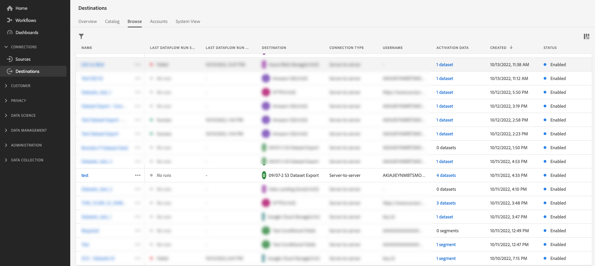
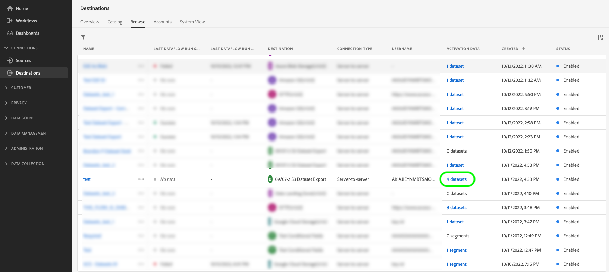
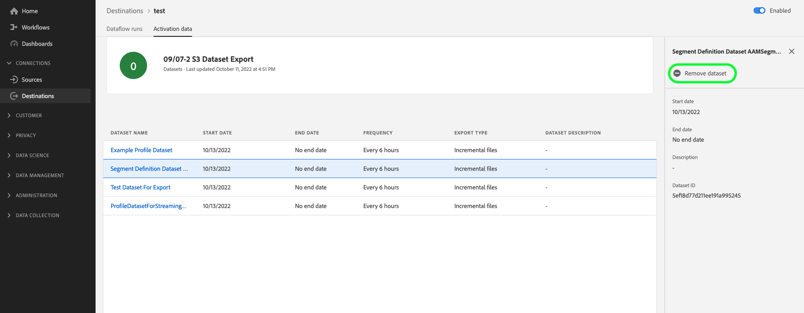
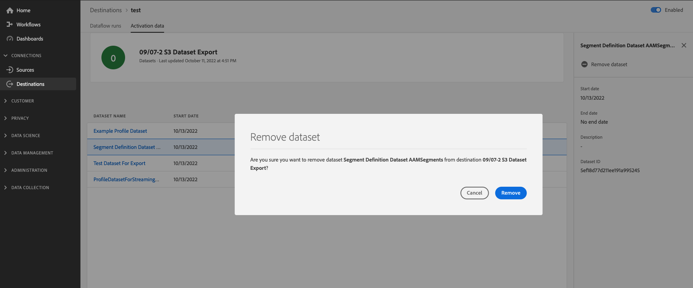

# (Beta) Export datasets to destinations

>[!IMPORTANT]
>
>* The functionality to export datasets is currently in Beta and is not available to all users. The documentation and the functionality are subject to change.
>* This functionality is available to customers who have purchased the Real-Time CDP Prime and Ultimate package. Please contact your Adobe representative for more information. 

This article explains the workflow required to export [datasets](/help/catalog/datasets/overview.md) from Adobe Experience Platform to your preferred cloud storage or email marketing location, such as Amazon S3, SFTP locations, or Google Cloud Storage.

## When to activate segments or export datasets {#when-to-activate-segments-or-activate-datasets}

Some file-based destinations in the Experience Platform catalog support both segment activation and dataset export. 

* Consider activating segments when you want your data structured into profiles grouped by audience interests or qualifications. 
* On the other hand, consider dataset exports when you are looking to export raw dataset data, which is not grouped or structured by audience interests or qualifications. You could use this data for reporting, data science tasks, to satisfy compliance requirements, and many other use cases.

If you are looking to export datasets, this document has all the information you need. If you are looking to activate segments to cloud storage or email marketing destinations, read [Activate audience data to batch profile export destinations](/help/destinations/ui/activate-batch-profile-destinations.md).

## Prerequisites {#prerequisites}

To export datasets to cloud storage destinations, you must have successfully [connected to a destination](./connect-destination.md). If you haven't done so already, go to the [destinations catalog](../catalog/overview.md), browse the supported destinations, and configure the destination that you want to use.

### Required permissions {#permissions}

To export datasets, you need the **[!UICONTROL Manage Destinations]**, **[!UICONTROL View Destinations]**, **[!UICONTROL Activate Destinations]**, and **[!UICONTROL Activate and Manage Datasets without Mapping]** [access control permissions](/help/access-control/home.md#permissions). Read the [access control overview](/help/access-control/ui/overview.md) or contact your product administrator to obtain the required permissions.

When browsing the destinations catalog, you should see an **[!UICONTROL Activate]** or an **[!UICONTROL Export datasets]** control for a destination. This means that you have the necessary permissions to export datasets and that the destination supports exporting datasets.

## Select your destination {#select-destination}

To select the destination where to export datasets: 

1. Go to **[!UICONTROL Connections > Destinations]**, and select the **[!UICONTROL Catalog]** tab.
    
    

1. Select **[!UICONTROL Activate]** or **[!UICONTROL Export datasets]** on the card corresponding to the destination where you want to export datasets, as shown in the image below.

    

1. Select **[!UICONTROL Data type Datasets]** and select the destination connection where you want to export datasets, then select **[!UICONTROL Next]**.

  >[!TIP]
  > 
  >If you want to set up a new destination to export datasets, select **[!UICONTROL Configure new destination]** to trigger the [Connect to destination](/help/destinations/ui/connect-destination.md) workflow. 

  

1. Proceed to the next section to [select your datasets](#select-datasets) for export.

## Select your datasets {#select-datasets}

Use the check boxes to the left of the dataset names to select the datasets that you want to export to the destination, then select **[!UICONTROL Next]**.

## Schedule dataset export {#scheduling}

>[!CONTEXTUALHELP]
>id="platform_destinations_activate_datasets_exportoptions"
>title="File export options for datasets"
>abstract="Select **Export incremental files** to export only the data which was added to the dataset since the last export.   The first incremental file export includes all the data in the dataset, acting as a backfill. Future incremental files include only the data which was added to the dataset since the first export."

In the **[!UICONTROL Scheduling]** step, you can set a start date as well as an export cadence for your dataset exports.

The **[!UICONTROL Export incremental files]** option is automatically selected. This triggers an export where the first file is a full snapshot of the dataset and subsequent files are incremental additions to the dataset since the previous export.

>[!IMPORTANT]
>
>The first exported incremental file includes all existing data in the dataset, functioning as a backfill.

1. Use the **[!UICONTROL Frequency]** selector to select the export frequency:
    
    * **[!UICONTROL Daily]**: schedule incremental file exports once a day, every day, at the time you specify.
    * **[!UICONTROL Hourly]**: schedule incremental file exports every 3, 6, 8, or 12 hours.

2. Use the **[!UICONTROL Time]** selector to choose the time of day, in [!DNL UTC] format, when the export should take place.

3. Use the **[!UICONTROL Date]** selector to choose the interval when the export should take place. Note that in the beta version of the feature, it is not possible to set an end data for the exports. For more information, view the [known limitations](#known-limitations) section.

4. Select **[!UICONTROL Next]** to save the schedule and proceed to the **[!UICONTROL Review]** step.

>[!NOTE] 
> 
>For dataset exports, the file names have a preset, default format, which cannot be modified. See the section [Verify successful dataset export](#verify) for more information and examples of exported files.

## Review {#review}

On the **[!UICONTROL Review]** page, you can see a summary of your selection. Select **[!UICONTROL Cancel]** to break up the flow, **[!UICONTROL Back]** to modify your settings, or **[!UICONTROL Finish]** to confirm your selection and start exporting datasets to the destination.

## Verify successful dataset export {#verify}

When exporting datasets, Experience Platform creates a `.json` or `.parquet` file in the storage location that you provided. Expect a new file to be deposited in your storage location according to the export schedule you provided. 

Experience Platform creates a folder structure in the storage location you specified, where it deposits the exported dataset files. A new folder is created for each export time, following the pattern below:

`folder-name-you-provided/datasetID/exportTime=YYYYMMDDHHMM`

The default file format is randomly generated and ensures that exported file names are unique.

### Sample dataset files {#sample-files}

The presence of these files in your storage location is confirmation of successful export. To understand how the exported files are structured, you can download a sample [.parquet file](../assets/common/part-00000-tid-253136349007858095-a93bcf2e-d8c5-4dd6-8619-5c662e261097-672704-1-c000.parquet) or [.json file](../assets/common/part-00000-tid-4172098795867639101-0b8c5520-9999-4cff-bdf5-1f32c8c47cb9-451986-1-c000.json).

## Remove dataset from destination {#remove-dataset}

To remove a dataset from an existing dataflow, follow the steps below:

1. Log in to the [Experience Platform UI](https://platform.adobe.com/) and select **[!UICONTROL Destinations]** from the left navigation bar. Select **[!UICONTROL Browse]** from the top header to view your existing destination dataflows.

    

    >[!TIP] 
    > 
    >Select the filter icon  on the top left to launch the sort panel. The sort panel provides a list of all your destinations. You can select more than one destination from the list to see a filtered selection of dataflows associated with the selected destination.

1. From the **[!UICONTROL Activation data]** column, select the datasets control to view all datasets mapped to this export dataflow.

    

1. The **[!UICONTROL Activation data]** page for the destination appears. Select **[!UICONTROL Remove dataset]** in the right rail to trigger the remove dataset confirmation dialog. 

    

1. In the confirmation dialog, select **[!UICONTROL Remove]** to immediately remove the dataset from exports to the destination. 

    

## Known limitations {#known-limitations}

Keep in mind the following limitations for the beta release of dataset exports:

* There is currently a single permission (**[!UICONTROL Activate and Manage Datasets without Mapping]**) that includes manage and activate permissions on datasets. These controls will be split up in the future into more granular permissions.
* Currently, you can only export incremental files and an end date cannot be selected for your dataset exports. 
* Exported filenames are currently not customizable
* The UI does not currently block you from deleting a dataset that is being exported to a destination. Do not delete any datasets that are being exported to destinations. [Remove the dataset](#remove-dataset) from a destination dataflow before deleting it.
* Monitoring numbers for dataset exports are currently mixed with numbers for profile exports so they do not reflect the true export numbers.
