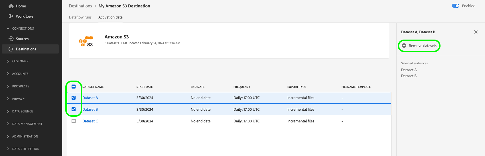

# Export datasets to cloud storage destinations

>[!AVAILABILITY]
>
>This functionality is available to customers who have purchased the Real-Time CDP Prime or Ultimate package, Adobe Journey Optimizer, or Customer Journey Analytics. Contact your Adobe representative for more information.

>[!IMPORTANT]
>
>**Action item**: The [September 2024 release of Experience Platform](/help/release-notes/latest/latest.md#destinations) introduced the option to set an `endTime` date for export dataset dataflows. Adobe has also introduced a default end date of September 1st 2025 for all dataset export dataflows created *prior to November 1st, 2024*. 
>
>For any of those dataflows, you need to update the end date in the dataflow manually before the end date, otherwise your exports will stop on that date. Use the Experience Platform UI to view which dataflows will be set to stop on September 1st 2025. 
>
>Refer to the [scheduling section](#scheduling) for information on how to edit the end date of a dataset export dataflow.

This article explains the workflow required to export [datasets](/help/catalog/datasets/overview.md) from Adobe Experience Platform to your preferred cloud storage location, such as [!DNL Amazon S3], SFTP locations, or [!DNL Google Cloud Storage] by using the Experience Platform UI. 

You can also use the Experience Platform APIs to export datasets. Read the [export datasets API tutorial](/help/destinations/api/export-datasets.md) for more information.  

## Datasets available for exporting {#datasets-to-export}

The datasets that you can export vary based on the Experience Platform application (Real-Time CDP, Adobe Journey Optimizer), the tier (Prime or Ultimate), and any add-ons that you purchased (for example: Data Distiller).

Use the table below to understand which dataset types you can export depending on your application, product tier, and any add-ons purchased:

<table>
<thead>
  <tr>
    <th>Application/Add-on</th>
    <th>Tier</th>
    <th>Datasets available for export</th>
  </tr>
</thead>
<tbody>
  <tr>
    <td rowspan="2">Real-Time CDP</td>
    <td>Prime</td>
    <td>Profile and Experience Event datasets created in the Experience Platform UI after ingesting or collecting data through Sources, Web SDK, Mobile SDK, Analytics Data Connector, and Audience Manager.</td>
  </tr>
  <tr>
    <td>Ultimate</td>
    <td><ul><li>Profile and Experience Event datasets created in the Experience Platform UI after ingesting or collecting data through Sources, Web SDK, Mobile SDK, Analytics Data Connector, and Audience Manager.</li><li> <a href="https://experienceleague.adobe.com/docs/experience-platform/dashboards/query.html#profile-attribute-datasets">System-generated Profile Snapshot dataset</a>.</li></td>
  </tr>
  <tr>
    <td rowspan="2">Adobe Journey Optimizer</td>
    <td>Prime</td>
    <td>Refer to the <a href="https://experienceleague.adobe.com/docs/journey-optimizer/using/data-management/datasets/export-datasets.html#datasets"> Adobe Journey Optimizer</a> documentation.</td>
  </tr>
  <tr>
    <td>Ultimate</td>
    <td>Refer to the <a href="https://experienceleague.adobe.com/docs/journey-optimizer/using/data-management/datasets/export-datasets.html#datasets"> Adobe Journey Optimizer</a> documentation.</td>
  </tr>
  <tr>
    <td>Customer Journey Analytics</td>
    <td>All</td>
    <td> Profile and Experience Event datasets created in the Experience Platform UI after ingesting or collecting data through Sources, Web SDK, Mobile SDK, Analytics Data Connector, and Audience Manager.</td>
  </tr>
  <tr>
    <td>Data Distiller</td>
    <td>Data Distiller (Add-on)</td>
    <td>Derived datasets created through Query Service.</td>
  </tr>
</tbody>
</table>

## Video tutorial {#video-tutorial}

Watch the video below for an end-to-end explanation of the workflow described on this page, benefits of using the export dataset functionality, and some suggested use cases.

>[!VIDEO](https://video.tv.adobe.com/v/3424392/)

## Supported destinations {#supported-destinations}

Currently, you can export datasets to the cloud storage destinations highlighted in the screenshot and listed below. 

* [[!DNL Azure Data Lake Storage Gen2]](../../destinations/catalog/cloud-storage/adls-gen2.md)
* [[!DNL Data Landing Zone]](../../destinations/catalog/cloud-storage/data-landing-zone.md)
* [[!DNL Google Cloud Storage]](../../destinations/catalog/cloud-storage/google-cloud-storage.md)
* [[!DNL Amazon S3]](../../destinations/catalog/cloud-storage/amazon-s3.md#changelog)
* [[!DNL Azure Blob]](../../destinations/catalog/cloud-storage/azure-blob.md#changelog) 
* [[!DNL SFTP]](../../destinations/catalog/cloud-storage/sftp.md#changelog)

## When to activate audiences or export datasets {#when-to-activate-audiences-or-activate-datasets}

Some file-based destinations in the Experience Platform catalog support both audience activation and dataset export. 

* Consider activating audiences when you want your data structured into profiles grouped by audience interests or qualifications. 
* Alternatively, consider dataset exports when you are looking to export raw datasets, which are not grouped or structured by audience interests or qualifications. You could use this data for reporting, data science workflows, and many other use cases. For example, as an administrator, data engineer, or analyst, you can export data from Experience Platform to synchronize with your data warehouse, use in BI analysis tools, external cloud ML tools, or store in your system for long-term storage needs.

This document contains all the information necessary to export datasets. If you want to activate *audiences* to cloud storage or email marketing destinations, read [Activate audience data to batch profile export destinations](/help/destinations/ui/activate-batch-profile-destinations.md).

## Prerequisites {#prerequisites}

Note the following prerequisites in order to export datasets:

* To export datasets to cloud storage destinations, you must have successfully [connected to a destination](./connect-destination.md). If you haven't done so already, go to the [destinations catalog](../catalog/overview.md), browse the supported destinations, and configure the destination that you want to use.
* Profile datasets need to be enabled for use in Real-Time Customer Profile. [Read more](/help/ingestion/tutorials/ingest-batch-data.md#enable-for-profile) about how to enable this option. 

### Required permissions {#permissions}

To export datasets, you need the **[!UICONTROL View Destinations]**, **[!UICONTROL View Datasets]**, and **[!UICONTROL Manage and Activate Dataset Destinations]** [access control permissions](/help/access-control/home.md#permissions). Read the [access control overview](/help/access-control/ui/overview.md) or contact your product administrator to obtain the required permissions.

To ensure that you have the necessary permissions to export datasets and that the destination supports exporting datasets, browse the destinations catalog. If a destination has an **[!UICONTROL Activate]** or an **[!UICONTROL Export datasets]** control, then you have the appropriate permissions.

## Select your destination {#select-destination}

Follow the instructions to select a destination where you can export your datasets:

1. Go to **[!UICONTROL Connections > Destinations]**, and select the **[!UICONTROL Catalog]** tab.
    
    

1. Select **[!UICONTROL Activate]** or **[!UICONTROL Export datasets]** on the card corresponding to the destination that you want to export datasets to.

    

1. Select **[!UICONTROL Data type Datasets]** and select the destination connection that you want to export datasets to, then select **[!UICONTROL Next]**.

  >[!TIP]
  > 
  >If you want to set up a new destination to export datasets, select **[!UICONTROL Configure new destination]** to trigger the [Connect to destination](/help/destinations/ui/connect-destination.md) workflow. 

  

1. The **[!UICONTROL Select datasets]** view appears. Proceed to the next section to [select your datasets](#select-datasets) for export.

## Select your datasets {#select-datasets}

Use the checkboxes to the left of the dataset names to select the datasets that you want to export to the destination, then select **[!UICONTROL Next]**.

>[!NOTE]
>
>All datasets selected here will share the same export schedule. If you need different export schedules (for example, incremental exports for some datasets and one-time full exports for others), create separate dataflows for each schedule type.

## Schedule dataset export {#scheduling}

>[!CONTEXTUALHELP]
>id="platform_destinations_activate_datasets_exportoptions"
>title="File export options for datasets"
>abstract="Select **Export incremental files** to export only the data which was added to the dataset since the last export.   The first incremental file export includes all the data in the dataset, acting as a backfill. Future incremental files include only the data which was added to the dataset since the first export.   Select **Export full files** to export the complete membership of each dataset on each export. "

>[!CONTEXTUALHELP]
>id="dataset_dataflow_needs_schedule_end_date_header"
>title="Update the end date for this dataflow"
>abstract="Update the end date for this dataflow"

>[!CONTEXTUALHELP]
>id="dataset_dataflow_needs_schedule_end_date_body"
>title="Update the end date for this dataflow body"
>abstract="Because of recent updates to this destination, the dataflow now requires an end date. Adobe has set a default end date to September 1st 2025. Please update to your desired end date, otherwise the data exports will stop on the default date."

>[!IMPORTANT]
>
>**Schedule applies to all datasets in the dataflow**
>
>When you configure or modify the export schedule, it applies to **all datasets** currently being exported through the dataflow you are configuring. You cannot set different schedules for individual datasets within the same dataflow.
>
>If you need different export schedules for different datasets, you must create separate dataflows (separate destination connections) for each schedule type.
>
>**Example:** If you have Dataset A exporting incrementally and you add Dataset B with a one-time full export schedule, Dataset A will also be updated to the one-time full export schedule.

Use the **[!UICONTROL Scheduling]** step to: 

* Set a start date and an end date, as well as an export cadence for your dataset exports.
* Configure if the exported dataset files should export the complete membership of the dataset or just incremental changes to the membership on each export occurrence.  
* Customize the folder path in your storage location where datasets should be exported. Read more about how to [edit the export folder path](#edit-folder-path).

Use the **[!UICONTROL Edit schedule]** control on the page to edit the export cadence of exports, as well as to select whether to export full or incremental files.

>[!WARNING]
>
>Modifying the schedule here will update the export behavior for all datasets in this dataflow. If this dataflow contains multiple datasets, all of them will be affected by this change.

The **[!UICONTROL Export incremental files]** option is selected by default. This triggers an export of one or multiple files representing a full snapshot of the dataset. Subsequent files are incremental additions to the dataset since the previous export. You can also select **[!UICONTROL Export full files]**. In this case, select the frequency **[!UICONTROL Once]** for a one-time full export of the dataset.

>[!IMPORTANT]
>
>The first incremental file export includes all existing data in the dataset, functioning as a backfill. The export can contain one or multiple files.

1. Use the **[!UICONTROL Frequency]** selector to select the export frequency:
    
    * **[!UICONTROL Daily]**: Schedule incremental file exports once a day, every day, at the time you specify.
    * **[!UICONTROL Hourly]**: Schedule incremental file exports every 3, 6, 8, or 12 hours.

2. Use the **[!UICONTROL Time]** selector to choose the time of day, in [!DNL UTC] format, when the export should take place.

3. Use the **[!UICONTROL Date]** selector to choose the interval when the export should take place.

4. Select **[!UICONTROL Save]** to save the schedule and proceed to the **[!UICONTROL Review]** step.

>[!NOTE] 
> 
>For dataset exports, the file names have a preset, default format, which cannot be modified. See the section [Verify successful dataset export](#verify) for more information and examples of exported files.

## Edit folder path {#edit-folder-path}

>[!CONTEXTUALHELP]
>id="destinations_folder_name_template"
>title="Edit folder path"
>abstract="Use several provided macros to customize the folder path where dataset are exported."

>[!CONTEXTUALHELP]
>id="destinations_folder_name_template_preview"
>title="Dataset folder path preview"
>abstract="Get a preview of the folder structure that gets created in your storage location based on the macros you added in this window."

Select **[!UICONTROL Edit folder path]** to customize the folder structure in your storage location where exported datasets are deposited. 

You can use several available macros to customize a desired folder name. Double-click a macro to add it to the folder path and use `/` between the macros to separate the folders. 

After selecting the desired macros, you can see a preview of the folder structure that will be created in your storage location. The first level in the folder structure represents the **[!UICONTROL Folder path]** that you indicated when you [connected to the destination](/help/destinations/ui/connect-destination.md#set-up-connection-parameters) to export datasets. 

### Best practices for managing multiple datasets {#best-practices-multiple-datasets}

When exporting multiple datasets, consider the following best practices:

* **Same schedule requirements**: Group datasets that need the same export schedule (frequency, type) into a single dataflow for easier management.
* **Different schedule requirements**: Create separate dataflows for datasets that require different export schedules or export types (incremental vs. full). This ensures each dataset exports according to its specific needs.
* **Review before modifying**: Before changing the schedule on an existing dataflow, review which datasets are already being exported through that dataflow to avoid unintended changes to their export behavior.
* **Document your setup**: Keep track of which datasets are in which dataflows, especially when managing multiple export schedules across different destinations.

## Review {#review}

On the **[!UICONTROL Review]** page, you can see a summary of your selection. Select **[!UICONTROL Cancel]** to break up the flow, **[!UICONTROL Back]** to modify your settings, or **[!UICONTROL Finish]** to confirm your selection and start exporting datasets to the destination.

## Verify successful dataset export {#verify}

When exporting datasets, Experience Platform creates one or multiple `.json` or `.parquet` files in the storage location that you provided. Expect new files to be deposited in your storage location according to the export schedule you provided.

Experience Platform creates a folder structure in the storage location you specified, where it deposits the exported dataset files. The default folder export pattern is shown below, but you can [customize the folder structure with your preferred macros](#edit-folder-path).

>[!TIP] 
> 
>The first level in this folder structure - `folder-name-you-provided` -  represents the **[!UICONTROL Folder path]** that you indicated when you [connected to the destination](/help/destinations/ui/connect-destination.md##set-up-connection-parameters) to export datasets. 

`folder-name-you-provided/datasetID/exportTime=YYYYMMDDHHMM`

The default file name is randomly generated and ensures that exported file names are unique.

### Sample dataset files {#sample-files}

The presence of these files in your storage location is confirmation of a successful export. To understand how the exported files are structured, you can download a sample [.parquet file](../assets/common/part-00000-tid-253136349007858095-a93bcf2e-d8c5-4dd6-8619-5c662e261097-672704-1-c000.parquet) or [.json file](../assets/common/part-00000-tid-4172098795867639101-0b8c5520-9999-4cff-bdf5-1f32c8c47cb9-451986-1-c000.json).

#### Compressed dataset files {#compressed-dataset-files}

In the [connect to destination workflow](/help/destinations/ui/connect-destination.md#file-formatting-and-compression-options), you can select the exported dataset files to be compressed, as shown below: 

Note the difference in file format between the two file types, when compressed: 

* When exporting compressed JSON files, the exported file format is `json.gz`. The format of the exported JSON is NDJSON, which is the standard interchange format in the big data ecosystem. Adobe recommends using an NDJSON-compatible client to read the exported files.
* When exporting compressed parquet files, the exported file format is `gz.parquet`

Exports to JSON files are supported *in a compressed mode only*. Exports to Parquet files are supported in a compressed and uncompressed mode.

## Remove datasets from destinations {#remove-dataset}

To remove datasets from an existing dataflow, follow the steps below:

1. Log in to the [Experience Platform UI](https://experience.adobe.com/platform/) and select **[!UICONTROL Destinations]** from the left navigation bar. Select **[!UICONTROL Browse]** from the top header to view your existing destination dataflows.

    

    >[!TIP] 
    > 
    >Select the filter icon  on the top left to launch the sort panel. The sort panel provides a list of all your destinations. You can select more than one destination from the list to see a filtered selection of dataflows associated with the selected destination.

2. From the **[!UICONTROL Activation data]** column, select the datasets control to view all datasets mapped to this export dataflow.

    

3. The **[!UICONTROL Activation data]** page for the destination appears. Use the checkboxes on the left side of the dataset list to select the datasets which you want to remove, then select **[!UICONTROL Remove datasets]** in the right rail to trigger the remove dataset confirmation dialog.

     

4. In the confirmation dialog, select **[!UICONTROL Remove]** to immediately remove the dataset from exports to the destination. 

    

## Dataset export entitlements {#licensing-entitlement}

Refer to the product description documents to understand how much data you are entitled to export for each Experience Platform application, per year. For example, you can view the Real-Time CDP Product Description [here](https://helpx.adobe.com/legal/product-descriptions/real-time-customer-data-platform-b2c-edition-prime-and-ultimate-packages.html).

Note that the data export entitlements for different applications are not additive. For example, this means that if you purchase Real-Time CDP Ultimate and Adobe Journey Optimizer Ultimate, the profile export entitlement will be the larger of the two entitlements, as per the product descriptions. Your volume entitlements are calculated by taking your total number of licensed profiles and multiplying by 500 KB for Real-Time CDP Prime or 700 KB for Real-Time CDP Ultimate to determine how much volume of data you are entitled to.

On the other hand, if you purchased add-ons such as Data Distiller, the data export limit that you are entitled to represents the sum of the product tier and the add-on. 

You can view and track your profile exports against your contractual limits in the [license usage dashboard](/help/landing/license-usage-and-guardrails/license-usage-dashboard.md). 

## Known limitations {#known-limitations}

Keep in mind the following limitations for the general availability release of dataset exports:

* Experience Platform may export multiple files even for small datasets. Dataset export is designed for system-to-system integration and optimized for performance, hence the number of exported files is not customizable.
* Exported file names are currently not customizable.
* The UI does not currently block you from deleting a dataset that is being exported to a destination. Do not delete any datasets that are being exported to destinations. [Remove the dataset](#remove-dataset) from a destination dataflow before deleting it.
* Monitoring metrics for dataset exports are currently mixed with numbers for profile exports so they do not reflect the true export numbers.
* Data with a timestamp older than 365 days is excluded from dataset exports. For more information, view the [guardrails for scheduled dataset exports](/help/destinations/guardrails.md#guardrails-for-scheduled-dataset-exports)

## Frequently Asked Questions {#faq}

**Can we generate a file without a folder if we just save at `/` as the folder path? Also, if we don't require a folder path, how will files with duplicate names be generated in a folder or location?**

+++Answer
Starting with the September 2024 release, it is possible to customize the folder name and even use `/` for exporting files for all datasets in the same folder. Adobe does not recommend this for destinations exporting multiple datasets, as system-generated filenames belonging to different datasets will be mixed in the same folder.
+++

**Can you route the manifest file to one folder and data files into another folder?**

+++Answer
No, there is no capability to copy the manifest file to a different location.
+++

**Can we control the sequencing or timing of file delivery?**

+++Answer
There are options for scheduling the export. There are no options for delaying or sequencing the copy of the files. They are copied to your storage location as soon as they are generated.
+++

**What formats are available for the manifest file?**

+++Answer
The manifest file is in .json format.
+++

**Is there API availability for the manifest file?**

+++Answer
No API is available for the manifest file, but it includes a list of files comprising the export.
+++

**Can we add additional details to the manifest file (i.e., record count)? If so, how?**

+++Answer
There is no possibility to add additional info to the manifest file. The record count is available via the `flowRun` entity (queryable via API). Read more in destinations monitoring.
+++

**How are data files split? How many records per file?**

+++Answer
Data files are split per the default partitioning in the Experience Platform data lake. Larger datasets have a higher number of partitions. The default partitioning is not configurable by the user as it is optimized for reading.
+++

**Can we set a threshold (number of records per file)?**

+++Answer
No, it is not possible.
+++

**How do we resend a data set in the event that the initial send is bad?**

+++Answer
Retries are in place automatically for most types of system errors.
+++

**Can I set different export schedules for different datasets in the same dataflow?**

+++Answer
No, all datasets within a single dataflow share the same export schedule. If you need different export schedules for different datasets, you must create separate dataflows (destination connections) for each schedule type. For example, if you want Dataset A to export incrementally every day and Dataset B to export as a one-time full export, you need to create two separate dataflows.
+++
