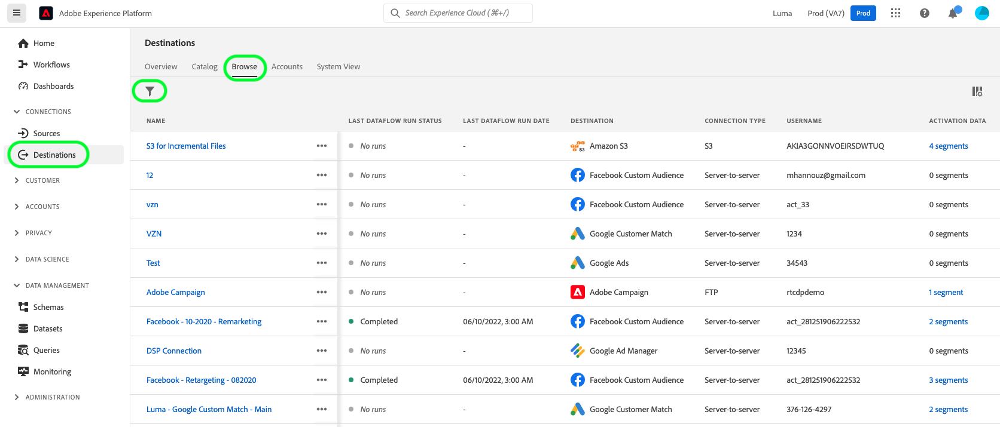
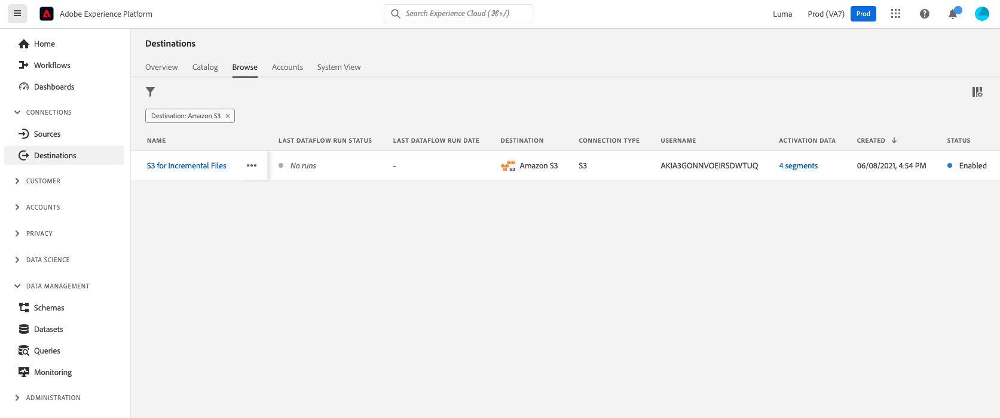
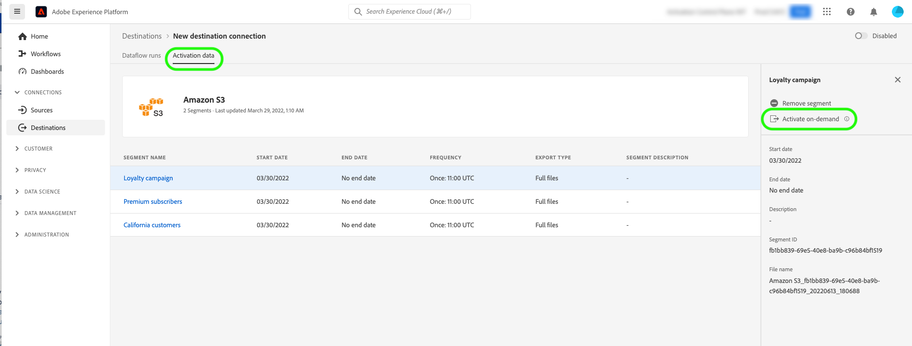
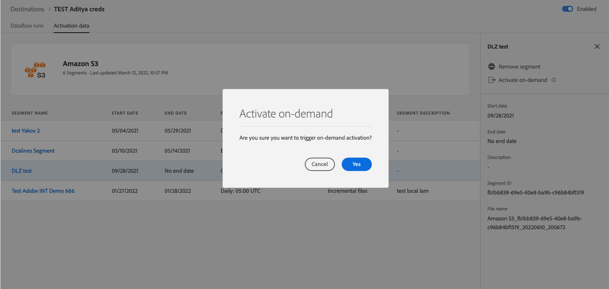
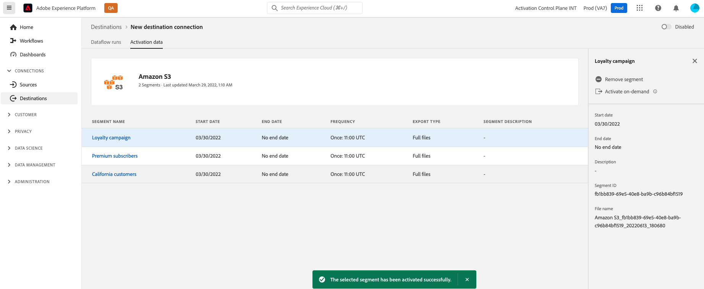

# (Beta) Export files on-demand to batch destinations using the Experience Platform UI

>[!IMPORTANT]
>
>The **[!UICONTROL Export file now]** option in Adobe Experience Platform is currently in Beta. The documentation and functionality are subject to change.
>Contact your Adobe representative for access to this functionality.

>[!IMPORTANT]
> 
>To activate data, you need the **[!UICONTROL View Destinations]**, **[!UICONTROL Activate Destinations]**, **[!UICONTROL View Profiles]**, and **[!UICONTROL View Segments]** [access control permissions](/help/access-control/home.md#permissions). Read the [access control overview](/help/access-control/ui/overview.md) or contact your product administrator to obtain the required permissions.

## **[!UICONTROL Export file now]** overview {#overview}

>[!CONTEXTUALHELP]
>id="platform_destinations_activationchaining_activatenow"
>title="Export file now"
>abstract="Select this control to deliver a full file export in addition to any previously scheduled exports. The file export is triggered immediately and it picks up the latest results from Experience Platform segmentation runs."

This article explains how to use the Experience Platform UI to export files on-demand to batch destinations such as [cloud storage](/help/destinations/catalog/cloud-storage/overview.md) and [email marketing](/help/destinations/catalog/email-marketing/overview.md) destinations.

The **[!UICONTROL Export file now]** control allows you to export a full file without interrupting the current export schedule of a previously scheduled audience. This export happens in addition to previously scheduled exports and does not change the export frequency of the audience. The file export is triggered immediately and it picks up the latest results from Experience Platform segmentation runs.

You can also use the Experience Platform APIs for this purpose. Read how to [activate audiences on-demand to batch destinations via the ad-hoc activation API](/help/destinations/api/ad-hoc-activation-api.md).

## Prerequisites {#prerequisites}

To export files on-demand to batch destinations, you must have successfully [connected to a destination](./connect-destination.md). If you haven't done so already, go to the [destinations catalog](../catalog/overview.md), browse the supported destinations, and configure the destination that you want to use.

## How to export files on-demand {#how-to-export-files-on-demand}

1. Go to **[!UICONTROL Connections > Destinations]**, select the **[!UICONTROL Browse]** tab and the filter symbol to show existing connections to your desired batch destinations.
    
    

2. Select your desired destination connection to inspect the existing dataflow to the destination.

    

3. Select the **[!UICONTROL Activation data]** tab and select the audience for which you want to export a file on-demand and select the **[!UICONTROL Export file now]** control to trigger a one-time export which will deliver a file to your batch destination.

    >[!IMPORTANT]
    >
    >Selecting multiple audiences to export files on-demand in bulk is currently not supported in the UI. Use the [ad-hoc activation API](/help/destinations/api/ad-hoc-activation-api.md) for that purpose.

    

4. Select **[!UICONTROL Yes]** to confirm and trigger the file export.

    

5. A confirmation message appears, letting you know that the file export has started.

    

6. You can also switch to the **[!UICONTROL Dataflow runs]** tab to confirm that the file export has kicked off.

## Considerations {#considerations}

Keep in mind the following considerations when using the **[!UICONTROL Export file now]** control:

* **[!UICONTROL Export file now]** works only for audiences whose schedule in the batch activation dataflow overlaps with the present date. This includes audiences with schedules that have no end date (export frequency of **[!UICONTROL Once]**), or where the end date has not yet passed.
* When adding an audience to an existing dataflow, wait for at least 15 minutes until using the **[!UICONTROL Export file now]** control.
* If you change an audience's merge policy, or if you create an audience which uses a new merge policy, wait 24 hours until using the **[!UICONTROL Export file now]** control.

## UI error messages {#ui-error-messages}

When using the **[!UICONTROL Export file now]** control, you might encounter any of the error messages listed below. Review the table to understand how to address them when they do appear.

|Error message | Resolution |
|---------|----------|
| Run already going on for audience `segment ID` for order `dataflow ID` with run id `flow run ID` | This error message indicates that an ad-hoc activation flow is currently ongoing for an audience. Wait for the job to finish before triggering the activation job again.|
| Audiences `<segment name>` are not part of this dataflow or out of schedule range! | This error message indicates that the audiences you selected to activate are not mapped to the dataflow or that the activation schedule set up for the audiences has either expired or not yet started. Check if the audience is indeed mapped to the dataflow and verify that the audience activation schedule overlaps with the present date.|

## Related information {#related-information}

* [Activate audiences to batch destinations on-demand using the Experience Platform APIs](/help/destinations/api/ad-hoc-activation-api.md)
* [Activate audience data to batch profile export destinations](/help/destinations/ui/activate-batch-profile-destinations.md)
