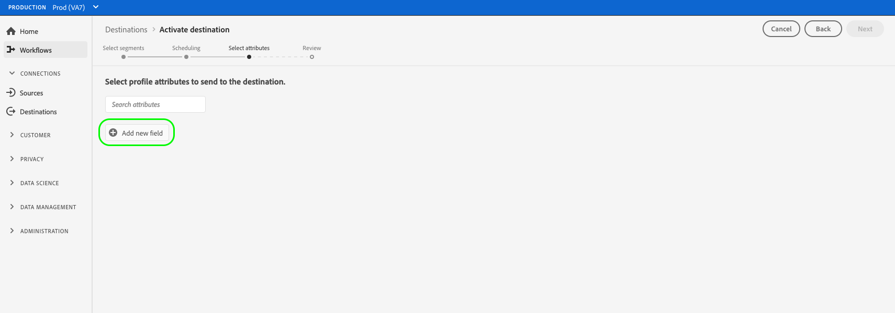
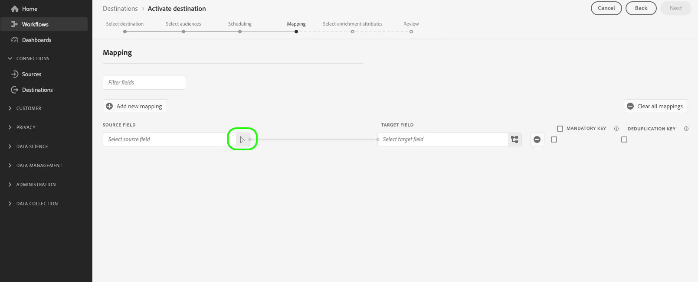
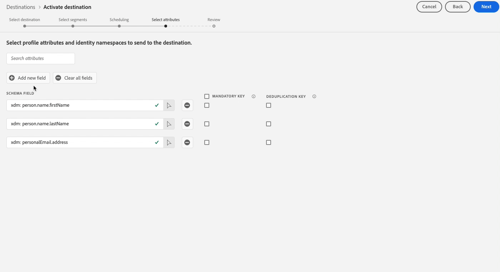

# Select profile attributes (legacy)

>[!IMPORTANT]
>
>All cloud storage destinations in the catalog can view an improved [[!UICONTROL Mapping] step](/help/destinations/ui/activate-batch-profile-destinations.md#mapping) which replaces the **[!UICONTROL Select attributes]** step described in this article.
>
>This **[!UICONTROL Select attributes]** step is still displayed for the [!DNL Adobe Campaign], Oracle Responsys, Oracle Eloqua, and Salesforce Marketing Cloud email marketing destinations.

For profile-based destinations, you must select the profile attributes that you want to send to the target destination.

1. In the **[!UICONTROL Select attributes]** page, select **[!UICONTROL Add new field]**.
    
    {zoomable="yes"}

2. Select the arrow to the right of the **[!UICONTROL Schema field]** entry.

    {zoomable="yes"}

3. In the **[!UICONTROL Select field]** page, select the XDM attributes or identity namespaces that you want to send to the destination, then choose **[!UICONTROL Select]**.

    {zoomable="yes"}

4. To add more mappings, repeat steps one to three.

>[!NOTE]
>
> [!DNL Adobe Experience Platform] prefills your selection with four recommended, commonly used attributes from your schema: `person.name.firstName`, `person.name.lastName`, `personalEmail.address`, `segmentMembership.seg_namespace.seg_id.status`.

{zoomable="yes"} 

>[!IMPORTANT]
>
>Due to a known limitation, you cannot currently use the **[!UICONTROL Select field]** window to add `segmentMembership.seg_namespace.seg_id.status` to your file exports. Instead, you must manually paste the value `xdm: segmentMembership.seg_namespace.seg_id.status` into the schema field, as shown below.
>
>{zoomable="yes"}

File exports vary in the following ways, depending on whether `segmentMembership.seg_namespace.seg_id.status` is selected:

* If the `segmentMembership.seg_namespace.seg_id.status` field is selected, exported files include **[!UICONTROL Active]** members in the initial full snapshot and **[!UICONTROL Active]** and **[!UICONTROL Expired]** members in subsequent incremental exports.
* If the `segmentMembership.seg_namespace.seg_id.status` field is not selected, exported files include only **[!UICONTROL Active]** members in the initial full snapshot and in subsequent incremental exports.
