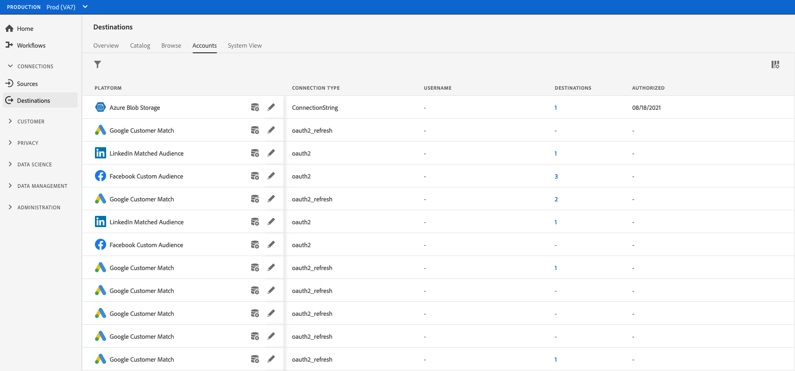
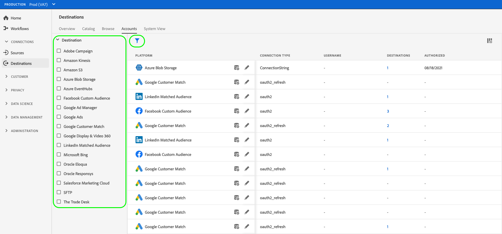
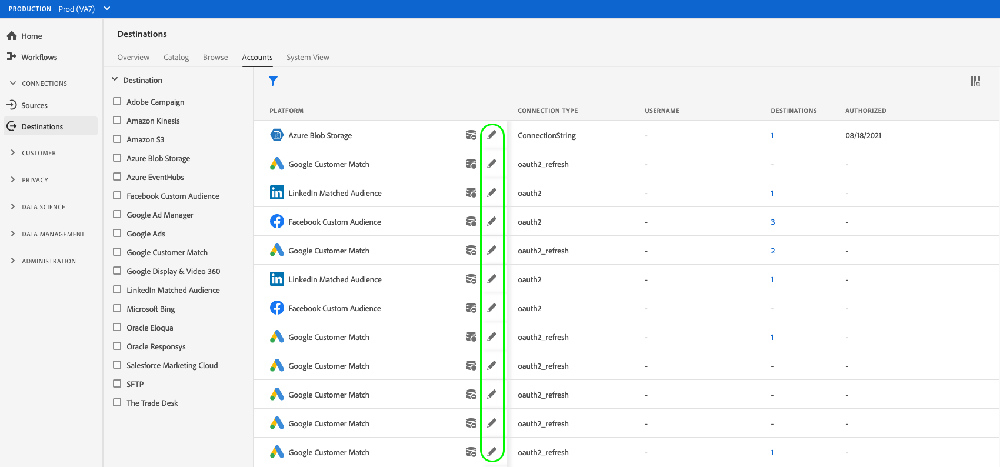
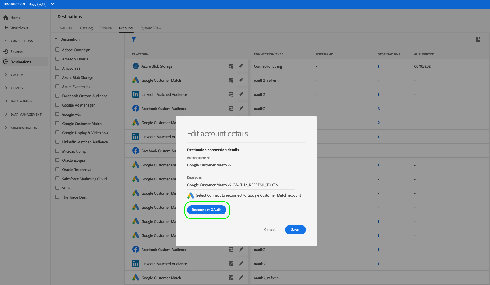
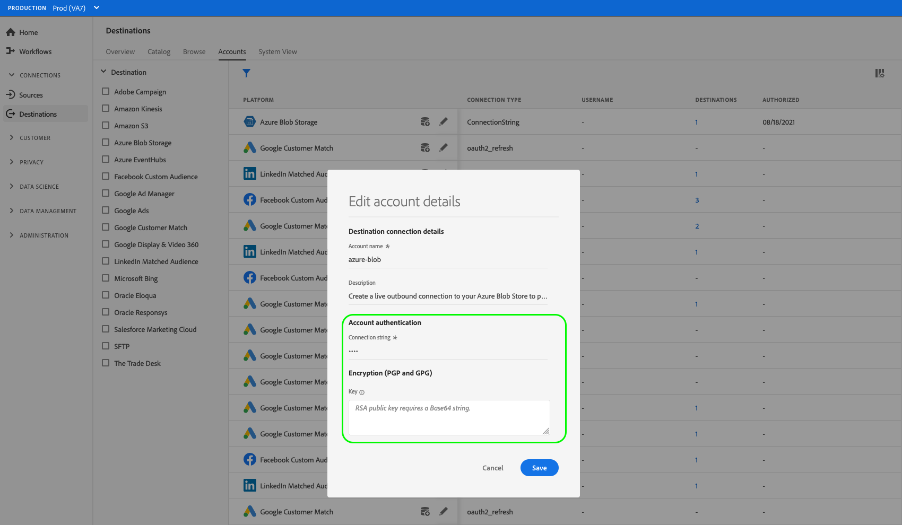
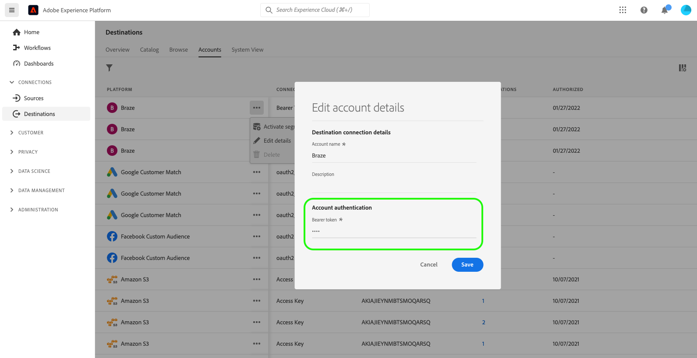
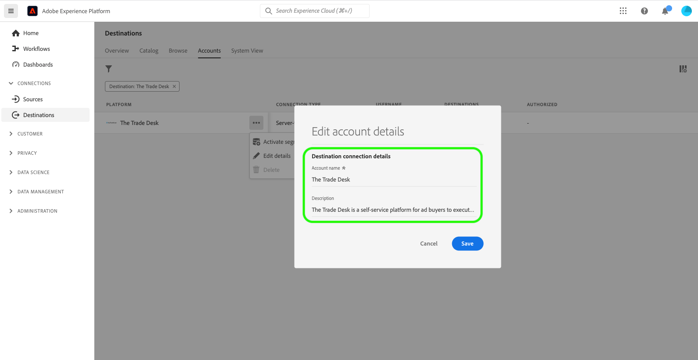

# Update destination accounts

## Overview {#overview}

The **[!UICONTROL Accounts]** tab shows you details about the connections that you have established with various destinations. Refer to the [Accounts overview](../ui/destinations-workspace.md#accounts) for all the information you can get on each destination account.

This tutorial covers the steps to update destination account details by using the Experience Platform UI.

You can update destination account details to refresh and re-authenticate credentials for your current or expired accounts for destinations you are currently using. Typically, OAuth and bearer tokens have a limited lifetime, depending on the destination platform. When these tokens expire, you can refresh them in the workflow described further below. This workflow directs you to go through the OAuth workflow or re-insert a token. Similarly, if a password or user access has changed in the downstream platform, you can refresh credentials.

For batch destinations, you can update the access or secret key, if any of those has changed. Additionally, should you want to encrypt your files moving forward, you can insert an RSA public key and your exported files will be encrypted going forward.

## Update accounts {#update}

Follow the steps below to update connection details to existing destinations.

1. Log in to the [Experience Platform UI](https://platform.adobe.com/) and select **[!UICONTROL Destinations]** from the left navigation bar. Select **[!UICONTROL Accounts]** from the top header to view your existing accounts.

    

2. Select the filter icon  on the top left to launch the sort panel. The sort panel provides a list of all your destinations. You can select more than one destination from the list to see a filtered selection of accounts associated with the selected destinations.

    

3. Select the ellipses (`...`) beside the name of the account you intend to update. A pop-up panel appears, providing options to **[!UICONTROL Activate audiences]**, **[!UICONTROL Edit details]**, and **[!UICONTROL Delete]** the account. Select the  **[!UICONTROL Edit details]** button to edit the account information.

    

4. Enter your updated account credentials.
   
   * For accounts that use an `OAuth1` or `OAuth2` connection type, select **[!UICONTROL Reconnect OAuth]** to renew your account credentials. You can also update the name and description of your account.
    
    

   * For accounts that use an `Access Key` or `ConnectionString` connection type, you can edit your account authentication information, including information such as access ID, secret keys, or connection strings. You can also update the name and description of your account.

    

    * For accounts that use a `Bearer token` connection type, you can input a new bearer token, if needed. You can also update the name and description of your account.

    

    * For accounts that use a `Server to server` connection type, you can update the name and description of your account.

    

5. Select **[!UICONTROL Save]** to finish the account details update.

## Next steps

By following this tutorial, you have successfully used the **[!UICONTROL destinations]** workspace to update existing accounts.

For more information about destinations, refer to the [destinations overview](../catalog/overview.md).