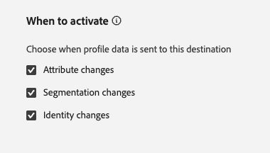
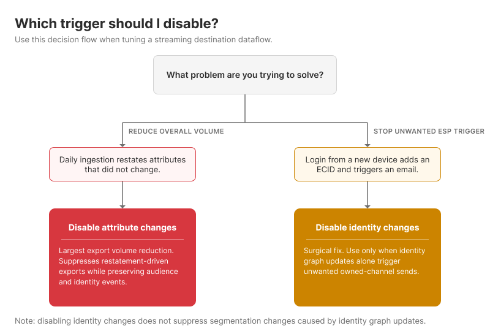
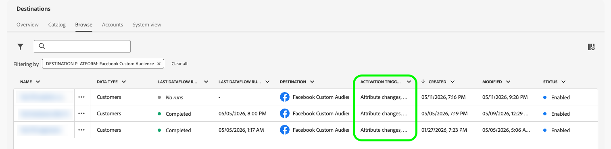

# When to activate

>[!IMPORTANT]
>
>This feature is currently in beta. The functionality and documentation are subject to change. This feature is also only available on-demand. Contact your Adobe representative for access.

>[!NOTE]
>
>For detailed information about how each profile change type triggers activation, see [Profile export behavior](/help/destinations/how-destinations-work/profile-export-behavior.md).

By default, [!DNL Adobe Experience Platform] exports data to a destination whenever any change occurs to a profile: an *attribute update*, an *audience qualification or disqualification*, or an *identity change*. This can generate a large volume of exports, many of which carry no meaningful change for downstream systems.

With the **[!UICONTROL When to activate]** feature, you get fine-grained control over which types of profile changes trigger exports for a given destination dataflow. You can enable or disable each trigger type independently. Disabling a trigger type suppresses exports caused only by that type of change.

## Supported destination types {#supported-destinations}

The **[!UICONTROL When to activate]** feature is supported for the following destination types:

- [Streaming API-based destinations](/help/destinations/how-destinations-work/profile-export-behavior.md#streaming-api-based-destinations)
- [Streaming profile export (enterprise) destinations](/help/destinations/how-destinations-work/profile-export-behavior.md#streaming-profile-destinations): [[!DNL HTTP API]](/help/destinations/catalog/streaming/http-destination.md), [[!DNL Amazon Kinesis]](/help/destinations/catalog/cloud-storage/amazon-kinesis.md), [[!DNL Azure Event Hubs]](/help/destinations/catalog/cloud-storage/azure-event-hubs.md), and [[!DNL Snowflake Streaming]](/help/destinations/catalog/warehouses/snowflake.md).

## Activation trigger types {#trigger-types}

>[!CONTEXTUALHELP]
>id="platform_destinations_activation_triggers"
>title="When to activate"
>abstract="Select which types of profile changes trigger exports to this destination. All three triggers are enabled by default. Attribute changes occur when profile attributes are updated from any upstream data source. Segmentation changes occur when a profile enters or exits an audience evaluated by Experience Platform Segmentation Service. Identity changes occur when a profile identity graph is updated, for example when a new identity is added."

The table below describes each trigger type. Triggers are listed in order of expected activation volume, from highest to lowest.

>[!NOTE]
>
>All three trigger types are enabled by default. If you had existing dataflows before this feature was released, their behavior is unchanged unless you explicitly update the settings.

| Trigger type | What triggers it | When to disable it |
| --- | --- | --- |
| **[!UICONTROL Attribute changes]** | Any of the profile's mapped attributes are updated. | You want to suppress high-frequency attribute updates from triggering exports to a partner API. |
| **[!UICONTROL Segmentation changes]** | A profile enters or exits an audience evaluated by [!DNL Experience Platform] Segmentation Service. |  |
| **[!UICONTROL Identity changes]** | A profile's identity graph changes, for example when a new identity is added or an existing identity is updated. | A known user logs in from a new device, adding a new ECID to their identity graph, and you do not want this to trigger an email, SMS, or other owned and operated media execution from the downstream system. |

{style="table-layout:auto"}

## Default behavior {#default-behavior}

All three trigger types are enabled on every new and existing dataflow. When you disable one or more triggers, exports caused by that trigger type are suppressed. Exports that result from a combination of trigger types still fire if at least one enabled trigger caused the change.

## Best practices and recommendations {#best-practices}

The best trigger configuration depends on your use case. Use the following guidance as a starting point.

**Start with attribute changes for the largest volume reduction.** Disabling the attribute changes trigger produces the most significant reduction in export volume for most organizations and addresses the most common source of unnecessary exports. For the underlying behavior, see what determines a data export for [enterprise destinations](/help/destinations/how-destinations-work/profile-export-behavior.md#enterprise-behavior) and for [streaming API-based destinations](/help/destinations/how-destinations-work/profile-export-behavior.md#streaming-behavior). The trigger fires whenever any mapped attribute is updated, including from daily batch ingestion that restates values that have not meaningfully changed.

For example, if you synchronize your CRM with [!DNL Experience Platform] on a daily basis, or you recompute a propensity or churn prediction score daily, most profiles are restated with values identical to the previous day. With attribute changes enabled, every one of those restatements triggers an export. Disabling the trigger suppresses these restatement-driven exports while preserving exports driven by audience qualification and identity events.

**Keep segmentation changes enabled.** Audience entry and exit events are typically the most meaningful signals for downstream systems such as CRMs and ad platforms. Most organizations keep this trigger enabled.

**Use identity changes as a surgical fix for specific scenarios.** Unlike attribute changes, disabling identity changes is not a broad volume-reduction lever, and you should apply it only in precise situations where new identities being added to a profile produce unwanted downstream activity.

A representative example is an email service provider (ESP) reacting to profile updates from [!DNL Experience Platform]: a known user logs in from a new device, which adds a new ECID to their identity graph, and you do not want that identity update alone to trigger an email or SMS. In this situation, disabling the identity changes trigger suppresses the unwanted export.

>[!IMPORTANT]
>
>Identity changes can be a high-value signal in many activation use cases. For example, when an unauthenticated visitor browsing your site authenticates by submitting their email, the identity graph update links their prior browsing behavior to a known profile. For verticals such as travel, retail, or financial services, this is often the moment a visitor qualifies as a high-intent prospect and should be exported to downstream systems. Disable identity changes only when you have a clear use case like the ESP example described earlier in this section, and you understand the trade-off.
>
>Disabling identity changes does not suppress segmentation changes that result from identity graph updates. When a new identity is added to a profile, the behaviors associated with that identity are also brought into the profile view, which can cause the profile to qualify for or disqualify from audiences. Those segmentation changes continue to trigger exports as long as the segmentation changes trigger is enabled.

Each organization has different use cases, so different trigger combinations may apply. Contact your Adobe account manager or Customer Care for guidance tailored to your activation setup.

## Configure When to activate {#configure}

You can configure the **[!UICONTROL When to activate]** settings in two places:

- **During activation setup:** The **[!UICONTROL When to activate]** step appears in the activation workflow when you set up a streaming API-based or enterprise destination. See [Activate audiences to streaming destinations](/help/destinations/ui/activate-segment-streaming-destinations.md#when-to-activate) and [Activate audiences to streaming profile export destinations](/help/destinations/ui/activate-streaming-profile-destinations.md#when-to-activate).
- **On existing dataflows:** Use the **[!UICONTROL Edit destination]** control on a dataflow to change the settings at any time. See [Edit activation dataflows](/help/destinations/ui/edit-activation.md#edit-when-to-activate).

## View trigger configuration in the Browse tab {#browse-tab}

The **[!UICONTROL Browse]** tab in the [Destinations workspace](/help/destinations/ui/destinations-workspace.md#browse) shows an **[!UICONTROL Activation trigger]** column. The column displays the triggers currently configured for each dataflow. Use this column to quickly review which profile change types activate each of your destination connections.

