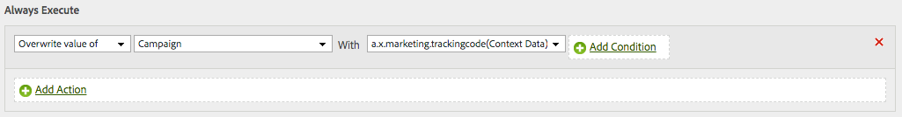

# Using Adobe Analytics with Platform Web SDK

The Adobe Experience Platform [!DNL Web SDK] can send data to Adobe Analytics. This works by translating `xdm` into a format the Adobe Analytics can use.

## Setup

Adobe Analytics automatically picks up the data you are sending if you have a report suite mapped in the Customer Config UI. Here you can map one or more reportings to a given config. After a report suite is mapped, the data will automatically begin flowing.

## XDM field group

To make it easier to capture the most common Adobe Analytics metrics, we provide an Analytics field group that you can use. For more details on this schema, see the documenation for the [Adobe Analytics ExperienceEvent Full Extension schema field group](../../../xdm/field-groups/event/analytics-full-extension.md)

## Automatically mapped data

The Adobe Experience Platform [!DNL Edge Network] automatically maps many XDM variables. The complete list of these variables is listed [here](automatically-mapped-vars.md).

## Manually mapped data

Any data that is not automatically mapped by the [!DNL Edge Network] can be accessed via processing rules. The data is flattened using dot notation and available as contextData.

If you had a schema that looked like this.

```javascript
{
  key:value,
  object:{
    key1:value1,
    key2:value2
  },
  array:[
    "v0",
    "v1",
    "v2"
  ],
  arrayofobjects:[
    {
      obj1key:objval0
    },
    {
      obj2key:objval1
    }
  ]
}
```

Then these would be the context data keys available to you.

```javascript
a.x.key //value
a.x.object.key1 //value1
a.x.object.key2 //value2
a.x.array.0 //v0
a.x.array.1 //v1
a.x.array.2 //v2
a.x.arrayofobjects.0.obj1key //objval0
a.x.arrayofobjects.1.obj2key //objval1
```

Here is an example of a processing rule that would use this data.



>[!NOTE]
>
>With the Edge Network collection, all events are sent to Analytics as well as to any other services you have configured for your datastream. For example, if you have both Analytics and Target configured as services and you make separate calls for personalization and for Analytics, both events will be sent to Analytics as well as Target. These events will be recorded in Analytics reporting and can affect metrics like bounce rate.
