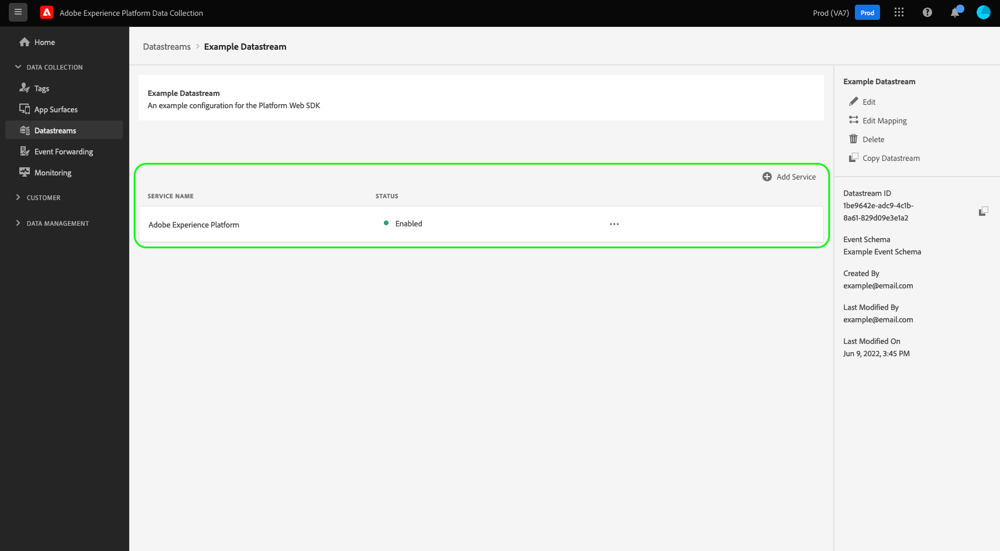

# Configure a datastream

This document covers the steps for configuring a [datastream](./overview.md) in the UI. 

## Access the [!UICONTROL Datastreams] workspace

You can create and manage datastreams in the Data Collection UI or Experience Platform UI by selecting **[!UICONTROL Datastreams]** in the left navigation.

The [!UICONTROL Datastreams] tab displays a list of existing datastreams, including their friendly name, ID, and last modified date. Select the name of a datastream to [view its details and configure services](#view-details).

Select the "more" icon (**...**) for a particular datastream to reveal more options. Select **[!UICONTROL Edit]** to update the [basic configuration](#configure) for the datastream, or select **[!UICONTROL Delete]** to remove the datastream.

## Create a new datastream {#create}

To create a datastream, start by selecting **[!UICONTROL New Datastream]**.

The datastream creation workflow appears, starting at the configuration step. From here, you must provide a name and optional description for the datastream.

If you are configuring this datastream for use in Experience Platform and are using the Platform Web SDK, you must also select an [event-based Experience Data Model (XDM) schema](../../xdm/classes/experienceevent.md) to represent the data you plan on ingesting.

Select **[!UICONTROL Advanced Options]** to reveal additional controls to configure the datastream.

 {#advanced-options}

| Setting | Description |
| --- | --- |
| [!UICONTROL Geo Location] | Determines whether Geo lookups occur based on the user's IP address. The default setting **[!UICONTROL None]** disables any Geo lookups, while the **[!UICONTROL City]** setting provides GPS coordinates to two decimal places.|
| [!UICONTROL First Party ID Cookie] | When enabled, this setting tells the Edge Network to refer to a specified cookie when looking up a [first-party device ID](../identity/first-party-device-ids.md), rather than looking up this value in the Identity Map.  When enabling this setting, you must provide the name of the cookie where the ID is expected to be stored.|
| [!UICONTROL Third Party ID Sync] | ID syncs can be grouped into containers to allow different ID syncs to be run at different times. When enabled, this setting lets you specify which container of ID syncs is run for this datastream.|
| [!UICONTROL Third Party ID Sync Container ID] | The ID of the container to be used for third party ID sync.|
| [!UICONTROL Container ID Overrides] | In this section you can define additional third party ID sync container ID which you can use to override the default one. |
| [!UICONTROL Access Type] | Defines the authentication type that the Edge Network accepts for the datastream. <ul><li>**[!UICONTROL Mixed Authentication]**: When this option is selected, the Edge Network accepts both authenticated and unauthenticated requests. Select this option when you plan to use the Web SDK or [Mobile SDK](https://aep-sdks.gitbook.io/docs/), along with the [Server API](../../server-api/overview.md). </li><li>**[!UICONTROL Authenticated Only]**: When this option is selected, the Edge Network only accepts authenticated requests. Select this option when you plan to use only the Server API and want to prevent any unauthenticated requests from being processed by the Edge Network.</li></ul>|

From here, if you are configuring your datastream for Experience Platform, follow the tutorial on [Data Prep for Data Collection](./data-prep.md) to map your data to a Platform event schema before returning to this guide. Otherwise, select **[!UICONTROL Save]** and continue to the next section.

## View datastream details {#view-details}

After configuring a new datastream or selecting an existing one to view, the details page for that datastream appears. Here you can find further information about the datastream, including its ID.

From the datastream details screen, you can [add services](#add-services) to enable capabilities from the Adobe Experience Cloud products you have access to. You can also edit the datastream's [basic configuration](#create), update its [mapping rules](./data-prep.md), [copy the datastream](#copy), or delete it entirely.

## Add services to a datastream {#add-services}

On the details page of a datastream, select **[!UICONTROL Add Service]** to start adding available services for that datastream.

On the next screen, use the dropdown menu to select a service to configure for this datastream. Only the services that you have access to will appear in this list.

Select the desired service, fill in the configuration options that appear, and then select **[!UICONTROL Save]** to add the service to the datastream. All added services appear in the details view for the datastream.

The subsections below describe the configuration options for each service.

>[!NOTE]
>
>Each service configuration contains an **[!UICONTROL Enabled]** toggle that is automatically activated when the service is selected. To disable the selected service for this datastream, select the **[!UICONTROL Enabled]** toggle again.

### Adobe Analytics settings {#analytics}

This service controls whether and how data is sent to Adobe Analytics. Additional details can be found in the guide on [sending data to Analytics](../data-collection/adobe-analytics/analytics-overview.md).

| Setting | Description |
| --- | --- |
| [!UICONTROL Report Suite ID] | **(Required)** The ID of the Analytics report suite that you want to send data to. This ID can be found in the Adobe Analytics UI under [!UICONTROL Admin] > [!UICONTROL ReportSuites]. If multiple report suites are specified, then data is copied to each report suite. |
| [!UICONTROL Report Suite Overrides]| In this section, you can add additional report suite IDs that you can use to override the default one. |

### Adobe Audience Manager settings {#audience-manager}

This service controls whether and how data is sent to Adobe Audience Manager. All that is needed to send data to Audience Manager is to enable this section. The other settings are optional but encouraged.

| Setting | Description |
| --- | --- |
| [!UICONTROL Cookie Destinations Enabled] | Allows the SDK to share segment information via [cookie destinations](https://experienceleague.adobe.com/docs/audience-manager/user-guide/features/destinations/custom-destinations/create-cookie-destination.html) from [!DNL Audience Manager]. |
| [!UICONTROL URL Destinations Enabled] | Allows the SDK to share segment information via [URL destinations](https://experienceleague.adobe.com/docs/audience-manager/user-guide/features/destinations/custom-destinations/create-url-destination.html) from [!DNL Audience Manager]. |

### Adobe Experience Platform settings {#aep}

>[!IMPORTANT]
>
>When enabling a datastream for Platform, take note of the Platform sandbox that you are currently using, as displayed in the top ribbon of the UI.
>
>
>
>Sandboxes are virtual partitions in Adobe Experience Platform that allow you to isolate your data and implementations from others in your organization. Once a datastream is created, its sandbox cannot be changed. For more details about the role of sandboxes in Experience Platform, see the [sandboxes documentation](../../sandboxes/home.md). 

This service controls whether and how data is sent to Adobe Experience Platform.

| Setting | Description |
|---| --- |
| [!UICONTROL Event Dataset] | **(Required)** Select the Platform dataset that customer event data will be streamed to. This schema must use the [XDM ExperienceEvent class](../../xdm/classes/experienceevent.md). To add additional datasets, select **[!UICONTROL Add Event Dataset]**. |
| [!UICONTROL Profile Dataset] | Select the Platform dataset that customer attribute data will be sent to. This schema must use the [XDM Individual Profile class](../../xdm/classes/individual-profile.md). |
| [!UICONTROL Offer Decisioning] | Select this checkbox to enable Offer Decisioning for a Platform Web SDK implementation. See the guide on [using Offer Decisioning with the Platform Web SDK](../personalization/offer-decisioning/offer-decisioning-overview.md) for more implementation details.  For more information on Offer Decisioning capabilities, refer to the [Adobe Journey Optimizer documentation](https://experienceleague.adobe.com/docs/journey-optimizer/using/offer-decisioniong/get-started/starting-offer-decisioning.html). |
| [!UICONTROL Edge Segmentation] | Select this checkbox to enable [edge segmentation](../../segmentation/ui/edge-segmentation.md) for this datastream. When the SDK sends data through an edge-segmentation-enabled datastream, any updated segment memberships for the profile in question are sent back in the response.  This option can be used in combination with [!UICONTROL Personalization Destinations] for [next-page personalization use cases](../../destinations/ui/configure-personalization-destinations.md). |
| [!UICONTROL Personalization Destinations] | When enabling this after enabling the [!UICONTROL Edge Segmentation] checkbox, this option allows the datastream to connect to personalization destinations, such as [Custom Personalization](../../destinations/catalog/personalization/custom-personalization.md).  Refer to the destinations documentation for specific steps on [configuring personalization destinations](../../destinations/ui/configure-personalization-destinations.md). |
| [!UICONTROL Adobe Journey Optimizer] | Select this checkbox to enable [Adobe Journey Optimizer](https://experienceleague.adobe.com/docs/journey-optimizer/using/ajo-home.html) for this datastream.    Enabling this option allows the datastream to return personalized content from web and app-based inbound campaigns in [!DNL Adobe Journey Optimizer]. This option requires [!UICONTROL Edge Segmentation] to be active. If [!UICONTROL Edge Segmentation] is unchecked, this option is greyed out. |

### Adobe Target settings {#target}

This service controls whether and how data is sent to Adobe Target.

| Setting | Description |
| --- | --- |
| [!UICONTROL Property Token] | [!DNL Target] allows customers to control permissions through the use of properties. For more information on properties, see the guide on [configuring enterprise permissions](https://experienceleague.adobe.com/docs/target/using/administer/manage-users/enterprise/properties-overview.html) in the [!DNL Target] documentation.  The property token can be found in the Adobe Target UI under [!UICONTROL Setup] > [!UICONTROL Properties]. |
| [!UICONTROL Target Environment ID] | [Environments in Adobe Target](https://experienceleague.adobe.com/docs/target/using/administer/hosts.html) help you manage your implementation through all stages of development. This setting specifies which environment you are going to use with this datastream.  Best practice is to set this differently for each of your `dev`, `stage`, and `prod` datastream environments to keep things simple. However, if you already have Adobe Target environments defined, you can use those. |
| [!UICONTROL Target Third Party ID namespace] | The identity namespace for the `mbox3rdPartyId` you want to use for this datastream. See the guide on [implementing `mbox3rdPartyId` with the Web SDK](../personalization/adobe-target/using-mbox-3rdpartyid.md) for more information. |
| [!UICONTROL Property Token Overrides] | In this section you can define additional property tokens that you can use to override the default one. |

### [!UICONTROL Event Forwarding] settings

This service controls whether and how data is sent to [event forwarding](../../tags/ui/event-forwarding/overview.md).

| Setting | Description |
| --- | --- |
| [!UICONTROL Launch Property] | **(Required)** The event forwarding property that you want to send data to. |
| [!UICONTROL Launch Environment] | **(Required)** The environment within the selected property that you want to send data to. |

>[!NOTE]
>
>You can select **[!UICONTROL Manually enter IDs]** to type in the property and environment names instead of using the dropdown menus.

## Copy a datastream {#copy}

You can create a copy of an existing datastream and alter its details as needed.

>[!NOTE]
>
>Datastreams can only be copied within the same [sandbox](../../sandboxes/home.md). In other words, you cannot copy a datastream from one sandbox to another.

From the main page in the [!UICONTROL Datastreams] workspace, select the ellipsis (**....**) for the datastream in question, then select **[!UICONTROL Copy]**.

![Image showing the [!UICONTROL Copy] option being selected from the datastream list view](../assets/datastreams/configure/copy-datastream-list.png)

Alternatively, you can select **[!UICONTROL Copy Datastream]** from the details view of a given datastream.

![Image showing the [!UICONTROL Copy] option being selected from the datastream details view](../assets/datastreams/configure/copy-datastream-details.png)

A confirmation dialog appears, prompting you to provide a unique name for the new datastream to be created, along with details about the configuration options that will be copied over. When ready, select **[!UICONTROL Copy]**.

The main page of the [!UICONTROL Datastreams] workspace reappears with the new datastream listed.

## Next steps

This guide covered how to manage datastreams in the Data Collection UI. For more information on how to install and configure the Web SDK after setting up a datastream, refer to the [Data Collection E2E guide](../../collection/e2e.md#install).
