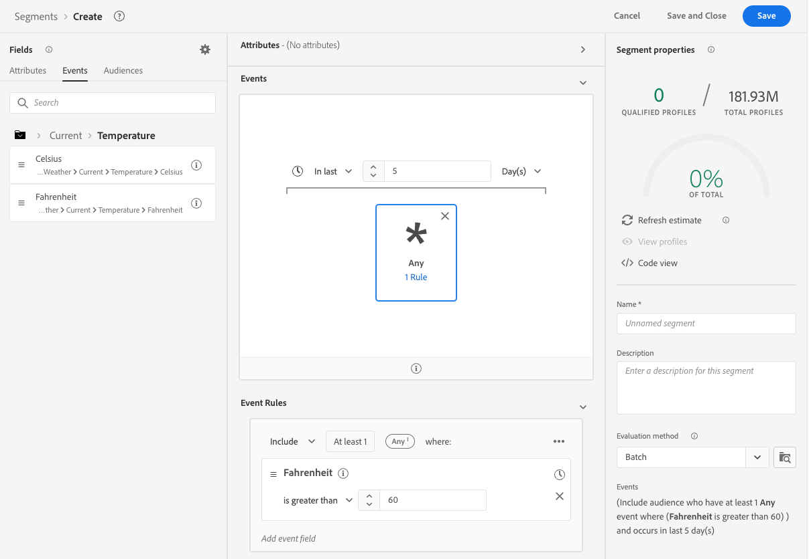

# Weather 

Adobe has partnered with the Weather Channel and IBM Company to bring the additional context of weather in the United States to the data collected via Datastream. This can be used for Analytics, Targeting and Segment creation. There are 3 types of data that are available from the Weather Channel. 

* __Current Weather__ - The current weather conditions of the user based on their location. This include current temperature, percipitation, cloud cover, etc
* __Forecasted Weather__ - The forecast includes the 1,2,3,5,7 and 10 day forecast for the users
* __Triggers__ - These triggers are specific combinations that map to different semantic weather conditions There are three different types of weather triggers. 
  * __Weather Triggers__ - Semantically meaningful conditions such as cold or rainy. These can differ in their definitions between various climates
  * __Product Triggers__ - Conditions that would lead to the purchase of different types of products. For example cold weather forecasted could mean weather purchase of coats are more likely. 
  * __Severe Weather Triggers__ - Severe weather warnings like winter storm warnings or hurricane warnings. 

## Prerequisites {#prerequisites}

- You must license this data from The Weather Channel. They will then enable it on your account. 
- Weather data is available only through Datastreams. So you must use the WebSDK, Mobile Edge Extension or the Edge API to leverage this data. Remember the SDKs can often be co-deployed if needed
- Geo-Location Enabled. The Datastream must have [GeoLocation enabled](../configure.md#advanced-options)
- Add the [Weather Field group](#experience-platform) to the schema you are using. 

## Provisioning

Once you have licensed the data from the Weather Channel. They will enable your account to access the data. Then reach out to Adobe Customer Care to have the data enabled on your datastream. Once enabled on the data stream the data will automatically be appended. You can validate that it is being added by running an edge trace with the debugger or by using Assurance to trace a hit through the edge. 

### Adobe Experience Platform {#experience-platform}
In Adobe Experience Platform you will need to add the weather field groups to the schema of the event dataset you are using in your datastream. There are three field groups available. 

* Forecasted Weather
* Current Weather
* Weather Triggers

## Access the Weather Data
Once you have everything setup then you can access the weather data in a variety of ways throughout the Adobe applicaitons. 

### Adobe Analytics

The weather data is available to map via processing rules along with the rest of your XDM. The available fields to map are available in the [weather reference page](weather-reference.md). As with all XDM the keys are prefixed with `a.x`. For example if I had `weather.current.temperature.farenheit` it would show up in Analytics as `a.x.weather.current.temperature.farenheit`

### Adobe Customer Journey Analytics

The weather data is available in the dataset that is specified in the datastream. As long as the weather attributes are in the schema [see above](#prerequisites-prerequisites) they will be available to [add to a data view](https://experienceleague.adobe.com/docs/analytics-platform/using/cja-dataviews/create-dataview.html?lang=en) in Customer Journey Analytics. 

### Real-Time Customder Data Platform {#real-time-data-platform}

Weather is available in the Real-Time Customer Data Platform (RT-CDP) for use in segments. The weather data is attached to the events so you will that are collected in real-time. 

Because weather is ephemeral we stronlgy advise you constrain the segment in time as in the example above. Having a cold day in the last day or two is much more impactful than someone having a cold day 6 months ago. 

See the [weather reference page](weather-reference.md) for the available fields. 

### Adobe Target {#Target}

With in Adobe Target the weather data can be used to create audiences to help drive personalization in real-time. The data is passed to Target as mBox parameters. It can be access as a custom mBox parameter. 

The parameter is the XDM path to the field you want. See the [weather reference page](weather-reference.md) for the available fields and their paths. 