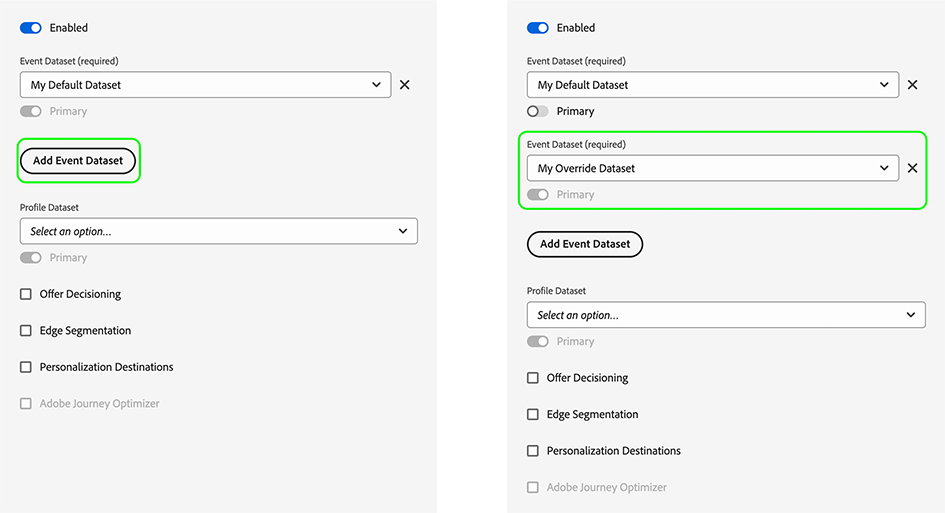
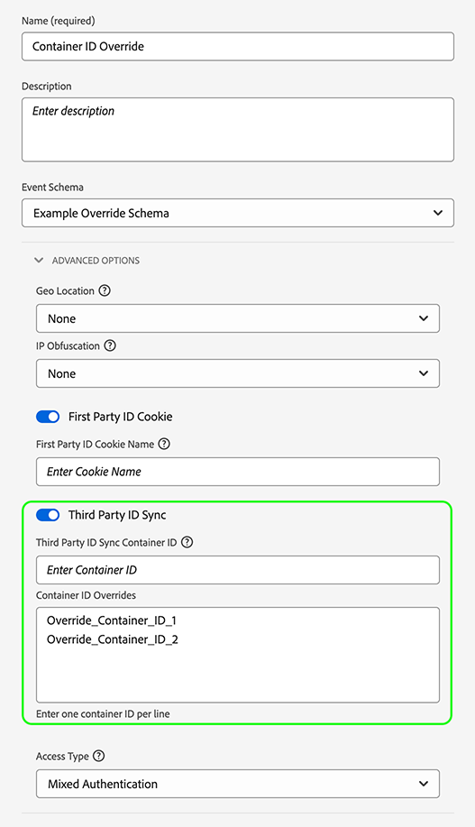

# Configure datastream overrides

Datastream overrides allow you to define additional configurations for your datastreams, which get passed to the Edge Network via the Web SDK.

This helps you trigger different datastream behaviors than the default ones, without creating a new datastream or modifying your existing settings.

Datastream configuration override is a two step process:

1. First, you must define your datastream configuration overrides in the [datastream configuration page](configure.md).
2. Then, you must send the overrides to the Edge Network either via a Web SDK command, or by using the Web SDK [tag extension](../extension/web-sdk-extension-configuration.md).

This article explains the end-to-end datastream configuration override process for every type of supported override.

## Configure datastream overrides in the Datastreams UI {#configure-overrides}

Datastream configuration overrides allow you to modify the following datastream configurations:

* Experience Platform event datasets
* Adobe Target property tokens
* Audience Manager ID sync containers
* Adobe Analytics report suites

### Datastream overrides for Adobe Target {#target-overrides}

To configure datastream overrides for an Adobe Target datastream, you must first have an Adobe Target datastream created. Follow the instructions to [configure a datastream](configure.md) with the [Adobe Target](configure.md#target) service.

Once you've created the datastream, edit the [Adobe Target](configure.md#target) service that you have added and use the **[!UICONTROL Property Token Overrides]** section to add the desired datastream overrides, as shown in the image below. Add one property token per line.


After you've added the desired overrides, save your datastream settings.

You should now have the Adobe Target datastream overrides configured. Now you can [send the overrides to the Edge Network via the Web SDK](#send-overrides).

### Datastream overrides for Adobe Analytics {#analytics-overrides}

To configure datastream overrides for an Adobe Analytics datastream, you must first have an [Adobe Analytics](configure.md#analytics) datastream created. Follow the instructions to [configure a datastream](configure.md) with the [Adobe Analytics](configure.md#analytics) service.

Once you've created the datastream, edit the [Adobe Analytics](configure.md#target) service that you have added and use the **[!UICONTROL Report Suite Overrides]** section to add the desired datastream overrides, as shown in the image below.

Select **[!UICONTROL Show Batch Mode]** to enable batch editing of the report suite overrides. You can copy and paste a list of report suite overrides, entering one report suite per line.


After you've added the desired overrides, save your datastream settings.

You should now have the Adobe Analytics datastream overrides configured. Now you can [send the overrides to the Edge Network via the Web SDK](#send-overrides).

### Datastream overrides for Experience Platform event datasets {#event-dataset-overrides}

To configure datastream overrides for Experience Platform event datasets, you must first have an [Adobe Experience Platform](configure.md#aep) datastream created. Follow the instructions to [configure a datastream](configure.md) with the [Adobe Experience Platform](configure.md#aep) service.

Once you've created the datastream, edit the [Adobe Experience Platform](configure.md#aep) service that you have added and select the **[!UICONTROL Add Event Dataset]** option to add one or more override event datasets, as shown in the image below.



After you've added the desired overrides, save your datastream settings.

You should now have the Adobe Experience Platform datastream overrides configured. Now you can [send the overrides to the Edge Network via the Web SDK](#send-overrides).

### Datastream overrides for third party ID sync containers {#container-overrides}

To configure datastream overrides for third party ID sync containers, you must first have a datastream created. Follow the instructions to [configure a datastream](configure.md) to create one.

Once you've created the datastream, go to **[!UICONTROL Advanced Options]** and enable the **[!UICONTROL Third Party ID Sync]** option.

Then, use the **[!UICONTROL Container ID Overrides]** section to add the container IDs that you want to override the default setting, as shown in the image below.

>[!IMPORTANT]
>
>Container IDs must be numeric values, like `1234567`, and not strings, such as `"1234567"`. If you send a string value through the Web SDK as a container ID override, you will receive an error.



After you've added the desired overrides, save your datastream settings.

You should now have the ID sync container overrides configured. Now you can [send the overrides to the Edge Network via the Web SDK](#send-overrides).

## Send the overrides to the Edge Network via the Web SDK {#send-overrides}

>[!NOTE]
>
>As an alternative to sending the configuration overrides via Web SDK commands, you can add the configuration overrides to the Web SDK [tag extension](../extension/web-sdk-extension-configuration.md).

After [configuring the datastream overrides](#configure-overrides) in the Data Collection UI, you can now send the overrides to the Edge Network, via the Web SDK.

Sending the overrides to the Edge Network via the Web SDK is the second and final step of activating datastream configuration overrides.

The datastream configuration overrides are sent to the Edge Network through the `edgeConfigOverrides` Web SDK command. This command creates datastream overrides that are passed on to the [!DNL Edge Network] on the next command, or, in the case of the `configure` command, for every request.

The `edgeConfigOverrides` command creates datastream overrides that are passed on to the [!DNL Edge Network] on the next command, or, in the case of `configure`, for every request.

When a configuration override is sent with the `configure` command, it is included on the following supported commands.

* [sendEvent](../fundamentals/tracking-events.md)
* [setConsent](../consent/iab-tcf/overview.md)
* [getIdentity](../identity/overview.md)
* [appendIdentityToUrl](../identity/id-sharing.md#cross-domain-sharing)
* [configure](../fundamentals/configuring-the-sdk.md)

Options specified globally can be overridden by the configuration option on individual commands.

### Sending configuration overrides via the `sendEvent` command {#send-event}

The example below shows what a configuration override could look like on a `sendEvent` command.

```js {line-numbers="true" highlight="5-25"}
alloy("sendEvent", {
  xdm: {
    /* ... */
  },
  edgeConfigOverrides: {
    com_adobe_experience_platform: {
      datasets: {
        event: {
          datasetId: "MyOverrideDataset"
        },
        profile: {
          datasetId: "www"
        }
      }
    },
    com_adobe_analytics: {
      reportSuites: [
        "MyFirstOverrideReportSuite",
        "MySecondOverrideReportSuite",
        "MyThirdOverrideReportSuite"
        ]
    },
    com_adobe_identity: {
      idSyncContainerId: "1234567"
    },
    com_adobe_target: {
      propertyToken: "63a46bbc-26cb-7cc3-def0-9ae1b51b6c62"
    }
  }
});
```

### Sending configuration overrides via the `configure` command {#send-configure}

The example below shows what a configuration override could look like on a `configure` command.

```js {line-numbers="true" highlight="8-30"}
alloy("configure", {
  defaultConsent: "in",
  edgeDomain: "etc",
  edgeBasePath: "ee",
  edgeConfigId: "etc",
  orgId: "org",
  debugEnabled: true,
  edgeConfigOverrides: {
    "com_adobe_experience_platform": {
      "datasets": {
        "event": { 
          datasetId: "MyOverrideDataset"
        },
        "profile": { 
          datasetId: "www"
        }
      }
    },
    "com_adobe_analytics": {
      "reportSuites": [
        "MyFirstOverrideReportSuite",
        "MySecondOverrideReportSuite",
        "MyThirdOverrideReportSuite"
      ]
    },
    "com_adobe_identity": {
      "idSyncContainerId": "1234567"
    },
    "com_adobe_target": {
      "propertyToken": "63a46bbc-26cb-7cc3-def0-9ae1b51b6c62"
    }
  },
  onBeforeEventSend: function() { /* … */ });
};
```

### Payload example {#payload-example}

The examples above generate an [!DNL Edge Network] payload that looks like this:

```json
{
  "meta": {
    "configOverrides": {
      "com_adobe_experience_platform": {
        "datasets": {
          "event": {
            "datasetId": "MyOverrideDataset"
          },
          "profile": {
            "datasetId": "www"
          }
        }
      },
      "com_adobe_analytics": {
        "reportSuites": [
        "MyFirstOverrideReportSuite",
        "MySecondOverrideReportSuite",
        "MyThirdOverrideReportSuite"
        ]
      },
      "com_adobe_identity": {
        "idSyncContainerId": "1234567"
      },
      "com_adobe_target": {
        "propertyToken": "63a46bbc-26cb-7cc3-def0-9ae1b51b6c62"
      }
    },
    "state": {  }
  },
  "events": [  ],
  "query": {
    "identity": {
      "fetch": [
        "ECID"
      ]
    }
  }
}
```
