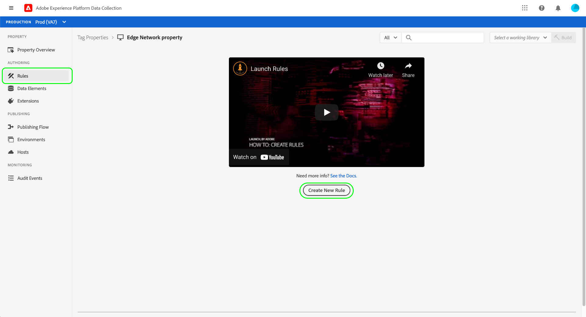

# Adobe Experience Platform Edge Network end-to-end overview

Adobe Experience Platform Edge Network provides a single gateway to transfer your data to other Adobe products or third-party destinations. In order to use the Edge Network to send event data from your application, it is important to understand the core components that have to be configured in order for that data to be delivered to the destinations you require.

This guide provides a high-level tutorial of how to send an event through the Edge Network. Specifically, the tutorial walks through the steps of installing and configuring the Adobe Experience Platform Web SDK tag extension within the Data Collection UI.

>[!NOTE]
>
>You can also opt to install and configure the SDK manually if you don't want to use tags, but the surrounding steps must still be completed as outlined below.

## Prerequisites

This tutorial uses the Data Collection UI to create a schema, configure a datastream, and install the Web SDK. In order to perform these actions in the UI, you must be granted access to at least one web property along with the following [property rights](../tags/ui/administration/user-permissions.md#property-rights):

* Develop
* Manage Extensions

See the guide on [managing permissions](../tags/ui/administration/manage-permissions.md) in the tags documentation to learn how to grant access to properties and property rights.

## Create an XDM schema {#schema}

[Experience Data Model (XDM)](../xdm/home.md) is an open-source specification that provides common structures and definitions for data in the form of schemas. In other words, XDM is a way of structuring and formatting your data in a way that is actionable by the Edge Network and other Adobe Experience Cloud applications.

The first step in setting up your Edge Network operations is to create an XDM schema to represent your data. At a later step in this tutorial, you will map the data you want to send to the structure of this schema.

>[!NOTE]
>
>XDM schemas are very customizable. Rather than being overly prescriptive, the steps outlined below focus specifically on the schema requirements for the Web SDK. Outside of these parameters, you are free to define the remaining structure your data however you wish.

In the Data Collection UI, select **[!UICONTROL Schemas]** in the left navigation. From here, you can see a list of previously created schemas belonging to your organization. To continue, select **[!UICONTROL Create schema]**, then select **[!UICONTROL XDM ExperienceEvent]** from the dropdown menu.

A dialog appears that prompts you to start adding field groups to the schema. In order to send events using the Web SDK, you must add the field group **[!UICONTROL AEP Web SDK ExperienceEvent Mixin]**. This field group contains definitions for data that is automatically collected by the Web SDK library.

Use the search bar to narrow down the list to help find this field group easier. Once you have found it, select it from the list before selecting **[!UICONTROL Add field groups]**.

The schema canvas appears, showing a tree structure of your XDM schema including the fields provided by the Web SDK field group.

Select the root field in the tree to open **[!UICONTROL Schema properties]** in the right rail, where you can provide a name and optional description for the schema.

If you want to add more fields to the schema, you can do so by selecting **[!UICONTROL Add]** under the **[!UICONTROL Field groups]** section in the left rail.

>[!NOTE]
>
>See the guide on [adding field groups](../xdm/ui/resources/schemas.md#add-field-groups) in the XDM documentation for detailed steps on how to search for different field groups to suit your use cases.
>
>Best practice is to only add fields for data you plan on sending through the Edge Network. Once you have added fields to a schema and saved it, only additive changes can be made to the schema thereafter. See the section on the [rules of schema evolution](../xdm/schema/composition.md#evolution) for more information.

Once you have added the fields you need, select **[!UICONTROL Save]** to save the schema.

## Create a datastream {#datastream}

A datastream is a configuration that tells the Edge Network where you want your data to be sent. Specifically, a datastream specifies which Experience Cloud products you want to send the data to, and how you want the data to be handled and stored in each product.

>[!NOTE]
>
>If you want to use [event forwarding](../tags/ui/event-forwarding/overview.md) (assuming your organization is licensed for the functionality), you must enable it for a datastream in the same way that you enable Adobe products. In other words, you must configure a datastream regardless of whether you are using tags or event forwarding.

In the Data Collection UI, select **[!UICONTROL Datastreams]**. From here, you can select an existing datastream from the list to edit, or you can can create a new configuration by selecting **[!UICONTROL New Datastream]**.

The configuration requirements for a datastream depend on which products and capabilities you are sending data to. For detailed information on the configuration options for each product, refer to the [datastreams overview](./fundamentals/datastreams.md).

## Install and configure the Web SDK

Once you have created a schema and a datastream, the next step is to install and configure the Platform Web SDK to start ending data to the Edge Network.

>[!NOTE]
>
>This section uses the Data Collection UI to configure the Web SDK tag extension, but you can also install and configure it using raw code instead. Refer to the following guides for more information:
>
>* [Install the SDK](./fundamentals/installing-the-sdk.md)
>* [Configure the SDK](./fundamentals/configuring-the-sdk.md)
>
>Also note that even if you only want to use event forwarding, you must still install and configure the SDK as described before configuring event forwarding at a [later step](#event-forwarding).

Select **[!UICONTROL Tags]** in the left navigation to show a list of tag properties. You can choose an existing property to edit if you wish, or you can select **[!UICONTROL New Property]** instead.

If creating a new property, provide a descriptive name and set the [!UICONTROL Platform] to **[!UICONTROL Web]**. Provide the full domain for the web property, and then select **[!UICONTROL Save]**.

The overview page for the property appears. From here, select **[!UICONTROL Extensions]** in the left navigation, then select **[!UICONTROL Catalog]**. Using the provided search bar, find the listing for the Platform Web SDK and select **[!UICONTROL Install]**.

The configuration page for the SDK appears. Most required values are auto-populated with defaults that you can choose to change if you wish.

Before you can install the SDK, however, you must select a datastream so it knows where to sent your data to. Under **[!UICONTROL Datastreams]**, use the dropdown menu to select the datastream that you configured at an [earlier step](#datastream). Once you've set the datastream, select **[!UICONTROL Save]** to finish installing the SDK to the property.

The SDK has now been installed on the property. Before implementing the SDK on your website, the final step is to create a rule that tells the SDK when it should send data to the Edge Network. These steps are summarized in the sections below.

### Create an XDM data element

In order for the SDK to send data to the Edge Network, that data must be mapped to the XDM schema you created in a [previous step](#schema). This mapping is accomplished through the use of a data element.

In the UI, select **[!UICONTROL Data Elements]**, then select **[!UICONTROL Create New Data Element]**.

On the next screen, select **[!UICONTROL Adobe Experience Platform Web SDK]** under the [!UICONTROL Extension] dropdown, then select **[!UICONTROL XDM object]** for the data element type.

The configuration dialog appears for the XDM object type. The dialog automatically selects your Platform sandbox, and from here you can see all the schemas that have been created in that sandbox. Select the XDM schema you created earlier from the list.

The structure of the schema appears. All fields with an asterisk (**\***) indicate fields that will automatically populate when events fire. For all other fields, you can explore the structure of the schema and fill out the rest of the data.

>[!NOTE]
>
>The screenshot above demonstrates how to map a globally accessible variable from the client side (`cartAbandonsTotal`) to an XDM field by referencing its name in the [!UICONTROL Value] field, surrounded by percent signs (`%`).
>
>You can also use other previously created data elements to populate these fields. See the reference on [data elements](../tags/ui/managing-resources/data-elements.md) in the tags documentation for more information.

Once you have finished mapping your data to the schema, provide a name for the data element before selecting **[!UICONTROL Save]**.

### Create a rule

After you've saved the data element, the next step is to create a rule that will send it to the Edge Network whenever a certain event occurs (such as when a customer adds a product to a cart).

As an example, this section shows how to create a rule that will trigger when a customer adds an item to a cart. However, you can set up rules for virtually any event that occurs on your website.

Select **[!UICONTROL Rules]** in the left navigation, then select **[!UICONTROL Create New Rule]**.

On the next screen, provide a name for the rule. From here, the next step is to determine the event for the rule (in other words, when the rule will fire). Select **[!UICONTROL Add]** under [!UICONTROL Events].

The event configuration page appears. To configure an event, you must first select the event type. Event types are provided by extensions. To set the event type to a form submit, for example, select the **[!UICONTROL Core]** extension, then select the **[!UICONTROL Submit]** event type. In the configuration dialog that appears, you can provide the CSS selector for the particular form you want this rule to fire on.

>[!NOTE]
>
>For more information on the different event types provided by Adobe web extensions, including how to configure them, see the [Adobe extensions reference](../tags/extensions/web/overview.md) in the tags documentation.

Select **[!UICONTROL Keep Changes]** to add the event to the rule.

The rule configuration page reappears, showing that the event has been added. You can narrow down the "[!UICONTROL If]" by adding further [!UICONTROL Conditions] to the rule.

Otherwise, the next step is to add an action for the rule to perform when it fires. Select **[!UICONTROL Add]** under [!UICONTROL Actions] to continue.

The action configuration page appears. To get the rule to send data to the Edge Network, select **[!UICONTROL Adobe Experience Platform Web SDK]** for the extension, and **[!UICONTROL Send event]** for the action type.

The screen updates to show additional options to configure the send event action. Under **[!UICONTROL Type]**, you can provide a custom type value to populate the `eventType` XDM field. Under **[!UICONTROL XDM data]**, provide the name of the XDM data type you created earlier (surrounded by percent signs), or select the database icon () to select it from a list. This is the data that will ultimately be sent to the Edge Network.

Select **[!UICONTROL Keep Changes]** when finished.

Once you are done configuring the rule, select **[!UICONTROL Save]** to finish the process.

### Build and install the library

After the rule has been configured, you are ready to build and install the tag library on your website.  

## Configure event forwarding (optional) {#event-forwarding}

* Set up everything we just talked about up until this point
* Enable event forwarding in the datastream
* Create an event forwarding property to configure the destination for the event using a rule (E.F. uses a lot of the same functionality philosophy as tags)
* Get your event sent to the edge

## Next steps
