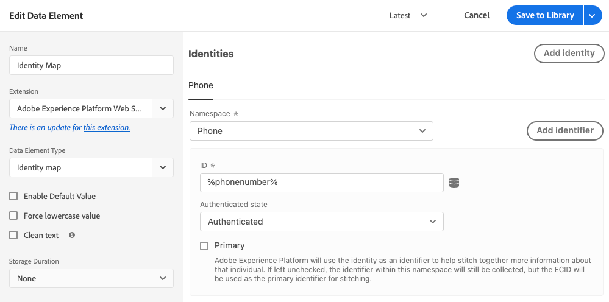

# Data element types

After you set your [action types](action-types.md) in the [Adobe Experience Platform Web SDK tag extension](web-sdk-extension-configuration.md), configure your data element types.

This page describes the available data element types.

## Event Merge ID

This data element provides an event merge ID when used. No configuration is needed for this data element. The data element that is provided stays the same until the visitor leaves the page or until the "Reset Event Merge ID" action type is used.

## Identity Map

An identity map allows you to establish identities for the visitor of your web page. An identity map consists of namespaces, like _phone_ or _email_, with each namespace containing one or more identifiers. For example, if the individual on your website has provided two phone numbers, your phone namespace should contain two identifiers.

In the [!UICONTROL Identity map] data element, you will provide the following pieces of information for each identifier:

* **[!UICONTROL ID]**: The value identifying the visitor. For example, if the identifier belongs to the _phone_ namespace, the [!UICONTROL ID] may be _555-555-5555_. This value typically is derived from a JavaScript variable or some other piece of data on your page, so it's best to create a data element that references the page data, then reference the data element in the [!UICONTROL ID] field within the [!UICONTROL Identity map] data element. If, when running on your page, the ID value is anything but a populated string, the identifier will be automatically removed from the identity map.
* **[!UICONTROL Authenticated state]**: A selection indicating whether the visitor is authenticated.
* **[!UICONTROL Primary]**: A selection indicating whether the identifier should be used as the primary identifier for the individual. If no identifier is marked as primary, the ECID will be used as the primary identifier.

You should not provide an ECID when building an identity map. When using the SDK, an ECID is automatically generated on the server and included in the identity map.

The identity map data element is often used in tandem with the [[!UICONTROL XDM object] data element type](#xdm-object) and the [[!UICONTROL Set consent] action type](action-types.md#set-consent).

Read more about [Adobe Experience Platform Identity Service](https://experienceleague.adobe.com/docs/experience-platform/identity/home.html).

## XDM object {#xdm-object}

Formatting your data to XDM is easier with the XDM object data element. When you first open this data element, select the correct Adobe Experience Platform sandbox and schema. After you have selected your schema, you see the structure of your schema, which you can easily fill out.

Notice that when you open certain fields of your schema, such as `web.webPageDetails.URL`, some items are automatically collected. Even though several items are automatically collected, you can overwrite any, if needed. All the values can be filled in manually or using other data elements.

>[!NOTE]
>
>Only fill in the pieces of information you are interested in collecting. Anything that is not filled in is omitted when the data is sent to the solutions.

## Variable (beta) {#variable}

>[!NOTE]
>
>This data element is a beta feature while the development team gathers feedback. Future versions may contain breaking changes.

Another way to create XDM objects is using the Variable data element. While the XDM object data element is created when it is referenced, such as inside a send event command, the variable data element can be updated via update variable actions. To use the data element, select the correct Adobe Experience Platform sandbox and schema.

Once you've created this data element you can use [update variable actions](./action-types.md#update-variable) to modify the data element. Then within send event actions use use the variable data element for the XDM option.

## What's next

Learn about specific use cases such as [accessing the ECID.](data-element-types.md)
