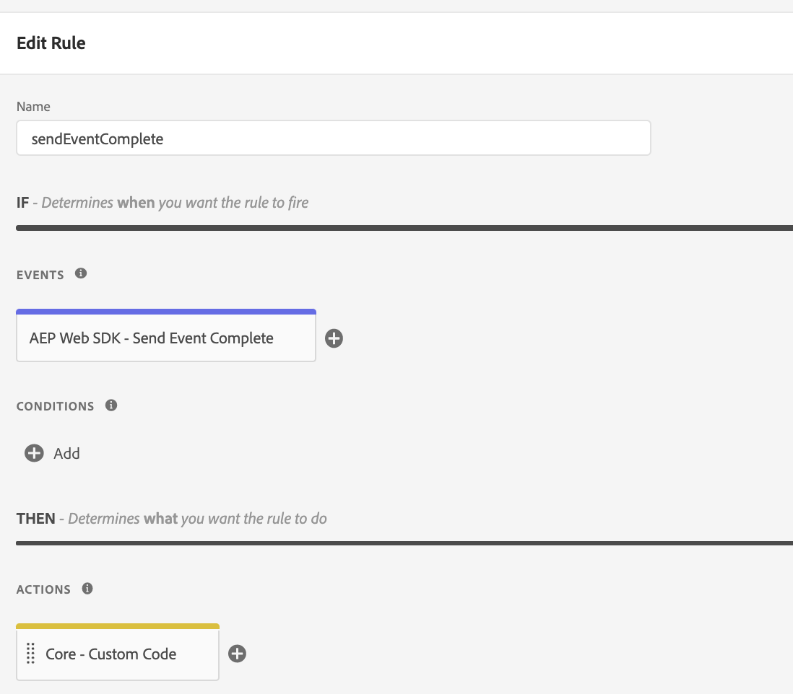

# Event types

After you configure the [Adobe Experience Platform Web SDK extension](web-sdk-extension-configuration.md) for [Adobe Experience Platform Launch](https://experienceleague.adobe.com/docs/launch.html), build rules using AEP WEB SDK extension event types

This page describes the available event types and how to use them.

## Send Event Complete

It triggers when a `sendEvent` command promise is resolved, see how to configure a [ Send Event Action ](action-types.md)
You can access the resulting `sendEvent` command promise object by accessing `event` object.
See the example below on how to process the event payload.
 * Add Send Event Complete event to the rule


### Extract Scope propositions

Add a Custom Code Action that would extract the `sendEvent` promise resulting object.
See the example below on how we can extract scope propositions of a specific type - HTML Content Item.
  
```
// extract propositions from event payload
var propositions = event.propositions;
// the HTML Content Schema
var htmlContentSchema = "https://ns.adobe.com/personalization/html-content-item";
var htmlContentPropositions = [];

for (i = 0; i < propositions.length; i++) {
  var items = propositions[i].items;
  for (j = 0; j < items.length; j++) {
    if (items[j].schema === htmlContentSchema) {
      htmlContentPropositions.push(propositions[i]);
      break;
    }
  }
}
// iterate thru the array of the HTML Content type propositions and add the content to containers

```

### Extract Response Tokens of rendered propositions
Add a Custom Code Action that would extract the `sendEvent` promise resulting object.

See the example below on how we can extract response tokens of propositions that were rendered.

```

var propositions = event.propositions;
var responseTokens = [];

for (i = 0; i < propositions.length; i++) {
  if (propositions[i].renderAttempted === true) {
    var items = propositions[i].item;
    for (j = 0; j < items.length; j++) {
      if (items[j].meta) {
        responseTokens.push(items[j].meta);
      }
    }
  }
}

```
 


