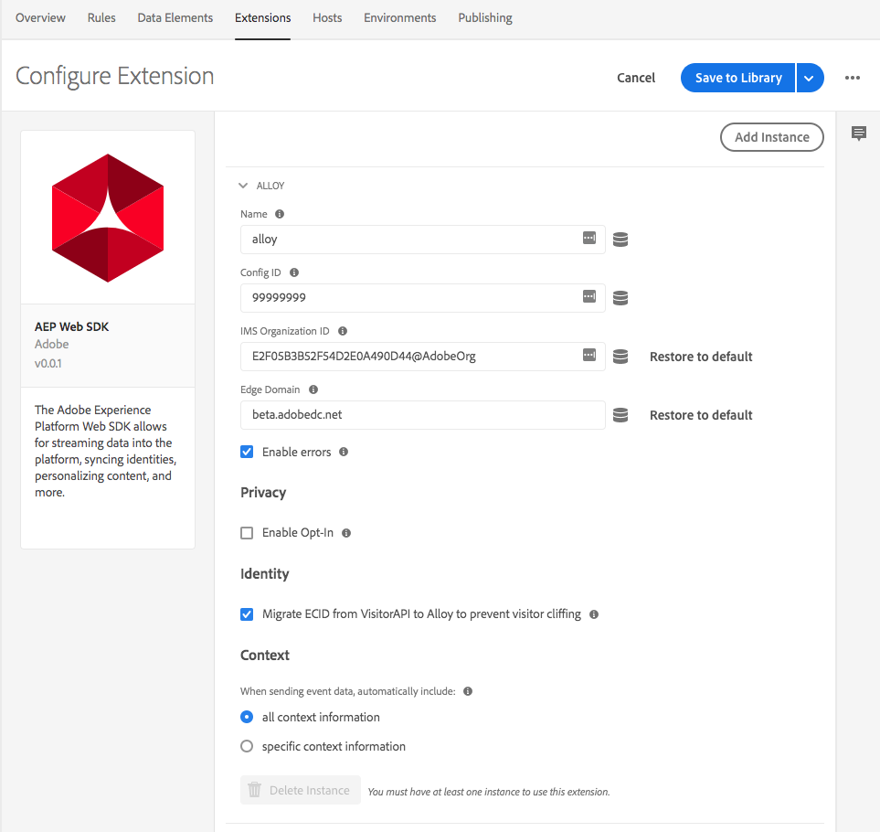

# Adobe Experience Platform Web SDK extension overview

The Adobe Experience Platform Web SDK Extension sends data to the Adobe Experience Cloud from web properties, through the Adobe Experience Platform Edge Network. The Adobe Experience Platform Web SDK extension allows for streaming data into platform, syncing identities, opt-in and automatically collecting context data. 

## Configure the AEP Web SDK extension

This section provides a reference for the options available when configuring the Adobe Experience Platform Web SDK extension.

If the Adobe Experience Platform Web SDK extension is not yet installed, open your property, then select **[!UICONTROL Extensions > Catalog]**, hover over the Adobe Experience Platform Web SDK extension, and select **[!UICONTROL Install]**.

To configure the extension, open the **[!UICONTROL Extensions]** tab, hover over the extension, and then select **[!UICONTROL Configure]**.

### Instance Name

The Adobe Experience Platform Web SDK extension supports multiple instances on the page. This is used to send data to multiple organizations with a single Adobe Experience Platform Launch configuration. The **[!UICONTROL Name]** defaults to alloy. However, you can change the instance name to any valid JavaScript object name. The Adobe Experience Platform extension requires that each instance have a different **[!UICONTROL Config ID]** and a different **[!UICONTROL Organization ID]**. 

## **[!UICONTROL Config ID]**

The **[!UICONTROL Config ID]** is what tells Adobe Experience Platform where the data should be routed and what configurations should be used on the server. This is required for the Adobe Experience Platform extension to work. You can obtain a configuration ID by contacting client care. 

### **[!UICONTROL Organization ID]**

The **[!UICONTROL Organization ID]** is the organization that you would like the data sent to at Adobe. Most of the time, you should use the default value that is autopopulated. When you have multiple instances on the page,  populate this with the value of the second organization you want to send data to. 

### **[!UICONTROL Edge Domain]**

The **[!UICONTROL Edge Domain]** is the domain that the Adobe Experience Platform extension sends and receives data from. The extension requires that you use a 1st-party CNAME for production traffic. The default 3rd-party domain works for development environments but is not suitable for production environments. Instructions on how to set up a first-party CNAME are listed [here](https://docs.adobe.com/content/help/en/core-services/interface/ec-cookies/cookies-first-party.html). 

### **[!UICONTROL Enable Errors]**

By default, if there is an error with the extension, it logs the error to the console. If you want to hide the errors in a production environment, you can uncheck the **[!UICONTROL Enable Errors]** checkbox. Errors still print out when debugging is turned on in Platform Launch. 

### **[!UICONTROL Enable Opt-in]**

If **[!UICONTROL Enable Opt-in]** is enabled, AEP Web SDK extension can hold hits until opt-in is received. The extension exposes an action to set the opt-in preferences. 

### **[!UICONTROL Enable Migrate ECID]**

The AEP Web SDK extension uses a new cookie to store the ECID. This setting enables compatibility between the new cookie and the old cookie for migration purposes. Adobe highly recommends this be enabled, unless you have no existing visitors with an ECID. 

### **[!UICONTROL Use 3rd Party Cookies]**

The Adobe Experience Platform will store a cookie in the first party domain always. This option allows you to use a third-party cookie set on demdex.net in addition to the cookie on the first-party domain. This can be helpful when you have users that move between multiple domains. This will disable calls to demdex.net. 

### **[!UICONTROL Context]**

The extension collects information automatically about the context of the request (for example, details about the URL and the browser). This can be disabled by deselecting specific contexts. 

- **[!UICONTROL web]** - Details about the webpage such as url, referrer, etc. 
- **[!UICONTROL device]** - Details about the device such as the screen orientation, screen height and screen width.
- **[!UICONTROL environment]** - Information about the computing environment (Browser, connection, and so on)
- **[!UICONTROL location]** - Limited information about the location of the user

## What's next

1. Set [action types](action-types.md).
2. Set [data element types](data-element-types.md).
