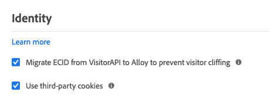

# Adobe Experience Platform Web SDK extension overview

The Adobe Experience Platform Web SDK extension sends data to Adobe Experience Cloud from web properties through the Adobe Experience Platform Edge Network. The extension allows you to stream data into Platform, synchronize identities, process customer consent signals, and automatically collect context data.

This document covers how to configure the extension in the Adobe Experience Platform Launch user interface.

## Configure the extension

If the Platform Web SDK extension has already been installed for a property, open the property in the Platform Launch UI and select the **[!UICONTROL Extensions]** tab. Under the Platform Web SDK, select **[!UICONTROL Configure]**.

If you have not installed the extension yet, select the **[!UICONTROL Catalog]** tab. From the list of available extensions, find the Platform Web SDK extension and select **[!UICONTROL Install]**.

In both cases, you arrive at the configuration page for the Platform Web SDK. The sections below explain the extension's configuration options.

## General configuration options

The configuration options at the top of the page tell Adobe Experience Platform where to route the data and what configurations to use on the server.

### [!UICONTROL Name]

The Adobe Experience Platform Web SDK extension supports multiple instances on the page. The name is used to send data to multiple organizations with a single Platform Launch configuration.

The extension's name defaults to "[!DNL alloy]". However, you can change the instance name to any valid JavaScript object name.

### **[!UICONTROL IMS Organization ID]**

The [!UICONTROL IMS Organization ID] is the organization that you would like the data sent to at Adobe. Most of the time, use the default value that is autopopulated. When you have multiple instances on the page, populate this field with the value of the second organization you want to send data to.

### **[!UICONTROL Edge Domain]**

The [!UICONTROL Edge Domain] is the domain that the Adobe Experience Platform extension sends and receives data from. The extension requires that you use a 1st-party CNAME for production traffic. The default 3rd-party domain works for development environments but is not suitable for production environments. Instructions on how to set up a first-party CNAME are listed [here](https://experienceleague.adobe.com/docs/core-services/interface/ec-cookies/cookies-first-party.html).

## [!UICONTROL Datastreams]

When a request is sent to the Adobe Experience Platform Edge Network, a datastream ID is used to reference the server-side configuration. You can update the configuration without having to make code changes on your website.

See the guide on [datastreams](../fundamentals/datastreams.md) for more information.

## [!UICONTROL Privacy]

The [!UICONTROL Privacy] section allows you to configure how the SDK handles user consent signals from your website. Specifically, it allows you to select the default level of consent that is assumed of a user if no other explicit consent preference has been provided. The default consent level is not saved to the user's profile. The following table breaks down what each option entails:

| [!UICONTROL Default Consent Level] | Description |
| --- | --- |
| [!UICONTROL In] | Collect events that occur before the user provides consent preferences. |
| [!UICONTROL Out] | Discard events that occur before the user provides consent preferences. |
| [!UICONTROL Pending] | Queue events that occur before the user provides consent preferences. When consent preferences are provided, the events will be collected or discarded depending on the provided preferences. |
| [!UICONTROL Provided by data element] | The default consent level is determined by a separate data element that you define. When using this option, you must specify the data element using the provided dropdown menu. |

Use Out or Pending if you require explicit user consent for your business operations.

## [!UICONTROL Identity]

### [!UICONTROL Migrate ECID from VisitorAPI]

This field will be turned on by default. When turned on the SDK will be able to read and set old AMCV cookies. This feature is important when migration to Adobe Experience Platform Web SDK as some pages might still be using Visitor.js. It will allow the Web SDK to continue to use the same ECID.

### [!UICONTROL Use third-party cookies]

This option will enable the use of Adobe third-party cookies. It will allow the Web SDK to keep the visitor ID in a third-party cookie so that it can be used accross sites.

## [!UICONTROL Personalization]

In the personalization configuration section we provide you two things, a prehiding style editor and a default prehiding snippet. If you would like to hide certain parts if your site while personalized content is loaded you can specify the elements to hide in the prehiding style editor. After you do this you can copy the default prehiding snippet that is provided for you and paste in head portion of your HTML site. 

## [!UICONTROL Data Collection]

### [!UICONTROL Callback function]

The callback function provided in the extension is also called the ['onBeforeEventSend' function](https://experienceleague.adobe.com/docs/experience-platform/edge/fundamentals/configuring-the-sdk.html?lang=en) in the library. This function allows you to modify events globally before they reach the Adobe Edge Network. More detailed information on how to use this function can be found [here](https://experienceleague.adobe.com/docs/experience-platform/edge/fundamentals/tracking-events.html?lang=en#modifying-events-globally). 

### [!UICONTROL Click data collection]

The AEP Web SDK can automatically collect link click information for you. By default this feature is turned on but can be turned off using this configuration. Links will also be labeled as download links if they contain one of the download expressions listed in the [!UI CONTROL Download Link Qualifier] textbox. We provide you with some default download link qualifiers but these can be edited at any time.

### [!UICONTROL Automatically collected context data]

By default the AEP Web SDK will collect certain context data for you. The data we collect is around device, web, environment, and place context. If you would like to see a list of the the exact information we collect you can find it [here](https://experienceleague.adobe.com/docs/experience-platform/edge/data-collection/automatic-information.html?lang=en). If you don't want this data collected or you only want certain categories you can change those settings with this configuration.  

## [!UICONTROL Advanced Settings]

### [!UICONTROL Edge base path]

This field will be used if you need to change the base path that is used to indetract with the Adobe Edge Network. This shouldn't require updating but in the case that you participate on a beta or alpha Adobe might ask you to change this field.
