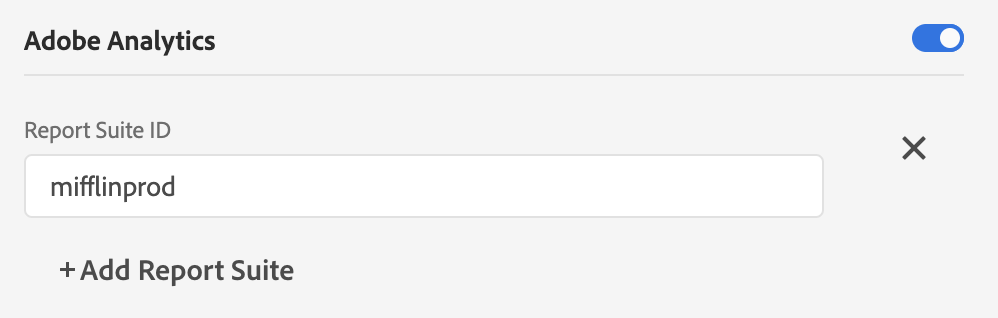

# Configure a datastream

The configuration for Adobe Experience Platform Web SDK is split between two places. The [configure command](configuring-the-sdk.md) in the SDK controls things that must be handled on the client, like the `edgeDomain`. Datastreams handle all other configurations for the SDK. When a request is sent to the Adobe Experience Platform Edge Network, the `edgeConfigId` is used to reference the server side configuration. This allows you to update the configuration without having to make code changes on your website. 

Your organization must be provisioned for this feature. Please contact your Customer Success Manager (CSM) to get put on the allowlist.

## Create a datastream configuration

You can create and manage datastreams in the Data Collection UI by selecting **[!UICONTROL Datastreams]** in the left navigation.

>[!NOTE]
>
>While you can access the [!UICONTROL Datastreams] tab regardless of whether you use Platform's tag management capabilities, you must have developer permissions to manage datastreams themselves. See the [user permissions](../../tags/ui/administration/user-permissions.md) article in the tags documentation for more details.

Create a datastream by clicking on **[!UICONTROL New Datastream]** in the top-right area of the screen. After you provide a name and a description, you are asked for the default settings for each environment. Available settings are detailed below.

When creating a datastream, three environments are automatically created with identical settings. These three environments are *dev*, *stage*, and *prod*. They match the three default environments for tags. When you build a tag library to a dev environment, the library automatically uses the dev environment from your configuration. You can edit settings in individual environments as much as you'd like.

The ID used in the SDK as the `edgeConfigId` is a composite ID that specifies the configuration and the environment (for example, `1c86778b-cdba-4684-9903-750e52912ad1:stage`). If no environment is present in the composite ID (for example, `stage` in the previous example), then the production environment is used.

Below are the available settings for each configuration environment. Most sections can be enabled or disabled. When disabled, your settings are saved but are not active.

## [!UICONTROL Third Party ID] settings

The third party ID section is the only section that is always on. It has two available settings: "[!UICONTROL Third Party ID Sync Enabled]" and "[!UICONTROL Third Party ID Sync Container ID]".

### [!UICONTROL Third Party ID Sync Enabled]

Controls whether or not the SDK performs identity syncs with 3rd-party partners.

### [!UICONTROL Third Party ID Sync Container ID]

ID syncs can be grouped into containers to allow different ID syncs to be run at different times. This controls which container of ID syncs is run for a given configuration ID.

## Adobe Experience Platform settings

The settings listed here enable you to send data to Adobe Experience Platform. You should only enable this section if you have purchased the Adobe Experience Platform.

| Field | Description |
| --- | --- |
| [!UICONTROL Sandbox] | **(Required)** Select the Platform sandbox that you want to send data to. Sandboxes are virtual partitions in Adobe Experience Platform that allow you to isolate your data and implementations from others in your organization.  Once a datastream is created, its sandbox cannot be changed. The [!UICONTROL Sandbox] selection field is therefore unavailable when editing an existing datastream.  For more details about the role of sandboxes in Experience Platform, see the [sandboxes documentation](../../sandboxes/home.md). |
| [!UICONTROL Event Dataset] | **(Required)** Select the Platform dataset that customer event data will be streamed to. This schema must use the [XDM ExperienceEvent class](../../xdm/classes/experienceevent.md). |
| [!UICONTROL Profile Dataset] | Select the Platform dataset that customer attribute data will be sent to. This schema must use the [XDM Individual Profile class](../../xdm/classes/individual-profile.md). |
| [!UICONTROL Offer Decisioning] | Select this checkbox to enable Offer Decisioning for a Platform Web SDK implementation. See the guide on [using Offer Decisioning with the Platform Web SDK](../personalization/offer-decisioning/offer-decisioning-overview.md) for more implementation details. For more information on Offer Decisioning capabilities, refer to the [Adobe Journey Optimizer documentation](https://experienceleague.adobe.com/docs/journey-optimizer/using/offer-decisioniong/get-started/starting-offer-decisioning.html). |
| [!UICONTROL Edge Segmentation] | Select this checkbox to enable [edge segmentation](../../segmentation/ui/edge-segmentation.md) for this datastream. When the Platform Web SDK sends data through an edge-segmentation-enabled datastream, any updated segment memberships for the profile in question are sent back in the response.  This option can be used in combination with [!UICONTROL Personalization Destinations] for [next-page personalization use cases](../../destinations/ui/configure-personalization-destinations.md). |
| [!UICONTROL Personalization Destinations] | When used in combination with the [!UICONTROL Edge Segmentation] checkbox, this option allows the datastream to connect to personalization engines like Adobe Target. Refer to the destinations documentation for specific steps on [configuring personalization destinations](../../destinations/ui/configure-personalization-destinations.md). |

## Adobe Target settings

To configure Adobe Target, you must provide a client code. The other fields are optional.

>[!NOTE]
>
>The Organization associated with the client code must match the organization where the configuration ID is created.

### [!UICONTROL Client Code]

The unique ID for a target account. To find this, you can navigate to [!UICONTROL Adobe Target] > [!UICONTROL Setup]> [!UICONTROL Implementation] > [!UICONTROL edit settings] next to the [!UICONTROL download] button for either [!UICONTROL at.js] or [!UICONTROL mbox.js]

### [!UICONTROL Property Token]

[!DNL Target] allows customers to control permissions through the use of properties. Details can be found in the [Enterprise Permissions](https://experienceleague.adobe.com/docs/target/using/administer/manage-users/enterprise/properties-overview.html) section of the [!DNL Target] documentation.

The property token can be found in [!UICONTROL Adobe Target] > [!UICONTROL setup] > [!UICONTROL Properties]

### [!UICONTROL Target Environment ID]

[Environments](https://experienceleague.adobe.com/docs/target/using/administer/hosts.html) in Adobe Target help you manage your implementation through all stages of development. This setting specifies which environment you are going to use with each environment.

Adobe recommends setting this differently for each of your `dev`, `stage`, and `prod` datastream environments to keep things simple. However, if you already have Adobe Target environments defined, you can use those.

## Adobe Audience Manager settings

All that is needed to send data to Adobe Audience Manager is to enable this section. The other settings are optional but encouraged.

### [!UICONTROL Cookie Destinations Enabled]

Allows the SDK to share segment information via [Cookie Destinations](https://experienceleague.adobe.com/docs/audience-manager/user-guide/features/destinations/custom-destinations/create-cookie-destination.html) from [!DNL Audience Manager].

### [!UICONTROL URL Destinations Enabled]

Allows the SDK to share segment information via [URL Destinations](https://experienceleague.adobe.com/docs/audience-manager/user-guide/features/destinations/custom-destinations/create-url-destination.html). These are configured in [!DNL Audience Manager].

## Adobe Analytics settings

Controls whether data is sent to Adobe Analytics. Additional details are in the [Analytics Overview](../data-collection/adobe-analytics/analytics-overview.md).

### [!UICONTROL Report Suite ID]

The report suite can be found in the Adobe Analytics Admin section under [!UICONTROL Admin > ReportSuites]. If multiple report suites are specified, then data is copied to each report suite.
