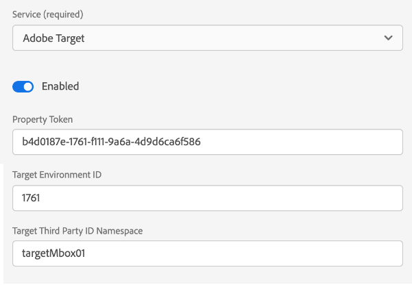

# Configure a datastream

A datastream represents the server-side configuration when implementing the Adobe Experience Platform Web and Mobile SDKs. While the [configure command](configuring-the-sdk.md) in the SDK controls things that must be handled on the client (such as the `edgeDomain`), datastreams handle all other configurations for the SDK. When a request is sent to the Adobe Experience Platform Edge Network, the `edgeConfigId` is used to reference the datastream. This allows you to update the server-side configuration without having to make code changes on your website. 

This document covers the steps for configuring a datastream in the Data Collection UI. 

>[!NOTE]
>
>Your organization must be provisioned for this feature in order to access it in the UI. If you do not have access, please fill out the following [form](http://adobe.ly/websdkaccess) and we will grant you the necessary access.

## Access the [!UICONTROL Datastreams] workspace

You can create and manage datastreams in the Data Collection UI by selecting **[!UICONTROL Datastreams]** in the left navigation.

>[!NOTE]
>
>While you can access the [!UICONTROL Datastreams] tab regardless of whether you use Platform's tag management capabilities, you must have developer permissions to manage datastreams themselves. See the [user permissions](../../tags/ui/administration/user-permissions.md) article in the tags documentation for more details.

The [!UICONTROL Datastreams] tab displays a list of existing datastreams, including their friendly name, ID, and last modified date. Select the name of of a datastream to [view its details and configure services](#view-details).

Select the "more" icon (**...**) for a particular datastream to reveal more options. Select **[!UICONTROL Edit]** to update the [basic configuration](#configure) for the datastream, or select **[!UICONTROL Delete]** to remove the datastream.

## Create a new datastream {#create}

To create a datastream, start by selecting **[!UICONTROL New Datastream]**.

### [!UICONTROL Configure] {#configure}

The datastream creation workflow appears, starting at the configuration step. From here, you must provide a name and optional description for the datastream.

If you are configuring this datastream for use in Experience Platform and are using the Platform Web SDK, you must also select an [event-based Experience Data Model (XDM) schema](../../xdm/classes/experienceevent.md) to represent the data you plan on ingesting.

Select **[!UICONTROL Advanced Options]** to reveal additional controls to configure the datastream.

| Setting | Description |
| --- | --- |
| [!UICONTROL Geo Location] | Determines whether GPS lookups occur based on the user's IP address. The default setting **[!UICONTROL None]** disables any GPS lookups, while the **[!UICONTROL City]** setting provides GPS coordinates to two decimal places. |
| [!UICONTROL First Party ID Cookie] | When enabled, this setting tells the Edge Network to refer to a specified cookie when looking up a [first-party device ID](../identity/first-party-device-ids.md), rather than looking up this value in the Identity Map.  When enabling this setting, you must provide the name of the cookie where the ID is expected to be stored. |
| [!UICONTROL Third Party ID Sync] | ID syncs can be grouped into containers to allow different ID syncs to be run at different times. When enabled, this setting lets you specify which container of ID syncs is run for this datastream. |

The rest of this section focuses on the steps to map data to a selected Platform event schema. If you are using the Mobile SDK or are otherwise not configuring your datastream for Platform, select **[!UICONTROL Save]** before proceeding to the next section on [adding services to the datastream](#add-services).

### Data Prep for Data Collection {#data-prep}

>[!IMPORTANT]
>
>Data Prep for Data Collection is currently not supported for Mobile SDK implementations.

Data Prep is an Experience Platform service that allows you to map, transform, and validate data to and from Experience Data Model (XDM). When configuring a Platform-enabled datastream, you can use Data Prep capabilities to map your source data to XDM when sending it to the Platform Edge Network.

The subsections below cover the basic steps for mapping your data within the Data Collection UI. For comprehensive guidance on all Data Prep capabilities, including transformation functions for calculated fields, refer to the following documentation:

* [Data Prep overview](../../data-prep/home.md)
* [Data Prep mapping functions](../../data-prep/functions.md)
* [Handling data formats with Data Prep](../../data-prep/data-handling.md)

#### [!UICONTROL Select data]

Select **[!UICONTROL Save and Add Mapping]** after completing the [basic configuration step](#configure), and the **[!UICONTROL Select data]** step appears. From here, you must provide a sample JSON object that represents the structure of the data you plan on sending to Platform. You can select the option to upload the object as a file, or paste the raw object into the provided textbox instead.

>[!IMPORTANT]
>
>The JSON object must have a single root node `data` in order to pass validation.

If the JSON is valid, a preview schema is displayed in the right panel. Select **[!UICONTROL Next]** to continue.

#### [!UICONTROL Mapping]

The **[!UICONTROL Mapping]** step appears, allowing you to map the fields in your source data to that of the target event schema in Platform. To get started, select **[!UICONTROL Add new mapping]** to create a new mapping row.

Select the source icon (), and in the dialog that appears select the source field that you want to map in the provided canvas. Once you have chosen a field, use the **[!UICONTROL Select]** button to continue.

Next, select the schema icon () to open a similar dialog for the target event schema. Choose the field that you want to map the data to before confirming with **[!UICONTROL Select]**.

The mapping page reappears with the completed field mapping shown. The **[!UICONTROL Mapping progress]** section updates to reflect the total number of fields that have been successfully mapped.

Continue following the above steps to map the rest of the fields to the target schema. While you do not have to map all available source fields, any fields in the target schema that are set as required must be mapped in order to complete this step. The **[!UICONTROL Required fields]** counter indicates how many required fields are not yet mapped in the current configuration.

Once the required fields count reaches zero and you are satisfied with your mapping, select **[!UICONTROL Save]** to finalize your changes.

## View datastream details {#view-details}

After configuring a new datastream or selecting an existing one to view, the details page for that datastream appears. Here you can find further information about the datastream, including its ID.

From the datastream details screen, you can [add services](#add-services) to enable capabilities from the Adobe Experience Cloud products you have access to.

## Add services to a datastream {#add-services}

On the details page of a datastream, select **[!UICONTROL Add Service]** to start adding available services for that datastream.

On the next screen, use the dropdown menu to select a service to configure for this datastream. Only the services that you have access to will appear in this list.

Select the desired service, fill in the configuration options that appear, and then select **[!UICONTROL Save]** to add the service to the datastream. All added services appear in the details view for the datastream.

The subsections below describe the configuration options for each service.

>[!NOTE]
>
>Each service configuration contains an **[!UICONTROL Enabled]** toggle that is automatically activated when the service is selected. To disable the selected service for this datastream, select the **[!UICONTROL Enabled]** toggle again.

### Adobe Analytics settings

This service controls whether and how data is sent to Adobe Analytics. Additional details can be found in the guide on [sending data to Analytics](../data-collection/adobe-analytics/analytics-overview.md).

| Setting | Description |
| --- | --- |
| [!UICONTROL Report Suite ID] | **(Required)** The ID of the Analytics report suite that you want to send data to. This ID can be found in the Adobe Analytics UI under [!UICONTROL Admin] > [!UICONTROL ReportSuites]. If multiple report suites are specified, then data is copied to each report suite. | 

### Adobe Audience Manager settings

This service controls whether and how data is sent to Adobe Audience Manager. All that is needed to send data to Audience Manager is to enable this section. The other settings are optional but encouraged.

| Setting | Description |
| --- | --- |
| [!UICONTROL Cookie Destinations Enabled] | Allows the SDK to share segment information via [cookie destinations](https://experienceleague.adobe.com/docs/audience-manager/user-guide/features/destinations/custom-destinations/create-cookie-destination.html) from [!DNL Audience Manager]. |
| [!UICONTROL URL Destinations Enabled] | Allows the SDK to share segment information via [URL destinations](https://experienceleague.adobe.com/docs/audience-manager/user-guide/features/destinations/custom-destinations/create-url-destination.html) from [!DNL Audience Manager]. |

### Adobe Experience Platform settings

>[!IMPORTANT]
>
>When enabling a datastream for Platform, take note of the Platform sandbox that you are currently using, as displayed in the top ribbon of the Data Collection UI.
>
>
>
>Sandboxes are virtual partitions in Adobe Experience Platform that allow you to isolate your data and implementations from others in your organization. Once a datastream is created, its sandbox cannot be changed. For more details about the role of sandboxes in Experience Platform, see the [sandboxes documentation](../../sandboxes/home.md). 

This service controls whether and how data is sent to Adobe Experience Platform.

| Setting | Description |
| --- | --- |
| [!UICONTROL Event Dataset] | **(Required)** Select the Platform dataset that customer event data will be streamed to. This schema must use the [XDM ExperienceEvent class](../../xdm/classes/experienceevent.md). |
| [!UICONTROL Profile Dataset] | Select the Platform dataset that customer attribute data will be sent to. This schema must use the [XDM Individual Profile class](../../xdm/classes/individual-profile.md). |
| [!UICONTROL Offer Decisioning] | Select this checkbox to enable Offer Decisioning for a Platform Web SDK implementation. See the guide on [using Offer Decisioning with the Platform Web SDK](../personalization/offer-decisioning/offer-decisioning-overview.md) for more implementation details. For more information on Offer Decisioning capabilities, refer to the [Adobe Journey Optimizer documentation](https://experienceleague.adobe.com/docs/journey-optimizer/using/offer-decisioniong/get-started/starting-offer-decisioning.html). |
| [!UICONTROL Edge Segmentation] | Select this checkbox to enable [edge segmentation](../../segmentation/ui/edge-segmentation.md) for this datastream. When the SDK sends data through an edge-segmentation-enabled datastream, any updated segment memberships for the profile in question are sent back in the response.  This option can be used in combination with [!UICONTROL Personalization Destinations] for [next-page personalization use cases](../../destinations/ui/configure-personalization-destinations.md). |
| [!UICONTROL Personalization Destinations] | When used in combination with the [!UICONTROL Edge Segmentation] checkbox, this option allows the datastream to connect to personalization engines like Adobe Target. Refer to the destinations documentation for specific steps on [configuring personalization destinations](../../destinations/ui/configure-personalization-destinations.md). |

### Adobe Target settings

This service controls whether and how data is sent to Adobe Target.

| Setting | Description |
| --- | --- |
| [!UICONTROL Property Token] | [!DNL Target] allows customers to control permissions through the use of properties. For more information on properties, see the guide on [configuring enterprise permissions](https://experienceleague.adobe.com/docs/target/using/administer/manage-users/enterprise/properties-overview.html) in the [!DNL Target] documentation.  The property token can be found in the Adobe Target UI under [!UICONTROL Setup] > [!UICONTROL Properties]. |
| [!UICONTROL Target Environment ID] | [Environments in Adobe Target](https://experienceleague.adobe.com/docs/target/using/administer/hosts.html) help you manage your implementation through all stages of development. This setting specifies which environment you are going to use with this datastream.  Best practice is to set this differently for each of your `dev`, `stage`, and `prod` datastream environments to keep things simple. However, if you already have Adobe Target environments defined, you can use those. |
| [!UICONTROL Target Third Party ID namespace] | The identity namespace for the `mbox3rdPartyId` you want to use for this datastream. See the guide on [implementing `mbox3rdPartyId` with the Web SDK](../personalization/adobe-target/using-mbox-3rdpartyid.md) for more information. |

### [!UICONTROL Event Forwarding] settings

This service controls whether and how data is sent to [event forwarding](../../tags/ui/event-forwarding/overview.md).

| Setting | Description |
| --- | --- |
| [!UICONTROL Launch Property] | **(Required)** The event forwarding property that you want to send data to. |
| [!UICONTROL Launch Environment] | **(Required)** The environment within the selected property that you want to send data to. |

>[!NOTE]
>
>You can select **[!UICONTROL Manually enter IDs]** to type in the property and environment names instead of using the dropdown menus.

## Next steps

This guide covered how to configure a datastream in the Data Collection UI. For more information on how to install and configure the Web SDK after setting up a datastream, refer to the [Data Collection E2E guide](../../collection/e2e.md#install).
