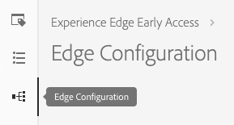
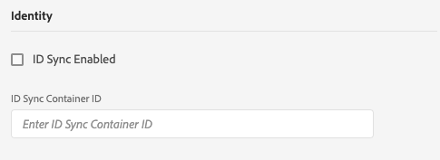
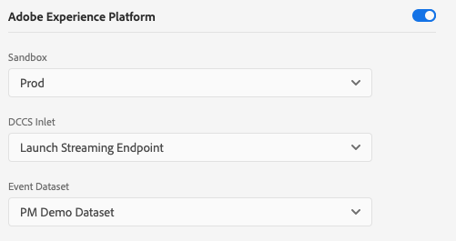
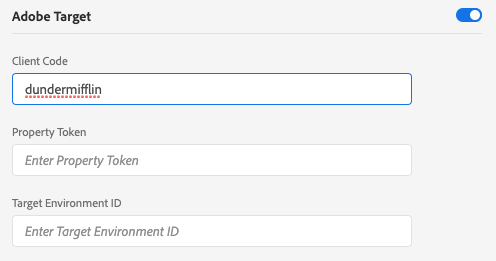
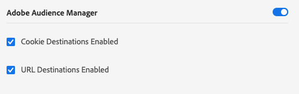

# Create an edge configuration

The configuration for Adobe Experience Platform Web SDK is split between two places. The [configure command](configuring-the-sdk.md) in the SDK controls things that must be handled on the client, like the `edgeDomain`. The edge configuration handles all other configuration for the SDK. When a request is sent to the Adobe Experience Platform Edge Network, the `edgeConfigId` is used to reference the server side configuration. This allows you to update the configuration without having to make code changes on your website. 

Your organization must be provisioned for this feature. Please contact your Customer Success Manager (CSM) to get put on the allowlist.

## Creating an Edge Configuration

Edge configurations can be created in Adobe [!DNL Experience Platform Launch] using the edge configuration tool.

>[!NOTE]
>
>The edge configuration tool is available to customers on the allow list regardless whether they use [!DNL Experience Platform Launch] as a tag manager. Additionally, users require Develop permissions in [!DNL Experience Platform Launch]. See the [User Permissions](https://docs.adobe.com/content/help/en/launch/using/reference/admin/user-permissions.html) article in the [!DNL Experience Platform Launch] documentation for more details.

Create an edge configuration by clicking on **[!UICONTROL New Edge Configuration]** in the top-right area of the screen. After you provide a name and a description, you are asked for the default settings for each environment. Available settings are detailed below.

When creating an edge configuration, three environments are automatically created with identical settings. These three environments are *dev*, *stage*, and *prod*. They match the three default environments in [!DNL Experience Platform Launch]. When you build a [!DNL Experience Platform Launch] library to a dev environment, the library automatically uses the dev environment from your configuration. You can edit settings in individual environments as much as you'd like.

The ID used in the SDK as the `edgeConfigId` is a composite ID that specifies the configuration and the environment (for example, `1c86778b-cdba-4684-9903-750e52912ad1:stage`). If no environment is present in the composite ID (for example, `stage` in the previous example), then the production environment is used.

Below you will find the available settings for each configuration environment. Most sections can be enabled or disabled. When disabled, your settings are saved but are not active.

## [!UICONTROL Identity] Settings

The identity section is the only section that is always on. It has two available settings: "[!UICONTROL ID Syncs Enabled]" and "[!UICONTROL ID Sync Container ID]".

### [!UICONTROL ID Sync Enabled]

Controls whether or not the SDK performs identity syncs with 3rd-party partners.

### [!UICONTROL ID Sync Container ID]

ID syncs can be grouped into containers to allow different ID syncs to be run at different times. This controls which container of ID syncs is run for a given configuration ID.

## Adobe Experience Platform Settings

The settings listed here enable you to send data to Adobe Experience Platform. You should only enable this section if you have purchased the Adobe Experience Platform.

### [!UICONTROL Sandbox]

Sandboxes are locations in Adobe Experience Platform that allow customers to isolate their data and implementations from each other. For more details about how they work, see the [Sandboxes documentation](../../sandboxes/home.md).

### [!UICONTROL Streaming Inlet]

A streaming inlet is an HTTP source in Adobe Experience Platform. These are created under the "[!UICONTROL Sources]" tab in the Adobe Experience Platform as an HTTP API.

### [!UICONTROL Event Dataset]

Edge configurations support sending data to datasets that have a schema of class [!UICONTROL Experience Event].

## Adobe Target Settings

To configure Adobe Target, you must provide a client code. The other fields are optional.

>[!NOTE]
>
>The Organization associated with the client code must match the organization where the configuration ID is created.

### [!UICONTROL Client Code]

The unique ID for a target account. To find this, you can navigate to [!UICONTROL Adobe Target] > [!UICONTROL Setup]> [!UICONTROL Implementation] > [!UICONTROL edit settings] next to the [!UICONTROL download] button for either [!UICONTROL at.js] or [!UICONTROL mbox.js]

### [!UICONTROL Property Token]

[!DNL Target] allows customers to control permissions through the use of properties. Details can be found in the [Enterprise Permissions](https://docs.adobe.com/content/help/en/target/using/administer/manage-users/enterprise/properties-overview.html) section of the [!DNL Target] documentation.

The property token can be found in [!UICONTROL Adobe Target] > [!UICONTROL setup] > [!UICONTROL Properties]

### [!UICONTROL Target Environment ID]

[Environments](https://docs.adobe.com/content/help/en/target/using/administer/hosts.html) in Adobe Target help you manage your implementation through all stages of development. This setting specifies which environment you are going to use with each environment.

Adobe recommends setting this differently for each of your `dev`, `stage`, and `prod` edge configuration environments to keep things simple. However, if you already have Adobe Target environments defined, you can use those.

## Adobe Audience Manager Settings

All that is needed to send data to Adobe Audience Manager is to enable this section. The other settings are optional but encouraged.

### [!UICONTROL Cookie Destinations Enabled]

Allows the SDK to share segment information via [Cookie Destinations](https://docs.adobe.com/content/help/en/audience-manager/user-guide/features/destinations/custom-destinations/create-cookie-destination.html) from [!DNL Audience Manager].

### [!UICONTROL URL Destinations Enabled]

Allows the SDK to share segment information via [URL Destinations](https://docs.adobe.com/content/help/en/audience-manager/user-guide/features/destinations/custom-destinations/create-url-destination.html). These are configured in [!DNL Audience Manager].

## Adobe Analytics Settings

Controls whether data is sent to Adobe Analytics. Additional details are in the [Analytics Overview](../data-collection/adobe-analytics/analytics-overview.md).

### [!UICONTROL Report Suite ID]

The report suite can be found in the Adobe Analytics Admin section under [!UICONTROL Admin > ReportSuites]. If multiple report suites are specified, then data is copied to each report suite.
