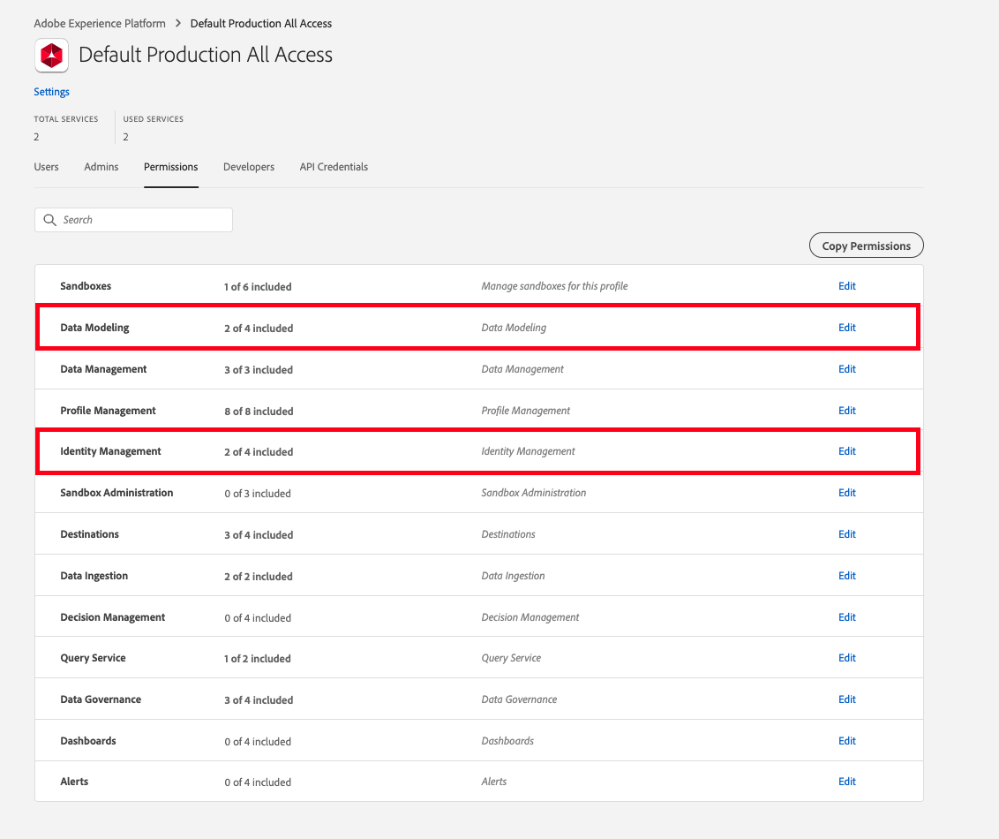
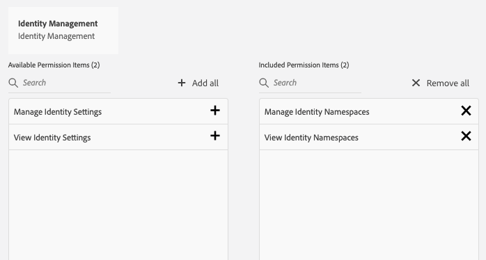

# Prerequisites for using the Adobe Experience Platform Web SDK

To use the Platform Web SDK, you must first:

- Have your organization provisioned for this feature. (Access to the Platform Web SDK is free, if you would like to get access please reach out to your Customer Success Manager (CSM)).
- Having 1st-party domain (CNAME) enabled is recommended. If you already have a CNAME for Adobe Analytics, you should use that one. Testing in development works without a CNAME, but Adobe recommends having one before you go to production. Although a CNAME implementation does not provide any benefits in terms of cookie lifetime, it can prevent certain ad blockers and less-common browsers from blocking SDK requests. In those cases, using a CNAME might prevent your data collection from being disrupted for users employing these tools.

>[!IMPORTANT]
>
>**Please note that as of 11/10/20, 1st-party CNAME implementations have a 7-day expiry on all Safari browsers and mobile iOS devices.** 

- Be entitled to Adobe Experience Platform. If you have not purchased Adobe Experience Platform, Adobe will provision you with the necessary access to use in a limited fashion with the SDK at no extra charge.
- If your website is already using the [Experience Cloud ID Service](https://experienceleague.adobe.com/docs/experience-platform/edge/identity/overview.html) on your website--either through Visitor API or the Experience Cloud ID Service extension within Adobe Experience Platform Launch--and you would like to continue using it while migrating to Adobe Experience Platform Web SDK, you must be using the latest version of Visitor API or the Experience Cloud ID Service extension. See [ID Migration](https://experienceleague.adobe.com/docs/experience-platform/edge/identity/overview.html?lang=en#identity) for more information.

## Managing permissions for Adobe Experience Platform Web SDK

Using Adobe Experience Platform doesn't require any special permissioning but you need to have the right [permissions](https://experienceleague.adobe.com/docs/experience-platform/access-control/home.html?lang=en) to create your schemas in Adobe Experience Platform. The minimum permissions that someone needs can be found in the Data Modeling and Identities category.  

 

Within the Data Modeling category, grant users the Manage Schemas and View Schemas permissions.

 

Within the Identity Management category, grant users the Manage Identity Namespaces and View Identity Namespaces permissions.

 
