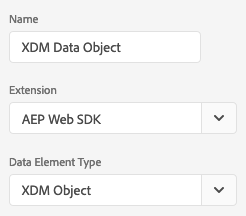

# Welcome

This guide leads you through the different ways to set up the Adobe Experience Platform Web SDK in Launch. To use this feature you need to be whitelisted. If you would like to get on the waiting list please reach out to your CSM.

- Have a [1st-party domain (CNAME)](https://docs.adobe.com/content/help/en/core-services/interface/ec-cookies/cookies-first-party.html) enabled. If you already have a CNAME for Analytics, you should use that one. Testing in development works without a CNAME, but you need one before you go to production.
- Be entitled to Adobe Experience Platform. If you have not purchased Platform, Adobe will provision you with Experience Platform Data Services Foundation for use in a limited fashion with the SDK at no extra charge.
- Be using the latest version of the Visitor ID service.

## Prepare a Schema

The Experience Platform Edge Network takes data as XDM. XDM is a data format that lets you define schemas. The schema defines how the Edge Network expects the data to be formatted. To send data, you must define your schema. 

1. [Create a schema](../../xdm/tutorials/create-schema-ui.md)
2. Add the AEP [!DNL Web SDK ExperienceEvent] Mixin to the schema you created.
3. Create a Dataset from the schema you created.

The following video is intended to support you in creating a schema, dataset, and streaming source connector for your [!DNL Web SDK] data.

>[!VIDEO](https://video.tv.adobe.com/v/35395?quality=12&learn=on)

Log in to Launch and install the `AEP Web SDK` extension. When you install the SDK, you are prompted to configure the extension. Enter the Config ID you requested above. The extension automatically fills in your Organization ID.

For more details on different configuration options, see [Configuring the SDK](../fundamentals/configuring-the-sdk.md).

## Create a configuration ID

You can create a configuration ID using the [edge configuration tool](../fundamentals/edge-configuration.md) in Launch. This allows you to enable the Edge Network to send data to the various solutions. Details for how to find each option are found in the [Edge Configuration Tool](../fundamentals/edge-configuration.md) Page.

>[!NOTE]
>
>Your organization must be whitelisted for this feature. Please contact your CSM to get put on the list for eventual whitelisting.

## Create a Data Element Based on Your Schema

In Launch, create a Data Element that references the schema by changing the extension to AEP Web SDK and setting the type to `XDM Object`. This loads your schema and allows you to map data elements into different parts of the schema.

## Send an event

After the extension is installed, start sending events by adding a `sendEvent` action from the AEP Web SDK extension to a rule. Add the data element you just created to the event as the XDM data. Adobe recommends that you send at least one event every time a page is loaded.

For more details on how to track events, see [Tracking Events](../fundamentals/tracking-events.md).

## Next Steps

After you have data flowing, you can do the following. 

- [Build out your schema](https://docs.adobe.com/content/help/en/experience-platform/xdm/schema/composition.html)
- [Learn about debugging](../fundamentals/debugging.md)
- Learn how to [personalize the experience](../fundamentals/rendering-personalization-content.md)
- Learn about how to send data to multiple solutions
  - [Adobe Analytics](../solution-specific/analytics/analytics-overview.md)
  - [Adobe Audience Manager](../solution-specific/audience-manager/audience-manager-overview.md)
  - [Adobe Target](../solution-specific/target/target-overview.md)
