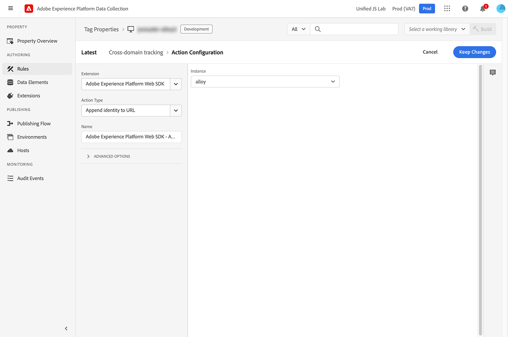

# Mobile-to-web and cross-domain ID sharing

## Overview

The Adobe Experience Platform Web SDK supports visitor ID sharing capabilities that enable customers to deliver personalized experiences more accurately, between mobile apps and mobile web content, and across domains.

## Use cases {#use-cases}

### Deliver consistent personalization between mobile apps and mobile websites

A clothing company wants to personalize their customers' experience based on their interests, and keep the personalization accurate in a mobile application that also loads WebViews. By using the mobile-to-web ID sharing feature, they can ensure that the most accurate offers are presented to customers, using the same visitor identifier in the app and mobile web content by passing the [!DNL ECID] to the mobile web URL.

### Deliver consistent personalization across domains

A retailer with multiple online stores wants to personalize the shopper experience across their domains, based on customer interests. Using the Web SDK cross-domain ID sharing feature, the retailer can deliver accurate offers based on customer interests, across all of their domains.

### Enhance visitor activity reporting

A technology retailer wants to improve their visitor activity reporting with information on when their visitors move from the mobile application to their mobile website, or to their other domains. Using the Web SDK cross-domain ID sharing feature, the marketing team can accurately track visitors across their web properties and generate activity reports.

## Prerequisites {#prerequisites}

To use mobile-to-web and cross-domain ID sharing, you must use [!DNL Web SDK] version 2.11.0 or later.

For Edge Network mobile implementations, this feature is supported in the [Identity for Edge Network](https://aep-sdks.gitbook.io/docs/foundation-extensions/identity-for-edge-network) extension starting with version 1.1.0 (iOS and Android).

This feature is also compatible with [!DNL VisitorAPI.js] version 1.7.0 or later.

## Mobile-to-web ID sharing {#mobile-to-web}

Use the `getUrlVariables` API from the [Identity for Edge Network](https://aep-sdks.gitbook.io/docs/foundation-extensions/identity-for-edge-network/api-reference#geturlvariables) extension to retrieve the identifiers as query parameters and attach them to your URL when opening [!DNL webViews].

No additional configuration is required for the Web SDK to accept `ECID` values in the query string. 

The query string parameter includes:

* `MCID`: The Experience Cloud ID (`ECID`)
* `MCORGID`: The Experience Cloud `orgID` that must match the `orgID` configured in the [!DNL Web SDK].
* `TS`: A timestamp parameter that cannot be older than five minutes.


Mobile-to-web ID sharing uses the `adobe_mc` parameter. When the `adobe_mc` parameter is present and valid, the `ECID` from the query string is automatically added to the identity map in the first request made to the Edge Network. All subsequent Edge Network interactions will use that `ECID`.

For more information on how to pass visitor IDs from a mobile app to a WebView, see the documentation on [handling WebViews](https://experienceleague.adobe.com/docs/platform-learn/implement-mobile-sdk/app-implementation/web-views.html#implementation).

## Cross-domain ID sharing {#cross-domain-sharing}

For cross-domain ID sharing, Web SDK version 2.11.0 adds support for the `appendIdentityToUrl` command. When used, this command generates the `adobe_mc` query string parameter.

The command accepts an object with one property, `url`, and returns an object with the property `url`.

This command does not wait for any consent update. If consent has not been provided, the URL is returned unchanged.

If an `ECID` is not provided, the `/acquire` endpoint will be called to generate an `ECID`.

Below is an example of how a customer can implement cross-domain ID sharing on their website. 

This code adds an event listener for all the clicks on the page, and if the click was on a link to a matching domain (in this case `adobe.com` or `behance.com`), adds the identity to the URL and redirects the user there.

```js
document.addEventListener("click", event => {
  const anchor = event.target.closest("a");
  if (!anchor || !anchor.href) {
    return;
  }
  const url = new URL(anchor.href);
  if (!url.hostname.endsWith("adobe.com") && !url.hostname.endsWith("behance.com")) {
    return;
  }
  event.preventDefault();
  alloy("appendIdentityToUrl", { url: anchor.href }).then(result => {
    document.location = result.url;
  });
});
```

## Using the Tags extension {#tags-extension}

Similar to using the [!DNL Web SDK], there is no additional configuration required in the [!DNL Tags] extension to use identities passed through the URL.

To use mobile-to-web and cross-domain ID sharing through the Tags extension, you must use version 2.12.0 or later of the Tags extension.

To share identities from the current page to other domains, there is a  new action available in the [!DNL Web SDK] [!DNL Tags] extension. This action is designed to be used with a **[!UICONTROL Core - Click]** event type and a value comparison condition.

Follow the steps described [here](../../tags/ui/managing-resources/rules.md) to create a rule with the following configuration:

* [!UICONTROL Event Configuration]:
  * **[!UICONTROL Extension: Core]**
  * **[!UICONTROL Event Type: Click]**
  * Select **[!UICONTROL When the user clicks on > specific elements]**
  * Type in the **[!UICONTROL Selector]**: `a[href]`. This event will trigger any time an anchor tag is clicked on the page with a `href` property.

    

* [!UICONTROL Condition Configuration]
  * **[!UICONTROL Logic Type]**: [!UICONTROL Regular]
  * **[!UICONTROL Extension]**: [!UICONTROL Core]
  * **[!UICONTROL Condition Type]**: [!UICONTROL Value Comparison]
  * **[!UICONTROL Left Operand]**: [!UICONTROL `%this.hostname%`]. This is a special data element that works with [!UICONTROL Core - Click] events and resolves to the hostname of the link that was clicked. 
  * **[!UICONTROL Operator]**: [!UICONTROL Matches Regex]
  * **[!UICONTROL Right Operand]**: Type a regular expression that matches the domains that you would like to share identities with. For example, to match links with hostnames ending with `adobe.com` or `behance.com`, use this regular expression: `behance.com$|adobe.com$`. The linked page needs to have the [!DNL Web SDK] or [!DNL Visitor ID] installed to accept the identity.

    

* [!UICONTROL Action Configuration]
  * **[!UICONTROL Extension]**: [!UICONTROL Adobe Experience Platform Web SDK]
  * **[!UICONTROL Action Type]**: [!UICONTROL Redirect with identity]
  * **[!UICONTROL Instance]**: Select your instance. In most cases, you will have only one instance configured. If you have multiple instances, select the one with the identity you would like to share.

    

The **[!UICONTROL Redirect with identity]** action will stop the browser from navigating through to the link. Then, it will call the `appendIdentityToUrl` method on the [!DNL Web SDK] instance.

Finally, it redirects the user to the [!DNL URL] with the `adobe_mc` query string parameter appended.
