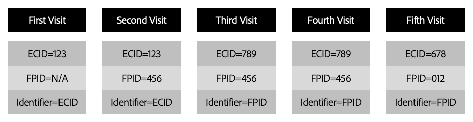

# Tracking Adobe Experience Cloud IDs (ECIDs) in the Platform Web SDK

The Adobe Experience Platform Web SDK leverages [Adobe Experience Cloud IDs (ECIDs)](https://experienceleague.adobe.com/docs/experience-platform/identity/ecid.html?lang=en) to track visitor behavior. Using ECIDs, you can ensure that each device has a unique identifier that can persist across multiple sessions, tying all the hits that occur during and across web sessions to a specific device.

The Platform Web SDK assigns and tracks ECIDs through the use of cookies, with multiple available methods for configuring how these cookies are generated. This document covers how each of these methods work along with their advantages and drawbacks.

## Prerequisites

This guide assumes you are familiar with how identity data works for the Platform Web SDK, including the role of ECIDs and `identityMap`. See the overview on [identity data in the Web SDK](./overview.md) for more information.

## Device identification process

When a new user arrives on your website, Identity Service attempts to set a device identification cookie for that user. For first-time visitors, the ECID is generated and returned in the first response from the Adobe Experience Platform Edge Network. For repeat visitors, the ECID is retrieved from the `kndctr_{YOUR-ORG-ID}_AdobeOrg_identity` cookie and added to the payload.

Once the cookie containing the ECID has been set, each subsequent request generated by the Adobe Experience Platform Web SDK will include the ECID. 

When using cookies for device identification, you have two options to interact with the Edge Network:

1. Send data directly to the Edge Network domain `adobedc.net`. This method is referred to as [third-party data collection](#third-party).
1. Create a CNAME on your own domain that points to `adobedc.net`. This method is referred to as [first-party data collection](#first-party).

As explained in the sections below, the data collection method that you choose to use has a direct impact on cookie lifetime across browsers.

### Third-party data collection {#third-party}

Third-party data collection involves sending data directly to the Edge Network domain `adobedc.net`.

In recent years, web browsers have becoming increasingly restrictive in their handling of cookies set by third parties. Some browsers block third-party cookies by default. If you use third-party cookies to identify site visitors, the lifetime of those cookies is almost always shorter than what would be otherwise available using first-party cookies instead. In some cases, a third-party cookie will expire in as little as seven days.

Additionally, when third-party data collection is used, some ad blockers restrict traffic to Adobe data collection endpoints altogether. 

### First-party data collection {#first-party}

First-party data collection involves setting cookies through a CNAME on your own domain that points to `adobedc.net`.

While browsers have long treated cookies set by CNAME endpoints in a similar manner to those set by site-owned endpoints, recent changes implemented by browsers have created a distinction in how CNAME cookies are handled. While there are no browsers that currently block first-party CNAME cookies by default, some browsers restrict the lifetime of cookies set using a CNAME to just seven days. 

### Effects of cookie lifespans on Adobe Experience Cloud applications {#lifespans}

Regardless of whether you choose first-party or third-party data collection, the length of time a cookie can persist has a direct impact on visitor counts in Adobe Analytics and Customer Journey Analytics. Additionally, end users may experience inconsistent personalization experiences when Adobe Target or Offer Decisioning is used on the site.

For example, consider a situation where you have created a personalization experience that will promote any item to the home page if a user has viewed it three times over the last seven days.

If an end user visits three times in a week and then does not return to the site for seven days, that use could be considered a new user when they return to the site because their cookies may have been deleted by a browser policy (depending on the browser they were using when they visited the site). If this occurs, your Analytics tool will treat the visitor as a new user even though they visited the site just a little over seven days ago. Additionally, any effort to personalize the experience for the user will begin again. 

## First-party device IDs

To account for the [effects of cookie lifespans](#lifespans) as outlined above, you can opt to set and manage your own device identifiers instead. These are referred to as first-party device IDs (FPIDs).

>[!NOTE]
>
>First-party device ID support is only available when sending data to the Platform Edge Network via the Platform Web SDK.

First-party cookies are most effective when they are set using a customer-owned server that leverages a DNS A-record as opposed to a DNS CNAME. Using first-party device IDs,  you to set your own device IDs in cookies using DNS A-records. These IDs can then be sent to Adobe and used as seeds to generate ECIDs that will continue to be the primary identifiers in Adobe Experience Cloud applications. 

If you are using [third-party data collection](#third-party), the FPID must be included in the `identityMap`. However, if you leverage [first-party data collection](#first-party), you can specify a cookie name in the datastream configuration that informs the Edge Network where the FPID cookie is located.

### ID formatting requirements

The Platform Edge Network only accepts IDs that comply with the [universally unique identifier version-4 (UUIDv4) format](https://datatracker.ietf.org/doc/html/rfc4122). Device IDs that are not in UUIDv4 format will be rejected. 

The primary reason the UUIDv4 is the only acceptable ID format is that generation of a UUID will almost always result in a unique, random ID being generated. The probability of a collision occurring is also incredibly small. UUIDv4 cannot be seeded using IP addresses or any other personal identifiable information (PII). 

UUIDs are ubiquitous and libraries can be found for virtually every programming language to generate them.

### Setting a cookie using a DNS A-record

A variety of methods can be used to set a cookie in a way that will prevent it from being restricted due to browser policies: 

* Generate cookies using server-side scripting languages
* Set cookies in response to an API request made to a sub-domain or other endpoint on the site
* Generate cookies using a CMS
* Generate cookies using a CDN

>[!NOTE]
>
>Cookies set using JavaScript's `document.cookie` method will almost never be protected from browser policies that restrict cookie durations. 

### When to set the cookie

The FPID cookie should ideally be set before making any requests to the Edge Network. However, in scenarios where that is not possible, an ECID is still generated using existing methods and acts as the primary identifier as long as the cookie exists.

Assuming the ECID is eventually impacted by a browser deletion policy, but the FPID is not, the FPID will become the primary identifier on the next visit and will be used to seed the ECID on each subsequent visit. 

### Setting the expiration for the cookie

Setting the expiration of a cookie is something that should be carefully considered as you implement the FPID functionality. When making this decision, you should take into account the countries or regions in which your organization operates along with the laws and policies in each one of those regions. 

As part of this decision, you may want to adopt a company-wide cookie setting policy or one that varies for users in each locale where you operate. 

Regardless of the setting you choose for the initial expiration of a cookie, you must ensure you include logic that extends the expiration of the cookie each time a new visit to the site occurs. 

### Impact of cookie flags

There are a variety of cookie flags that impact the how cookies are treated across different browsers:

* [`HTTPOnly`](#http-only)
* [`Secure`](#secure)
* [`SameSite`](#same-site)

#### `HTTPOnly` {#http-only}

Cookies set using the `HTTPOnly` flag cannot be accessed using client-side scripts. This means that if you set an `HTTPOnly` flag when setting the FPID, you must leverage a server-side scripting language to read the cookie value for inclusion in the `identityMap`.

If you choose to have the Platform Edge Network read the value of the FPID cookie, setting the `HTTPOnly` flag will ensure the value is not accessible by any client-side scripts but will not have any negative impact on the Platform Edge Network's ability to read the cookie. 

>[!NOTE]
>
>Use of the `HTTPOnly` flag does not have an impact on the cookie policies that may restrict cookie lifetime. However, it is still something you should consider as you set and read the value of the FPID.

#### `Secure` {#secure}

Cookies set with the `Secure` attribute are only sent to the server with an encrypted request over the HTTPS protocol. Using this flag can help ensure man-in-the-middle attackers cannot easily access the value of the cookie. When possible, it is always a good idea to set the `Secure` flag.

#### `SameSite` {#same-site}

The `SameSite` attribute lets servers determine whether cookies are sent with cross-site requests. The attribute provides some protection against cross-site forgery attacks. Three possible values exist: `Strict`, `Lax` and `None`. Please consult your internal team to determine which setting is right for your organization.

If no `SameSite` attribute is specified, the default setting for some browsers is now `SameSite=Lax`. 

### Using FPIDs in `identityMap`

Below is an example of how you would set an FPID on it's own in the `identityMap`:

```json
{
  "identityMap": {
    "FPID": [
      {
        "id": "123e4567-e89b-42d3-9456-426614174000",
        "authenticatedState": "ambiguous",
        "primary": true
      }
    ]
  }
}
```

As with other identity types, you can include the FPID with other identities within `identityMap`. The following is an example of the FPID included with an Authenticated CRM ID:

```json
{
  "identityMap": {
    "FPID": [
      {
        "id": "123e4567-e89b-42d3-9456-426614174000",
        "authenticatedState": "ambiguous",
        "primary": true
      }
    ],
    "EMAIL": [
      {
        "id": "email@mail.com",
        "authenticatedState": "authenticated",
        "primary": true
      }
    ]
  }
}
```

If the FPID is contained in a cookie being read by the Edge Network when first-party data collection is enabled, you should capture only the authenticated CRM ID: 

```json
{
  "identityMap": {
    "EMAIL": [
      {
        "id": "email@mail.com",
        "authenticatedState": "authenticated",
        "primary": true
      }
    ]
  }
}
```

The following `identityMap` would result in an error response from the Edge Network since it is missing the `primary` indicator for the FPID. At last one of the IDs present in `identityMap` must be marked as `primary`. 

```json
{
  "identityMap": {
    "FPID": [
      {
        "id": "123e4567-e89b-12d3-a456-426614174000",
        "authenticatedState": "ambiguous"
      }
    ],
    "EMAIL": [
      {
        "id": "email@mail.com",
        "authenticatedState": "authenticated"
      }
    ]
  }
}
```

The error response returned by Experience Edge in this case would be similar to the following:

```json
{
    "type": "https://ns.adobe.com/aep/errors/EXEG-0306-400",
    "status": 400,
    "title": "No primary identity set in request (event)",
    "detail": "No primary identity found in the input event. Update the request accordingly to your schema and try again.",
    "report": {
        "requestId": "{REQUEST_ID}",
        "configId": "{CONFIG_ID}",
        "orgId": "{ORG_ID}"
    }
}
```

### ID hierarchy

When both an ECID and FPID are present, the ECID will be prioritized in identifying the user. This will ensure that when an existing ECID is present in the browser cookie store, it will continue to be the primary identifier and existing visitor counts do not risk being affected. For existing users, the FPID will not the primary identity until the ECID has either been deleted manually, it expires, or is deleted as as result of a browser policy.

Identities are prioritized in the following order:

1. ECID included in the `identityMap`
1. ECID stored in a cookie
1. FPID included in the `identityMap`
1. FPID stored in a cookie

### Migrating to first-party device IDs

If you are migrating to using FPIDs from a previous implementation, it may be difficult to visualize what the transition might look like at a low level.

To help illustrate this process, consider a scenario that involves a customer who has previously visited your site and what impact an FPID migration would have on how that customer is identified in Adobe solutions. 



| Visit | Description |
| --- | --- |
| First Visit | Assume you have not yet started setting the FPID cookie. The ECID contained in the [AMCV cookie](https://experienceleague.adobe.com/docs/id-service/using/intro/cookies.html#section-c55af54828dc4cce89f6118655d694c8) will be the identifier used to identify the visitor. |
| Second Visit | Rollout of the First-Party Device ID solution has started. The existing ECID is still present and continues to be the primary identifier for visitor identification. |
| Third Visit | Between the second and third visit, a sufficient amount of time has elapsed that the ECID has been deleted due to browser policy. However, because the FPID was set using a DNS A-record, the FPID persists. The FPID is now considered the primary ID and used to seed the ECID, which is written to the end-user device. The user would now be considered a new visitor in the Adobe Experience Platform and Experience Cloud solutions. |
| Fourth Visit  | Between the third and fourth visits, a sufficient amount of time has elapsed that the ECID has been deleted due to browser policy. Like the previous visit, the FPID remains due to the manner in which it was set. This time, the same ECID is generated as the previous visit. The user is seen throughout the Experience Platform and Experience Cloud solutions as the same user as the previous visit. |
| Fifth Visit | Between the fourth and fifth visits, the end-user cleared all the cookies in their browser. A new FPID is generated and used to seed the creation of a new ECID. The user would now be considered a new visitor in the Adobe Experience Platform and Experience Cloud solutions. |

{style="table-layout:auto"}

### FAQ 

The following is a list of answers to frequently asked questions about first-party device IDs.

#### How is seeding an ID different from simply generating an ID? 

The concept of seeding is unique in that the FPID passed to Adobe Experience Cloud is converted to an ECID using a deterministic algorithm. Each time the same FPID is sent the Adobe Experience Platform Edge Network, the same ECID is seeded from the FPID. 

#### When should the first-party device ID be generated?

To reduce potential visitor inflation, the FPID should be generated prior to making your first request using the Platform Web SDK. However, if you are unable to do this, an ECID will still be generated for that user and will be used as the primary identifier. The FPID that was generated will not become the primary identifier until the ECID is no longer present. 

#### Which data collection methods support first-party device IDs?

Currently only the Platform Web SDK supports FPIDs. 

#### Are FPIDs stored on any Platform or Experience Cloud solutions?

Once the FPID has been used to seed an ECID, it is dropped from the `identityMap` and replaced with the ECID that has been generated. The FPID is not stored in any Adobe Experience Platform or Experience Cloud solutions.
