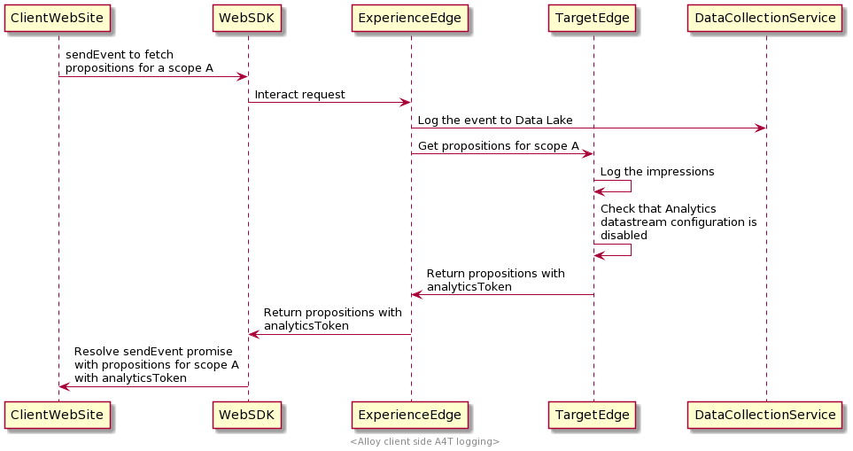

# Client Side Analytics Logging

## Overview

Adobe Experience Platform Web SDK allows the customers to collect the Target related Analytics data on the client side. 
`Analytics Client Side Logging` means that the data that needs to be shared with Analytics will be returned to client side, so that the customers are able to collect it and share it with Analytics.
This option is used by the customers that want to collect the Analytics data by themselves and send it to Analytics. This can be achieved using:
- Data Insertion API
- AppMeasurement.js

NOTE: The AppMeasurement.js route is not fully working, but it will be available in the near future.

For the Analytics reporting to work properly, the customer has to send the A4T related data retrieved from the `sendEvent` command in the Analytics hit.
We consider `Analytics Client Side Logging` is enabled when Analytics is disabled in the customers datastream configuration. Check the screenshot below for an example.


When Target Edge computes propositions response it will check if `Analytics Client Side Logging` is enabled then it will add to each proposition an Analytics token.

The flow looks similar to this:



This is an example of a `interact` response when `Analytics Client Side Logging` is enabled:

```json
{
    "requestId": "1234",
    "handle": [
        {
            "payload": [
                {
                    "id": "AT:eyJhY3Rpdml0eUlkIjoiNDM0Njg5IiwiZXhwZXJpZW5jZUlkIjoiMCJ9",
                    "scope": "a4t-test",
                    "scopeDetails": {
                        "decisionProvider": "TGT",
                        "activity": {
                            "id": "434689"
                        },
                        "experience": {
                            "id": "0"
                        },
                        "strategies": [
                            {
                                "algorithmID": "0",
                                "trafficType": "0"
                            }
                        ],
                        "characteristics": {
                            "eventToken": "2lTS5KA6gj4JuSjOdhqUhGqipfsIHvVzTQxHolz2IpTMromRrB5ztP5VMxjHbs7c6qPG9UF4rvQTJZniWgqbOw==",
                            "analyticsToken": "434689:0:0|2,434689:0:0|1"
                        }
                    },
                    "items": [
                        {
                            "id": "1184844",
                            "schema": "https://ns.adobe.com/personalization/html-content-item",
                            "meta": {
                                "geo.state": "bucuresti",
                                "activity.id": "434689",
                                "experience.id": "0",
                                "activity.name": "a4t test form based activity",
                                "offer.id": "1184844",
                                "profile.tntId": "04608610399599289452943468926942466370-pybgfJ"
                            },
                            "data": {
                                "id": "1184844",
                                "format": "text/html",
                                "content": "<div> analytics impressions </div>"
                            }
                        }
                    ]
                },
                {
                    "id": "AT:eyJhY3Rpdml0eUlkIjoiNDM0Njg5IiwiZXhwZXJpZW5jZUlkIjoiMCJ9",
                    "scope": "a4t-test",
                    "scopeDetails": {
                        "decisionProvider": "TGT",
                        "activity": {
                            "id": "434689"
                        },
                        "characteristics": {
                            "eventToken": "E0gb6q1+WyFW3FMbbQJmrg==",
                            "analyticsToken": "434689:0:0|32767"
                        }
                    },
                    "items": [
                        {
                            "id": "434689",
                            "schema": "https://ns.adobe.com/personalization/measurement",
                            "data": {
                                "type": "click",
                                "format": "application/vnd.adobe.target.metric"
                            }
                        }
                    ]
                }
            ],
            "type": "personalization:decisions",
            "eventIndex": 0
        }
    ]
}
```

If the proposition is for an activity that has Analytics reporting then it will have a `scopeDetails.characteristics.analyticsToken`.
This is the A4T payload that needs to be included as a `tnta` tag into the [Adobe Analytics Data Insertion API](https://github.com/AdobeDocs/analytics-1.4-apis/blob/master/docs/data-insertion-api/index.md) call.

## Implementation

### Form Based Composer based Activities

Form Based Composer Based Activities give the customer full control over the execution of the propositions.
Here you can find how to implement them using Adobe Experience Platform Web SDK - [Manually render personalized content](../../rendering-personalization-content.md).

When the customer requests propositions for a specific decision scope, the proposition returned will contain its Analytics token.

We advise that the customer chain the AEP WEB SDK `sendEvent` command and iterate through the returned propositions to execute them. At the same time they should collect the Analytics tokens.
This is how you can trigger a `sendEvent` for a form based composer based activity scope:

```javascript
alloy("sendEvent", {
    "decisionScopes": ["a4t-test"],
    "xdm": {
      "web": {
        "webPageDetails": {
          "name": "Home Page"
        }
      }
    }
  }
).then(function(results) {
  for (var i = 0; i < results.propositions.length; i++) {
    var proposition = propositions[i];
    //execute the propositions and collect the Analytics payload
  }
});
```

This is an example of what `results.propositions` might contain:

```javascript
[
  {
    "id": "AT:eyJhY3Rpdml0eUlkIjoiNDM0Njg5IiwiZXhwZXJpZW5jZUlkIjoiMCJ9",
    "scope": "a4t-test",
    "scopeDetails": {
      "decisionProvider": "TGT",
      "activity": {
        "id": "434689"
      },
      "experience": {
        "id": "0"
      },
      "strategies": [
        {
          "algorithmID": "0",
          "trafficType": "0"
        }
      ],
      "characteristics": {
        "eventToken": "2lTS5KA6gj4JuSjOdhqUhGqipfsIHvVzTQxHolz2IpTMromRrB5ztP5VMxjHbs7c6qPG9UF4rvQTJZniWgqbOw==",
        "analyticsToken": "434689:0:0|2,434689:0:0|1"
      }
    },
    "items": [
      {
        "id": "1184844",
        "schema": "https://ns.adobe.com/personalization/html-content-item",
        "meta": {
          "geo.state": "bucuresti",
          "activity.id": "434689",
          "experience.id": "0",
          "activity.name": "a4t test form based activity",
          "offer.id": "1184844",
          "profile.tntId": "04608610399599289452943468926942466370-pybgfJ"
        },
        "data": {
          "id": "1184844",
          "format": "text/html",
          "content": "<div> analytics impressions </div>"
        }
      }
    ]
  },
  {
    "id": "AT:eyJhY3Rpdml0eUlkIjoiNDM0Njg5IiwiZXhwZXJpZW5jZUlkIjoiMCJ9",
    "scope": "a4t-test",
    "scopeDetails": {
      "decisionProvider": "TGT",
      "activity": {
        "id": "434689"
      },
      "characteristics": {
        "eventToken": "E0gb6q1+WyFW3FMbbQJmrg==",
        "analyticsToken": "434689:0:0|32767"
      }
    },
    "items": [
      {
        "id": "434689",
        "schema": "https://ns.adobe.com/personalization/measurement",
        "data": {
          "type": "click",
          "format": "application/vnd.adobe.target.metric"
        }
      }
    ]
  }
]
```

This is a sample function, showing how we can extract the Analytics token from a proposition:

```javascript
function getAnalyticsPayload(proposition) {
  if(proposition === undefined) {
    return;
  }
  if(proposition.scopeDetails === undefined) {
    return;
  }
  if(proposition.scopeDetails.characteristics === undefined) {
    return;
  }
  return proposition.scopeDetails.characteristics.analyticsToken;
}
```

A proposition can have different type of items, and we differentiate them by `item.schema`.
These are the Form Based Composer based Activities proposition item schemas that we support: 

```javascript
var HTML_SCHEMA = "https://ns.adobe.com/personalization/html-content-item";
var MEASUREMENT_SCHEMA = "https://ns.adobe.com/personalization/measurement";
var JSON_SCHEMA = "https://ns.adobe.com/personalization/json-content-item";
var REDIRECT_SCHEMA = "https://ns.adobe.com/personalization/redirect-item"
```

`HTML_SCHEMA` and `JSON_SCHEMA` are the schemas that reflect the type of the offer, while `MEASUREMENT_SCHEMA` reflects the metrics that should be attached to a DOM element.

Here are the steps that have to be executed when using Form Base Composer based activities with AEP Web SDK:
1. Send event that fetches Form-Based Composer based activity offers 
2. Apply the content changes to the page 
3. Send the `decisioning.propositionDisplay` notification event 
4. Collect the Analytics tokens
5. Send the Analytics Hit using [Adobe Analytics Data Insertion API](https://github.com/AdobeDocs/analytics-1.4-apis/blob/master/docs/data-insertion-api/index.md).

```javascript
alloy("sendEvent", {
    "decisionScopes": ["a4t-test"],
    "xdm": {
      "web": {
        "webPageDetails": {
          "name": "Home Page"
        }
      }
    }
  }
).then(function(results) {
  var analyticsPayload = new Set();
  for (proposition of results.propositions) {
    for (item of proposition) {
      if (item.schema === HTML_SCHEMA) {
        // 1. apply offer
        // 2. collect executed propositions and send the `decisioning.propositionDisplay` notification event
        // 3. collect the Analytics tokens
      }
    }
  }
  // send the page view Analytics hit with collected Analytics payload
});
```

A full working example you can be found here: [AEP WEB SDK repo](https://github.com/adobe/alloy).

### Visual Experience Composer Based composed Activities

The VEC Based Composer based Activities offers are the offers that were authored using Visual Experience Composer. 
These types of offers can be completely handled by the Adobe Experience Platform Web SDK. 
Here are more details on how to use this feature: [Automatically rendering content](../../rendering-personalization-content.md)

When auto rendering is enabled the customer can collect the Analytics tokens from the propositions that were executed on the page. We advise that the
customer chain the `sendEvent` command and iterate the propositions to filter propositions that Adobe Experience Platform Web SDK
have attempted to render. Take a look at the example bellow:

```javascript
alloy("sendEvent", {
    "renderDecisions": true,
    "xdm": {
      "web": {
        "webPageDetails": {
          "name": "Home Page"
        }
      }
    }
  }
).then(function (results) {
  var analyticsPayloads = new Set();
  
  for (var i = 0; i < results.propositions.length; i++) {
  
    var proposition = propositions[i];
    var renderAttempted = proposition.renderAttempted;

    if (renderAttempted === true) {
      var analyticsPayload = getAnalyticsPayload(proposition);
      
      if (analyticsPayload !== undefined) {
        analyticsPayloads.add(analyticsPayload);
      }
    }
  }
  var analyticsPayloadsToken = concatenateAnalyticsPayloads(analyticsPayloads);
  // send the page view Analytics hit with collected Analytics payload
});
```

One thing to mention is that Analytics token that is passed in the Analytics hit is a `String` that contain a set of tokens delimited by `,`. 
Here is an example of how to concatenate the Analytics tokens array:

```javascript
var concatenateAnalyticsPayloads = function concatenateAnalyticsPayloads(analyticsPayloads) {
  if (analyticsPayloads.size > 1) {
    return [].concat(analyticsPayloads).join(',');
  }
  return [].concat(analyticsPayloads).join();
};

```

### Click Track events

Using Adobe Target activities the customer can set up different metrics on the page:
- automatically attached to the DOM (VEC authored Activities)
- manually attached to the DOM

Both types are a delayed end user interaction on the web page. We recommend collecting the Analytics payloads using the `onBeforeEventSend` Adobe Experience Platform Web SDK hook.
The `onBeforeEventSend` hook should be configured in the `configure` command, and it is going to be reflected across entire DataStream Configuration events.

Here is a sample:

```javascript
alloy("configure", {
  edgeConfigId: "datastream configuration ID",
  orgId: "adobe ORG ID",
  onBeforeEventSend: function(options) {
    const xdm = options.xdm;
    const eventType = xdm.eventType;
    if (eventType === "decisioning.propositionInteract") {
      const analyticsPayloads = new Set();
      const propositions = xdm._experience.decisioning.propositions;

      for (var i = 0; i < propositions.length; i++) {
        var proposition = propositions[i];
        analyticsPayloads.add(getAnalyticsPayload(proposition));
      }
      // trigger the Analytics hit
    }
  }
});
```

