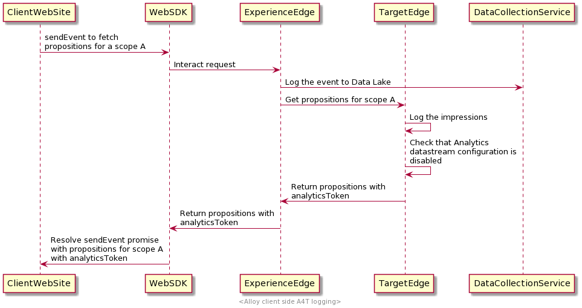

# Client-side logging for A4T data in the Platform Web SDK

## Overview {#overview}

The Adobe Experience Platform Web SDK allows you to collect [Adobe Analytics for Target (A4T)](https://experienceleague.adobe.com/docs/target/using/integrate/a4t/a4t.html) data on the client side of your web application.

Client-side logging means that relevant [!DNL Target] data is returned on the client side, allowing you to collect it and share it with Analytics. This option should be enabled if you intend to manually send data to Analytics using the [Data Insertion API](https://experienceleague.adobe.com/docs/analytics/import/c-data-insertion-api.html).

>[!NOTE]
>
>A method for performing this using [AppMeasurement.js](https://experienceleague.adobe.com/docs/analytics/implementation/js/overview.html) is currently under development and will be available in the near future.

This document covers the steps for setting up client-side A4T logging for the Web SDK and provides some implementation examples for common use cases.

## Prerequisites {#prerequisites}

This tutorial assumes that you are familiar with the fundamental concepts and processes related to using the Web SDK for personalization purposes. Please review the following documentation if you require an introduction:

* [Configuring the Web SDK](../../../fundamentals/configuring-the-sdk.md)
* [Sending events](../../../fundamentals/tracking-events.md)
* [Rendering personalization content](../../rendering-personalization-content.md)

## Set up Analytics client-side logging {#set-up-client-side-logging}

The following subsections outline how to enable Analytics client-side logging for your Web SDK implementation.

### Enable Analytics client-side logging {#enable-analytics-client-side-logging}

To consider Analytics client-side logging enabled for your implementation, you must disable the Adobe Analytics configuration in your [datastream](../../../datastreams/overview.md).


### Retrieve [!DNL A4T] data from the SDK and send it to Analytics {#a4t-to-analytics}

In order for this reporting method to work properly, you must send the [!DNL A4T] related data retrieved from the [`sendEvent`](../../../fundamentals/tracking-events.md) command in the Analytics hit.

When Target Edge computes a propositions response, it checks if Analytics client-side logging is enabled (i.e. if Analytics is disabled in your datastream). If client-side logging is enabled, the system adds an Analytics token to each proposition in the response.

The flow looks similar to this:



The following is an example of an `interact` response when Analytics client-side logging is enabled. If the proposition is for an activity that has Analytics reporting, it will have a `scopeDetails.characteristics.analyticsToken` property.

```json
{
  "requestId": "1234",
  "handle": [
    {
      "payload": [
        {
          "id": "AT:eyJhY3Rpdml0eUlkIjoiNDM0Njg5IiwiZXhwZXJpZW5jZUlkIjoiMCJ9",
          "scope": "a4t-test",
          "scopeDetails": {
            "decisionProvider": "TGT",
            "activity": {
              "id": "434689"
            },
            "experience": {
              "id": "0"
            },
            "strategies": [
              {
                "algorithmID": "0",
                "trafficType": "0"
              }
            ],
            "characteristics": {
              "eventToken": "2lTS5KA6gj4JuSjOdhqUhGqipfsIHvVzTQxHolz2IpTMromRrB5ztP5VMxjHbs7c6qPG9UF4rvQTJZniWgqbOw==",
              "analyticsToken": "434689:0:0|2,434689:0:0|1"
            }
          },
          "items": [
            {
              "id": "1184844",
              "schema": "https://ns.adobe.com/personalization/html-content-item",
              "meta": {
                "geo.state": "bucuresti",
                "activity.id": "434689",
                "experience.id": "0",
                "activity.name": "a4t test form based activity",
                "offer.id": "1184844",
                "profile.tntId": "04608610399599289452943468926942466370-pybgfJ"
              },
              "data": {
                "id": "1184844",
                "format": "text/html",
                "content": "<div> analytics impressions </div>"
              }
            }
          ]
        },
        {
          "id": "AT:eyJhY3Rpdml0eUlkIjoiNDM0Njg5IiwiZXhwZXJpZW5jZUlkIjoiMCJ9",
          "scope": "a4t-test",
          "scopeDetails": {
            "decisionProvider": "TGT",
            "activity": {
              "id": "434689"
            },
            "characteristics": {
              "eventToken": "E0gb6q1+WyFW3FMbbQJmrg==",
              "analyticsToken": "434689:0:0|32767"
            }
          },
          "items": [
            {
              "id": "434689",
              "schema": "https://ns.adobe.com/personalization/measurement",
              "data": {
                "type": "click",
                "format": "application/vnd.adobe.target.metric"
              }
            }
          ]
        }
      ],
      "type": "personalization:decisions",
      "eventIndex": 0
    }
  ]
}
```

Propositions for Form-based Experience Composer activities can contain both content and click metric items under the same proposition. Thus, instead of having a single analytics token for content display in `scopeDetails.characteristics.analyticsToken` property, these can have both a display and a click analytics token specified in `scopeDetails.characteristics.analyticsDisplayToken` and `scopeDetails.characteristics.analyticsClickToken` properties, correspondingly.

```json
{
  "requestId": "1234",
  "handle": [
    {
      "payload": [
        {
          "id": "AT:eyJhY3Rpdml0eUlkIjoiNDM0Njg5IiwiZXhwZXJpZW5jZUlkIjoiMCJ9",
          "scope": "a4t-test",
          "scopeDetails": {
            "decisionProvider": "TGT",
            "activity": {
              "id": "434689"
            },
            "experience": {
              "id": "0"
            },
            "strategies": [
              {
                "algorithmID": "0",
                "trafficType": "0"
              }
            ],
            "characteristics": {
               "displayToken": "2lTS5KA6gj4JuSjOdhqUhGqipfsIHvVzTQxHolz2IpTMromRrB5ztP5VMxjHbs7c6qPG9UF4rvQTJZniWgqbOw==",
               "clickToken": "E0gb6q1+WyFW3FMbbQJmrg==",
               "analyticsDisplayToken": "434689:0:0|2,434689:0:0|1", 
               "analyticsClickToken": "434689:0:0|32767"
            }
          },
          "items": [
            {
              "id": "1184844",
              "schema": "https://ns.adobe.com/personalization/html-content-item",
              "meta": {
                "geo.state": "bucuresti",
                "activity.id": "434689",
                "experience.id": "0",
                "activity.name": "a4t test form based activity",
                "offer.id": "1184844",
                "profile.tntId": "04608610399599289452943468926942466370-pybgfJ"
              },
              "data": {
                "id": "1184844",
                "format": "text/html",
                "content": "<div> analytics impressions </div>"
              }
            },
            {
              "id": "434689",
              "schema": "https://ns.adobe.com/personalization/measurement",
              "data": {
                "type": "click",
                "format": "application/vnd.adobe.target.metric"
              }
            }
          ]
        }
      ],
      "type": "personalization:decisions",
      "eventIndex": 0
    }
  ]
}
```

All the values from `scopeDetails.characteristics.analyticsToken`, as well as `scopeDetails.characteristics.analyticsDisplayToken` (for displayed content) and `scopeDetails.characteristics.analyticsClickToken` (for click metrics) are the A4T payloads that need to be collected and included as `tnta` tag in the [Data Insertion API](https://github.com/AdobeDocs/analytics-1.4-apis/blob/master/docs/data-insertion-api/index.md) call.

>[!IMPORTANT]
>
>The `analyticsToken`, `analyticsDisplayToken`, `analyticsClickToken` properties can contain multiple tokens, concatenated as a single comma-delineated string.
>
>In the implementation examples provided in the next section, multiple Analytics tokens are being collected iteratively. To concatenate an array of Analytics tokens, use a function similar this:
>
>```javascript
>var concatenateAnalyticsPayloads = function concatenateAnalyticsPayloads(analyticsPayloads) {
>  if (analyticsPayloads.size > 1) {
>    return [].concat(analyticsPayloads).join(',');
>  }
>  return [].concat(analyticsPayloads).join();
>};
>```

## Implementation examples {#implementation-examples}

The following subsections demonstrate how to implement Analytics client-side logging for common use cases.

### Form-Based Experience Composer activities {#form-based-composer}

You can use the Web SDK to control the execution of propositions from [Adobe Target Form-Based Experience Composer](https://experienceleague.adobe.com/docs/target/using/experiences/form-experience-composer.html) activities.

When you request propositions for a specific decision scope, the proposition returned contains its appropriate Analytics token. Best practice is to chain the Platform Web SDK `sendEvent` command and iterate through the returned propositions to execute them while collecting the Analytics tokens at the same time.

You can trigger a `sendEvent` command for a Form-Based Experience Composer activity scope like this:

```javascript
alloy("sendEvent", {
    "decisionScopes": ["a4t-test"],
    "xdm": {
      "web": {
        "webPageDetails": {
          "name": "Home Page"
        }
      }
    }
  }
).then(function(results) {
  for (var i = 0; i < results.propositions.length; i++) {
    //Execute the propositions and collect the Analytics payload
  }
});
```

From here, you must implement code to execute the propositions and construct a payload that will ultimately be sent to Analytics. This is an example of what `results.propositions` might contain:

```json
[
  {
    "id": "AT:eyJhY3Rpdml0eUlkIjoiNDM0Njg5IiwiZXhwZXJpZW5jZUlkIjoiMCJ9",
    "scope": "a4t-test",
    "scopeDetails": {
      "decisionProvider": "TGT",
      "activity": {
        "id": "434689"
      },
      "experience": {
        "id": "0"
      },
      "strategies": [
        {
          "algorithmID": "0",
          "trafficType": "0"
        }
      ],
      "characteristics": {
        "eventToken": "2lTS5KA6gj4JuSjOdhqUhGqipfsIHvVzTQxHolz2IpTMromRrB5ztP5VMxjHbs7c6qPG9UF4rvQTJZniWgqbOw==",
        "analyticsToken": "434689:0:0|2,434689:0:0|1"
      }
    },
    "items": [
      {
        "id": "1184844",
        "schema": "https://ns.adobe.com/personalization/html-content-item",
        "meta": {
          "geo.state": "bucuresti",
          "activity.id": "434689",
          "experience.id": "0",
          "activity.name": "a4t test form based activity",
          "offer.id": "1184844",
          "profile.tntId": "04608610399599289452943468926942466370-pybgfJ"
        },
        "data": {
          "id": "1184844",
          "format": "text/html",
          "content": "<div> analytics impressions </div>"
        }
      }
    ]
  },
  {
    "id": "AT:eyJhY3Rpdml0eUlkIjoiNDM0Njg5IiwiZXhwZXJpZW5jZUlkIjoiMCJ9",
    "scope": "a4t-test",
    "scopeDetails": {
      "decisionProvider": "TGT",
      "activity": {
        "id": "434689"
      },
      "characteristics": {
        "eventToken": "E0gb6q1+WyFW3FMbbQJmrg==",
        "analyticsToken": "434689:0:0|32767"
      }
    },
    "items": [
      {
        "id": "434689",
        "schema": "https://ns.adobe.com/personalization/measurement",
        "data": {
          "type": "click",
          "format": "application/vnd.adobe.target.metric"
        }
      }
    ]
  },
  {
    "id": "AT:eyJhY3Rpdml0eUlkIjoiNDM0Njg5IiwiZXhwZXJpZW5jZUlkIjoiMCJ9",
    "scope": "a4t-test",
    "scopeDetails": {
      "decisionProvider": "TGT",
      "activity": {
        "id": "434688"
      },
      "experience": {
        "id": "0"
      },
      "strategies": [
        {
          "algorithmID": "0",
          "trafficType": "0"
        }
      ],
      "characteristics": {
          "displayToken": "91TS5KA6gj4JuSjOdhqUhGqipfsIHvVzTQxHolz2IpTMromRrB5ztP5VMxjHbs7c6qPG9UF4rvQTJZniWgqgEt==",
          "clickToken": "Tagb6q1+WyFW3FMbbQJrtg==",
          "analyticsDisplayTokens": "434688:0:0|2,434688:0:0|1",
          "analyticsClickTokens": "434688:0:0|32767"
        }
      }
    },
    "items": [
      {
        "id": "1184845",
        "schema": "https://ns.adobe.com/personalization/html-content-item",
        "meta": {
          "geo.state": "bucuresti",
          "activity.id": "434688",
          "experience.id": "0",
          "activity.name": "a4t test form based activity 1",
          "offer.id": "1184845"
        },
        "data": {
          "id": "1184845",
          "format": "text/html",
          "content": "<div> analytics impressions 1</div>"
        }
      },
      {
        "id": "434688",
        "schema": "https://ns.adobe.com/personalization/measurement",
        "data": {
          "type": "click",
          "format": "application/vnd.adobe.target.metric"
        }
      }
    ]
  }
]
```

To extract the Analytics token from a proposition with content items, you can implement a function similar to the following:

```javascript
function getDisplayAnalyticsPayload(proposition) {
  if (!proposition || !proposition.scopeDetails || !proposition.scopeDetails.characteristics) {
    return;
  }
  var characteristics = proposition.scopeDetails.characteristics;
  if (characteristics.analyticsDisplayToken) {
    return characteristics.analyticsDisplayToken;
  }
  return characteristics.analyticsToken;
}
```

A proposition can have different types of items, as indicated by the `schema` property of the item in question. There are four proposition item schemas supported for Form-Based Experience Composer activities:

```javascript
var HTML_SCHEMA = "https://ns.adobe.com/personalization/html-content-item";
var MEASUREMENT_SCHEMA = "https://ns.adobe.com/personalization/measurement";
var JSON_SCHEMA = "https://ns.adobe.com/personalization/json-content-item";
var REDIRECT_SCHEMA = "https://ns.adobe.com/personalization/redirect-item";
```

`HTML_SCHEMA` and `JSON_SCHEMA` are the schemas that reflect the type of the offer, while `MEASUREMENT_SCHEMA` reflects the metrics that should be attached to a DOM element.

Analytics payloads for click metrics should be collected and sent to Analytics separately from content items, at the moment when the visitor actually clicks on the previously displayed content.

The following helper function for getting the click metric A4T payloads will come in handy in this case:

```javascript
function getClickAnalyticsPayload(proposition) {
  if (!proposition || !proposition.scopeDetails || !proposition.scopeDetails.characteristics) {
    return;
  }
  var characteristics = proposition.scopeDetails.characteristics;
  if (characteristics.analyticsClickToken) {
    return characteristics.analyticsClickToken;
  }
  return characteristics.analyticsToken;
}
```

#### Implementation summary {#implementation-summary}

In summary, the following steps must be executed when applying Form-Based Experience Composer activities with the Platform Web SDK:

1. Send an event that fetches Form-Based Experience Composer activity offers;
1. Apply the content changes to the page;
1. Send the `decisioning.propositionDisplay` notification event;
1. Collect the Analytics display tokens from the SDK response and construct a payload for the Analytics hit;
1. Send the payload to Analytics using the [Data Insertion API](https://github.com/AdobeDocs/analytics-1.4-apis/blob/master/docs/data-insertion-api/index.md);
1. If there are any click metrics in delivered propositions, click listeners should be setup so that when a click is performed, it sends the `decisioning.propositionInteract` notification event. The `onBeforeEventSend` handler should be configured so that when intercepting `decisioning.propositionInteract` events, the following actions happen:
   1. Collecting the click Analytics tokens from `xdm._experience.decisioning.propositions`
   1. Sending the click Analytics hit with the collected Analytics payload via [Data Insertion API](https://github.com/AdobeDocs/analytics-1.4-apis/blob/master/docs/data-insertion-api/index.md);

```javascript
alloy("sendEvent", {
    "decisionScopes": ["a4t-test"],
    "xdm": {
      "web": {
        "webPageDetails": {
          "name": "Home Page"
        }
      }
    }
  }
).then(function(results) {
  var analyticsPayload = new Set();
  results.propositions.forEach(function (proposition) {
    proposition.items.forEach(function (item) {
      if (item.schema === HTML_SCHEMA) {
        // 1. Apply offer
        // 2. Collect executed propositions and send the decisioning.propositionDisplay notification event
        // 3. Collect the display Analytics tokens
      }
      if (item.schema === MEASUREMENT_SCHEMA) {
        // Setup click listener, so that when clicked:
        // 1. Collect clicked propositions and send the decisioning.propositionInteract notification event
        // Note: onBeforeEventSend handler should be configured, so that when intercepting decisioning.propositionInteract events:
        //   1. Collect the click Analytics tokens from xdm._experience.decisioning.propositions
        //   2. Send the click Analytics hit with the collected Analytics payload via Data Insertion API
      }
    });
  });
  // Send the page view Analytics hit with the collected display Analytics payload via Data Insertion API
});
```

### Visual Experience Composer activities {#visual-experience-composer-acitivties}

The Web SDK allows you to handle offers that were authored using [Visual Experience Composer (VEC)](https://experienceleague.adobe.com/docs/target/using/experiences/vec/visual-experience-composer.html).

>[!NOTE]
>
>The steps for implementing this use case are very similar to the steps for [Form-Based Experience Composer activities](#form-based-composer). Please review the previous section for further details.

When auto rendering is enabled, you can collect the Analytics tokens from the propositions that were executed on the page. Best practice is to chain the Platform Web SDK `sendEvent` command and iterate through the returned propositions to filter those that the Web SDK has attempted to render.

**Example**

```javascript
alloy("sendEvent", {
    "renderDecisions": true,
    "xdm": {
      "web": {
        "webPageDetails": {
          "name": "Home Page"
        }
      }
    }
  }
).then(function (results) {
  var analyticsPayloads = new Set();
  
  for (var i = 0; i < results.propositions.length; i++) {
  
    var proposition = propositions[i];
    var renderAttempted = proposition.renderAttempted;

    if (renderAttempted === true) {
      var analyticsPayload = getDisplayAnalyticsPayload(proposition);
      
      if (analyticsPayload !== undefined) {
        analyticsPayloads.add(analyticsPayload);
      }
    }
  }
  var analyticsPayloadsToken = concatenateAnalyticsPayloads(analyticsPayloads);
  // Send the page view Analytics hit with collected Analytics payload via Data Insertion API
});
```

### Using `onBeforeEventSend` to handle page metrics {#using-onbeforeeventsend}

Using Adobe Target activities, you can set up different metrics on the page, either manually attached to the DOM or automatically attached to the DOM (VEC authored Activities). Both types are a delayed end-user interaction on the web page.

To account for this, the best practice is to collect Analytics payloads using the `onBeforeEventSend` Adobe Experience Platform Web SDK hook. The `onBeforeEventSend` hook should be configured using the `configure` command, and will be reflected across all events that are sent through the datastream.

The following is an example of how `onBeforeEventSent` can be configured to trigger Analytics hits:

```javascript
alloy("configure", {
  edgeConfigId: "datastream configuration ID",
  orgId: "adobe ORG ID",
  onBeforeEventSend: function(options) {
    const xdm = options.xdm;
    const eventType = xdm.eventType;
    if (eventType === "decisioning.propositionInteract") {
      const analyticsPayloads = new Set();
      const propositions = xdm._experience.decisioning.propositions;

      for (var i = 0; i < propositions.length; i++) {
        var proposition = propositions[i];
        analyticsPayloads.add(getClickAnalyticsPayload(proposition));
      }
      // Trigger the Analytics hit
    }
  }
});
```

## Next steps {#next-steps}

This guide covered client-side logging for A4T data in the Web SDK. See the guide on [server-side logging](server-side.md) for more information on how to handle A4T data on the Edge Network.
