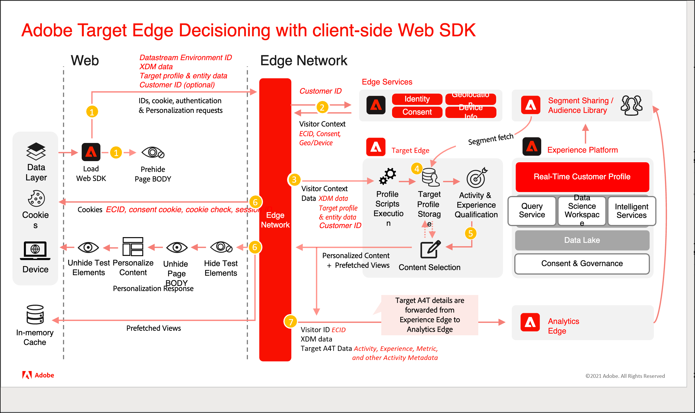

# Using [!DNL Adobe Target] with the [!DNL Platform Web SDK]

[!DNL Adobe Experience Platform] [!DNL Web SDK] can deliver and render personalized experiences managed in [!DNL Adobe Target] to the web channel. You can use a WYSIWYG editor, called the [Visual Experience Composer](https://experienceleague.adobe.com/docs/target/using/experiences/vec/visual-experience-composer.html) (VEC), or a non-visual interface, the [Form-based Experience Composer](https://experienceleague.adobe.com/docs/target/using/experiences/form-experience-composer.html), to create, activate, and deliver your activities and personalization experiences.

>[!IMPORTANT]
>
>Learn how to migrate your Target implementation to Platform Web SDK with the [Migrate Target from at.js 2.x to Platform Web SDK](https://experienceleague.adobe.com/docs/platform-learn/migrate-target-to-websdk/introduction.html) tutorial.
>
>Learn how to implement Target for the first time with the [Implement Adobe Experience Cloud with Web SDK](https://experienceleague.adobe.com/docs/platform-learn/implement-web-sdk/overview.html) tutorial. For information specific to Target, see the tutorial section titled [Set up Target with Platform Web SDK](https://experienceleague.adobe.com/docs/platform-learn/implement-web-sdk/applications-setup/setup-target.html).


The following features have been tested and are currently supported in [!DNL Target]:

* [A/B Tests](https://experienceleague.adobe.com/docs/target/using/activities/abtest/test-ab.html)
* [A4T Impression and conversion reporting](https://experienceleague.adobe.com/docs/target/using/integrate/a4t/a4t.html)
* [Automated Personalization activities](https://experienceleague.adobe.com/docs/target/using/activities/automated-personalization/automated-personalization.html)
* [Experience Targeting activities](https://experienceleague.adobe.com/docs/target/using/activities/automated-personalization/automated-personalization.html)
* [Multivariate Tests (MVT)](https://experienceleague.adobe.com/docs/target/using/activities/multivariate-test/multivariate-testing.html)
* [Recommendations activities](https://experienceleague.adobe.com/docs/target/using/recommendations/recommendations.html)
* [Native Target impression and conversion reporting](https://experienceleague.adobe.com/docs/target/using/reports/reports.html)
* [VEC Support](https://experienceleague.adobe.com/docs/target/using/experiences/vec/visual-experience-composer.html)

## [!DNL Platform Web SDK] system diagram

The following diagram helps you understand the workflow of [!DNL Target] and [!DNL Platform Web SDK] edge decisioning.



|Call|Details|
| --- | --- |
|1|The device loads the [!DNL Platform Web SDK]. The [!DNL Platform Web SDK] sends a request to the edge network with XDM data, the Datastreams Environment ID, passed-in parameters, and the Customer ID (optional). Page (or containers) is pre-hidden.|
|2|The edge network sends the request to the edge services to enrich it with the Visitor ID, consent, and other visitor context info, such as geolocation and device-friendly names.|
|3|The edge network sends the enriched personalization request to the [!DNL Target] edge with the Visitor ID and passed-in parameters.|
|4|Profile scripts execute and then feed into [!DNL Target] profile storage. Profile storage fetches segments from the [!UICONTROL Audience Library] (for example, segments shared from [!DNL Adobe Analytics], [!DNL Adobe Audience Manager], the [!DNL Adobe Experience Platform]).|
|5|Based on URL request parameters and profile data, [!DNL Target] determines which activities and experiences to display for the visitor for the current page view and for future prefetched views. [!DNL Target] then sends this back to the edge network.|
|6|a. The edge network sends the personalization response back to the page, optionally including profile values for additional personalization. Personalized content on the current page is revealed as quickly as possible without flicker of default content.<br>b. Personalized content for views that are shown as a result of user actions in a Single Page Application (SPA) is cached so it can be instantly applied without an additional server call when the views are triggered. <br>c. The edge network sends the Visitor ID and other values in cookies, such as consent, Session ID, identity, cookie check, personalization, and so forth.|
|7|The edge network forwards [!UICONTROL Analytics for Target] (A4T) details (activity, experience, and conversion metadata) to the [!DNL Analytics] edge.|

## Enabling [!DNL Adobe Target]

To enable [!DNL Target], do the following:

1. Enable [!DNL Target] in your [datastream](../../../datastreams/overview.md) with the appropriate client code.
1. Add the `renderDecisions` option to your events.

Then, optionally, you can also add the following options:

* **`decisionScopes`**: Retrieve specific activities (useful for activities created with the form-based composer) by adding this option to your events.
* **[Prehiding snippet](../manage-flicker.md)**: Hide only certain portions of the page.

## Using the Adobe Target VEC

To use the VEC with a [!DNL Platform Web SDK] implementation, install and activate either the [Firefox](https://addons.mozilla.org/en-US/firefox/addon/adobe-target-vec-helper/) or [Chrome](https://chrome.google.com/webstore/detail/adobe-target-vec-helper/ggjpideecfnbipkacplkhhaflkdjagak) VEC Helper Extension.

For more information, see [Visual Experience Composer helper extension](https://experienceleague.adobe.com/docs/target/using/experiences/vec/troubleshoot-composer/vec-helper-browser-extension.html) in the *Adobe Target guide*.

## Rendering personalized content

See [Rendering personalization content](../rendering-personalization-content.md) for more information.

## Audiences in XDM

When defining audiences for your [!DNL Target] activities that are delivered via the [!DNL Platform Web SDK], [XDM](https://experienceleague.adobe.com/docs/experience-platform/xdm/home.html) must be defined and used. After you define XDM schemas, classes, and schema field groups, you can create a [!DNL Target] audience rule defined by XDM data for targeting. Within [!DNL Target], XDM data displays in the [!UICONTROL Audience Builder] as a custom parameter. The XDM is serialized using dot notation (for example, `web.webPageDetails.name`).

If you have [!DNL Target] activities with predefined audiences that use custom parameters or a user profile, they are not delivered correctly via the SDK. Instead of using custom parameters or the user profile, you must use XDM instead. However, there are out-of-the-box audience targeting fields supported via the [!DNL Platform Web SDK] that do not require XDM. These fields are available in the [!DNL Target] UI that do not require XDM: 

* Target Library
* Geo
* Network
* Operating System
* Site Pages
* Browser
* Traffic Sources
* Time Frame

For more information, see [Categories for audiences](https://experienceleague.adobe.com/docs/target/using/audiences/create-audiences/categories-audiences/target-rules.html) in the *Adobe Target guide*.

### Response tokens

Response tokens are mainly used to send metadata to third parties like Google, Facebook, etc. Response tokens are returned
in the `meta` field within `propositions` -> `items`. Here is a sample:

```json      
{
  "id": "AT:eyJhY3Rpdml0eUlkIjoiMTI2NzM2IiwiZXhwZXJpZW5jZUlkIjoiMCJ9",
  "scope": "__view__",
  "scopeDetails": ...,
  "renderAttempted": true,
  "items": [
    {
      "id": "0",
      "schema": "https://ns.adobe.com/personalization/dom-action",
      "meta": {
        "experience.id": "0",
        "activity.id": "126736",
        "offer.name": "Default Content",
        "offer.id": "0"
      }
    }
  ]
}
```

To collect the response tokens, you have to subscribe to `alloy.sendEvent` promise, iterate through `propositions`
and extract the details from `items` -> `meta`. Every `proposition` has a `renderAttempted` boolean field
indicating whether the `proposition` was rendered or not. See the sample below:

```js
alloy("sendEvent",
  {
    renderDecisions: true,
    decisionScopes: [
      "hero-container"
    ]
  }).then(result => {
    const { propositions } = result;

    // filter rendered propositions
    const renderedPropositions = propositions.filter(proposition => proposition.renderAttempted === true);

    // collect the item metadata that represents the response tokens
    const collectMetaData = (items) => {
      return items.filter(item => item.meta !== undefined).map(item => item.meta);
    }

    const pageLoadResponseTokens = renderedPropositions
      .map(proposition => collectMetaData(proposition.items))
      .filter(e => e.length > 0)
      .flatMap(e => e);
  });
  
```

When automatic rendering is enabled, propositions array contains:

#### On Page-Load:

* Form-Based Composer based `propositions` with `renderAttempted` flag set to `false`
* Visual Experience Composer based propositions with `renderAttempted` flag set to `true`
* Visual Experience Composer based propositions for a Single Page Application view with `renderAttempted` flag set to `true`

#### On View - change (for cached views):

* Visual Experience Composer based propositions for a Single Page Application view with `renderAttempted` flag set to `true`

When automatic rendering is disabled, propositions array contains:

#### On Page-Load:

* Form-based Composer based `propositions` with `renderAttempted` flag set to `false`
* Visual Experience Composer based propositions with `renderAttempted` flag set to `false`
* Visual Experience Composer based propositions for a Single Page Application view with `renderAttempted` flag set to `false`

#### On View - change (for cached views):

* Visual Experience Composer based propositions for a Single Page Application view with `renderAttempted` flag set to `false`

### Single profile update

The [!DNL Platform Web SDK] lets you update the profile to the [!DNL Target] profile and to the [!DNL Platform Web SDK] as an experience event.

To update a [!DNL Target] profile, ensure that the profile data is passed with the following:

* Under `"data {"`
* Under `"__adobe.target"`
* Prefix `"profile."` e.g. as below

|Key|Type|Description|
| --- | --- | --- |
|`renderDecisions`|Boolean|Instructs the personalization component whether it should interpret DOM actions|
|`decisionScopes`|Array `<String>`|A list of scopes to retrieve decisions for|
|`xdm`|Object|Data formatted in XDM that land in the Platform Web SDK as an experience event|
|`data`|Object|Arbitrary key/value pairs sent to [!DNL Target] solutions under the target class.|

Typical [!DNL Platform Web SDK] code using this command looks like the following:

**`sendEvent` with profile data**

```js
alloy("sendEvent", {
   renderDecisions: true|false,
   xdm: { // Experience Event XDM data },
   data: { // Freeform data }
});
```

**How to send Profile attributes to Adobe Target:**

```js
alloy("sendEvent", {
  renderDecisions: true,
  data: {
    __adobe: {
      target: {
        "profile.gender": "female",
        "profile.age": 30
      }
    }
  }
});
```

## Request recommendations

The following table lists [!DNL Recommendations] attributes and whether each one is supported via the [!DNL Platform Web SDK]:

|Category|Attribute|Support Status|
| --- | --- | --- |
|Recommendations – Default entity attributes |entity.id|Supported|
||entity.name|Supported|
||entity.categoryId|Supported|
||entity.pageUrl|Supported|
||entity.thumbnailUrl|Supported|
||entity.message|Supported|
||entity.value|Supported|
||entity.inventory|Supported|
||entity.brand|Supported|
||entity.margin|Supported|
||entity.event.detailsOnly|Supported|
|Recommendations – Custom entity attributes|entity.yourCustomAttributeName|Supported|
|Recommendations – Reserved mbox/page parameters|excludedIds|Supported|
||cartIds|Supported|
||productPurchasedId|Supported|
|Page or item category for category affinity|user.categoryId|Supported|

**How to send Recommendations attributes to Adobe Target:**

```js
alloy("sendEvent", {
  renderDecisions: true,
  data: {
    __adobe: {
      target: {
        "entity.id": "123",
        "entity.genre": "Drama"
      }
    }
  }
});
```

## Debugging

mboxTrace and mboxDebug have been deprecated. Use [[!DNL Platform Web SDK] debugging](https://experienceleague.adobe.com/docs/experience-platform/edge/fundamentals/debugging.html).

## Terminology

__Propositions:__ In [!DNL Target], propositions correlate to the experience that is selected from an Activity.

__Schema:__ The schema of a decision is the type of offer in [!DNL Target]. 

__Scope:__ The scope of the decision. In [!DNL Target], the scope is the mBox. The global mBox is the `__view__` scope.

__XDM:__ The XDM is serialized into dot notation and then put into [!DNL Target] as mBox parameters.
