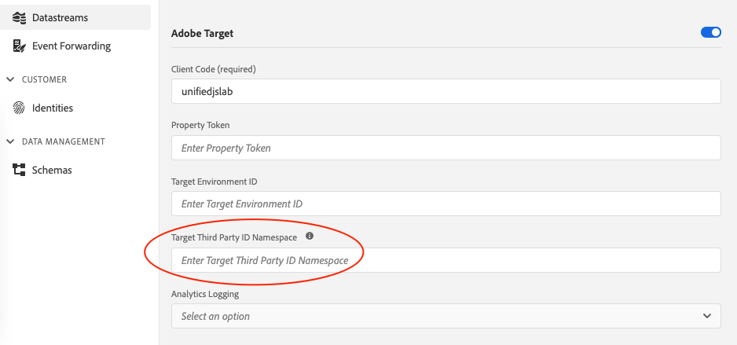

# What is `mbox3rdPartyId`

The mbox3rdPartyId in Adobe Target is your company's visitor ID, such as the membership ID for your company's loyalty program.

When a visitor logs in to a company's site, the company typically creates an ID that is tied to the visitor's account, loyalty card, membership number, or other applicable identifiers for that company. [Learn more](https://experienceleague.adobe.com/docs/target/using/audiences/visitor-profiles/3rd-party-id.html#)


## How to use `mbox3rdPartyId` with the Web SDK

### Step 1: Configure the `Target Third Party ID Namespace`

Configure the `Target Third Party ID Namespace` in your [Datastream](../../../datastreams/overview.md), using the ID Namespace you want to use as an mbox 3rd party ID. 
[Learn more about ID namespaces](https://experienceleague.adobe.com/docs/experience-platform/identity/namespaces.html)



### Step 2: Send the `mbox3rdpartyId` to Target

Send the `mbox3rdpartyId` to Target in the `sendEvent` command, using the ID namespace that you configured in Step 1.
[Learn more about sending IDs](../../identity/overview.md#syncing-identities)

```javascript
alloy("sendEvent", {
  xdm: {
    "identityMap": {
      "ID_NAMESPACE": [ // Replace `ID_NAMESPACE` with the namespace you have configured in Step 1.
        {
          "id": "1234",
          "authenticatedState": "authenticated"
        }
      ]
    }
  }
});
```
