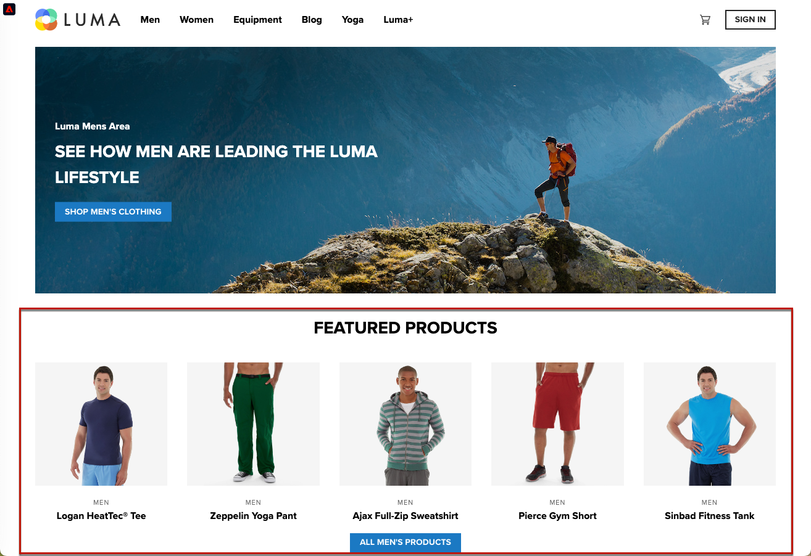

# Implement single-page applications (SPAs) {#web-spa-implementation}

Adobe Experience Platform Web SDK provides rich features that equip your business to execute personalization on next-generation, client-side technologies, such as single-page applications (SPAs).

Traditional websites work on "page-to-page" navigation models, otherwise known as multi-page applications, where website designs are tightly coupled to URLs and transitions from one web page to another requires a page load.

Modern web applications, such as single-page applications (SPAs), have instead adopted a model that propels rapid use of browser UI rendering, which is often independent of page reloads. These experiences can be triggered by customer interactions, such as scrolls, clicks, and cursor movements. As the paradigms of the modern web have evolved, the relevance of traditional generic events, such as a page load, to deploy personalization and experimentation no longer works.


## Benefits of using Web SDK for SPAs {#web-spa-benefits}

Here are some benefits of using Web SDK for your single-page applications:

* Ability to cache all offers on page-load to reduce multiple server calls to a single server call.
* Tremendously improve the user experience on your site because offers are shown immediately via the cache, without lag time introduced by traditional server calls.
* One-time developer setup enables marketers to create and run personalization and experimentation activities via Adobe Journey Optimizer Web visual editor on your SPA.

## XDM Views and single-page applications {#web-spa-xdm}

The Journey Optimizer web editor takes advantage of a concept called _views_.

Views are a logical group of visual elements which together make up an SPA experience. A single-page application can, therefore, be considered as transitioning through views, instead of URLs, based on user interactions. A view can typically represent a whole site, a single page or grouped visual elements within a page.

To further explain what views are, the following example uses a hypothetical online e-commerce site.

* After navigating to the home site, a hero image promotes seasonal collections as well as the different product catalogues available on the site. In this case, a view could be defined for the entire home screen. This view could simply be called "home".

  

* As the customer becomes more interested in the products that the business is selling, they decide to click the **Men** link. Similar to the home page, the entirety of the **Men** page can be defined as a view. This view could be named "men".

  

* Since a view can be defined as a whole site or a group of visual elements on a site, the four products shown on the products site could be grouped and considered as a view. This view could be named "products".

  

* When the customer decides to click the **ALL MEN'S PRODUCTS** button to explore more products on the site, the website URL does not change in this case, but a view can be created here to represent only the second row of products that are shown. The view name could be "products-page-2".

* The customer decides to purchase a few products from the site and proceeds to the checkout screen. The cart screen itself can be associated with a view named "cart". Or you could have a different view inside the checkout screen to handle the recommended products below.

  

The concept of views can be extended much further than this. These are just a few examples of views that can be defined on a site.

## Implementing XDM views {#implement-xdm-views}

XDM views can be leveraged in Adobe Journey Optimizer to empower marketers to run web personalization and experimentation campaigns on SPAs, via the Journey Optimizer web visual editor.

This requires performing the following steps in order to complete a one-time developer setup:

1. Install [Adobe Experience Platform Web SDK](../../fundamentals/installing-the-sdk.md) and check the [web channel pre-requisites](https://experienceleague.adobe.com/docs/journey-optimizer/using/web/configure-web-channel/web-prerequisites.html) page.

2. Determine all XDM views in your single-page application that you want to personalize.

3. After defining the XDM views, in order to deliver content to those views, you need to implement the `sendEvent()` function with `renderDecisions` set to `true` and the corresponding XDM view in your single-page application. The XDM view must be passed in `xdm.web.webPageDetails.viewName`. This step allows marketers to be able to discover these views inside the Journey Optimizer web editor and apply content modifications for them:

```
 alloy("sendEvent", {
  "renderDecisions": true,
  "xdm": {
   "web": {
    "webPageDetails": {
    "viewName":"home"
   }
  }
 }
});

```

>[!NOTE]
>
>On the first `sendEvent()` call, all XDM views that should be rendered to the end-user will be fetched and cached. Subsequent `sendEvent()` calls with XDM views passed in will be read from the cache and rendered without a server call.

## `sendEvent()` function examples

This section outlines two examples showing how to invoke the `sendEvent()` function in React for a hypothetical e-commerce SPA.

### Example 1: A/B test home page {#web-spa-sample-1}

The marketing team want to run A/B tests on the entire home page.


To run A/B tests on the whole home site, `sendEvent()` must be invoked with the XDM `viewName` set to `home`:

```js
function onViewChange() {

  var viewName = window.location.hash; // or use window.location.pathName if router works on path and not hash

  viewName = viewName || 'home'; // view name cannot be empty

  // Sanitize viewName to get rid of any trailing symbols derived from URL

  if (viewName.startsWith('#') || viewName.startsWith('/')) {
    viewName = viewName.substr(1);
  }

  alloy("sendEvent", {
    "renderDecisions": true,

    "xdm": {
      "web": {
        "webPageDetails": {
          "viewName":"home"
        }
      }
    }
  });
}

// react router v4

const history = syncHistoryWithStore(createBrowserHistory(), store);

history.listen(onViewChange);

// react router v3

<Router history={hashHistory} onUpdate={onViewChange} >

```

### Example 2: Personalized products {#web-spa-sample-2}

The marketing team want to personalize the second row of products by changing the price label color to red after a user clicks to see all Men products.


```js
function onViewChange(viewName) {

    alloy("sendEvent", {
        "renderDecisions": true,
        "xdm": {
            "web": {
                "webPageDetails": {
                    "viewName": viewName
                }
            }
        }
    });
}

class Products extends Component {

    render() {
        return (

            <
            button type = "button"
            onClick = {
                this.handleLoadMoreClicked
            } > All Men 's Products</button>
        );
    }

    handleLoadMoreClicked() {
        var page = this.state.page + 1; // assuming page number is derived from component's state
        this.setState({
            page: page
        });
        onViewChange('PRODUCTS-PAGE-' + page);
    }
}
```
